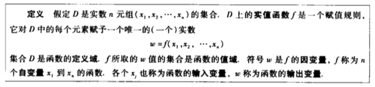
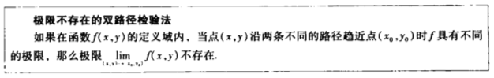
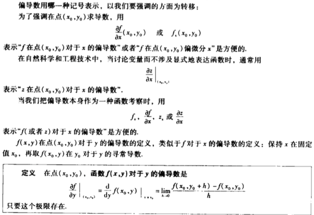

# 12 偏导数

## 12.1多元函数

### 定义域与值域

### 二元函数

### 二元函数的图形、层曲线和等值曲线

### 三元函数

## 12.2 高维空间中函数的极限和连续性

### 极限

**例12.2.2** 求$\lim\limits_{(x, y)\rightarrow(0, 0)}\frac{x^2-xy}{\sqrt{x}-\sqrt{y}}$

解：因为(x, y)在(0, 0)处没有定义，所以不能用商法则。但对于分母为根式的和或差，并且趋向于0的情况，可以利用平方差公式将式子分母有理化：

$\lim\limits_{(x, y)\rightarrow(0, 0)}\frac{x^2-xy}{\sqrt{x}-\sqrt{y}}$

$ = \lim\limits_{(x, y)\rightarrow(0, 0)}\frac{x(x-y)(\sqrt{x}+\sqrt{y})}{x-y}$

$ = \lim\limits_{(x, y)\rightarrow(0, 0)}x(\sqrt{x}+\sqrt{y})$

$ = 0$

注意，第二个等号之所以成立是因为路径y = x不在函数的定义域里。

**例12.2.3** 求极限$\lim\limits_{(x, y)\rightarrow(0, 0)}\frac{4xy^2}{x^2+y^2}$ ，如果极限值存在

解：因为(x, y)在(0, 0)处没有定义，所以不能用商法则。接下来观察函数。

若单看 $x = 0, y\ne 0$ 的情况，函数值为0，若单看 $x \ne 0, y = 0$ 的情况，函数值也为0。

因此，如果函数在(0, 0)极限存在，那么其值一定为0。下面用极限的定义来证明：

令$\epsilon$ 是任意给定的实数，若函数在(0, 0)处极限存在且极限为0，就要证明存在$\delta > 0$ ，若$0 < \sqrt{x^2+y^2}<\delta$ 则有$|\frac{4xy^2}{x^2+y^2} - 0|<\epsilon$ 。

如果我们能利用$0 < \sqrt{x^2+y^2}<\delta$ 给出一个 $|\frac{4xy^2}{x^2+y^2} - 0|$ 的用$\delta$表示的上界，那么对任意的$\epsilon$ ，我们就能通过将$\delta$ 代换成$\epsilon$ 来构造出$|\frac{4xy^2}{x^2+y^2} - 0|<\epsilon$ 了。

具体地，我们令 $0 < \sqrt{x^2+y^2}<\delta$ ，于是

$|\frac{4xy^2}{x^2+y^2} - 0|=\frac{4|x|y^2}{x^2+y^2}\le4|x|=4\sqrt{x^2}\le4\sqrt{x^2+y^2} < 4\delta$

也就是说对任意给定的$\epsilon$ ，存在$\delta=\frac{\epsilon}{4}$ ，若$0 < \sqrt{x^2+y^2}<\delta$ ，则有$|\frac{4xy^2}{x^2+y^2} - 0|<4\delta<\epsilon$，进而得到

$\lim\limits_{(x, y)\rightarrow(0, 0)}\frac{4xy^2}{x^2+y^2}=0$

### 连续性

**例12.2.4** 证明函数

$\begin{equation} f(x, y)=\left\{\begin{aligned}\frac{2xy}{x^2+y^2}&,&(x, y)\ne(0, 0)\\0&,&(x, y)=(0, 0)\end{aligned} \right. \end{equation}$

在原点以外是连续的，在原点处是不连续的。

证明：因为函数f在原点外的值由有理函数给出，所以f在原点以外是连续的。

下面通过连续的定义的第二条来证明。也就是通过证明沿不同路径趋近原点时结果不同来证明函数在原点处不连续。假设有直线$y = mx(x\ne0)$，那么

$f(x, y)|_{y=mx} = \frac{2xy}{x^2+y^2}|_{y=mx} = \frac{2mx^2}{x^2(1+m^2)} = \frac{2m}{1+m^2}$

因此，当(x, y)沿这条直线趋近原点时，极限为

$\lim\limits_{(x, y)\rightarrow(0, 0)\\along \ y=mx}f(x, y)=\lim\limits_{(x, y)\rightarrow(0, 0)}[f(x, y)|_{y=mx}]=\frac{2m}{1+m^2}$

这个值会随着m的改变而改变，所以函数在原点的极限不存在，也就是函数在零点不连续。

**例12.2.5** 证明函数

$f(x, y)=\frac{2x^2y}{x^4+y^2}$ 

在(x, y)趋近于(0, 0)时极限不存在。

证明：根据上述式子的特点，考虑函数沿着$y = kx^2(x\ne0)$ 逼近零点的情况：

$f(x, y)|_{y=kx^2} = \frac{2x^2y}{x^4+y^2}|_{y=kx^2} = \frac{2kx^4}{x^4+k^2x^4} = \frac{2k}{1+k^2}$

因此，当(x, y)沿这条曲线趋近原点时，极限为

$\lim\limits_{(x, y)\rightarrow(0, 0)\\along \ y=kx^2}f(x, y)=\lim\limits_{(x, y)\rightarrow(0, 0)}[f(x, y)|_{y=kx^2}]=\frac{2k}{1+k^2}$

这个值会随着k的改变而改变，所以函数在原点的极限不存在

### 闭有界集上的连续函数的极值

## 12.3 偏导数

### 二元函数的偏导数

### 偏导数的求法

**例12.3.3** 设$f(x, y)=\frac{2y}{y+\cos x}$

求$f_x, f_y$。

解：保持y为常数，得到

$f_x=\frac{\partial}{\partial x}\frac{2y}{y+\cos x} = \frac{2y\sin x}{(y+\cos x)^2}$

保持x为常数，得到

$f_y=\frac{\partial}{\partial y}\frac{2y}{y+\cos x} = \frac{2\cos x}{(y+\cos x)^2}$

**例12.3.4** 设方程

$yz-\ln z=x+y$

定义z为两个自变量x和y的函数，并且存在偏导数，求$\frac{\partial z}{\partial x}$

解：保持y为常数，并且把z作为x的可微函数，求方程两端对于x的导数：

$\frac{\partial}{\partial x}(yz-\ln z)=\frac{\partial}{\partial x}(x+y)$

$y\frac{\partial z}{\partial x}-\frac{1}{z}\frac{\partial z}{\partial x}=1$

$\Rightarrow \frac{\partial z}{\partial x} = \frac{z}{yz-1}$

### 偏导数与连续性

**例12.3.8** 令

$\begin{equation} f(x, y)=\left\{\begin{aligned}0&,&xy\ne0\\1&,&xy=0\end{aligned} \right. \end{equation}$

1. 求f当(x, y)沿直线y = x趋近(0, 0)时的极限
2. 证明f在原点是不连续的
3. 证明两个偏函数$\frac{\partial f}{\partial x}, \frac{\partial f}{\partial y}$ 在原点存在

解：

1. 由于f(x, y)沿直线y = x（除原点）恒为零，故有$\lim\limits_{(x, y)\rightarrow(0, 0)}|_{y=x}=0$
2. 因为 $\lim\limits_{(x, y)\rightarrow(0, 0)}|_{y=x}\ne f(0, 0)$ 所以f在原点是不连续的
3. 为了求f在点(0, 0)处的$\frac{\partial f}{\partial x}$ ，我们保持y = 0，于是对于所有x，有f(x, y)=1，因此 $\frac{\partial f}{\partial x}|_{(0, 0)}=0$ 。同理可求f在点(0, 0)处的$\frac{\partial f}{\partial y}$ 。

### 二阶偏导数

### 混合导数定理

**例12.3.10** 设$w = xy + \frac{e^y}{y^2+1}$，求$\frac{\partial^2w}{\partial x\partial y}$

解：记号表明要先对y求偏导，但因为我们有混合导数定理，所以可以先对x求偏导，事实上，这样求偏导要容易许多

$\frac{\partial w}{\partial x} = y, \frac{\partial^2w}{\partial x\partial y} = 1$

### 可微性

## 12.4 链式法则

### 二元函数

**附例12.4.1** 证明定理5

证明：需要证明的是：若x = x(t), y = y(t)在$t=t_0$ 处是可微的，则w在$t=t_0$ 处也是可微的，并且有

$(\frac{dw}{dt})_{t_0} = (\frac{\partial w}{\partial x})_{P_0}(\frac{dx}{dt})_{t_0}+(\frac{\partial w}{\partial y})_{P_0}(\frac{dy}{dt})_{t_0}$

（其中 $P_0=(x(t_0), y(t_0))$，下标$P_0, t_0$ 指示每个导数所在的点）

因为f具有连续偏导数$f_x, f_y$ ，因此f是可微的，令$\Delta x, \Delta y, \Delta w$ 是t从$t_0$ 变化到$t_0+\Delta t$ 产生的增量， 有

$\Delta w = (\frac{\partial w}{\partial x})_{P_0}\Delta x+(\frac{\partial w}{\partial y})_{P_0}\Delta y + \epsilon_1\Delta x + \epsilon_2\Delta y$ 

（其中当$\Delta x, \Delta y \rightarrow 0$ 时$\epsilon_1, \epsilon_2 \rightarrow 0$ ）

为了求$\frac{dw}{dt}$ ，在这个等式中遍除以$\Delta t$ ，并且令 $\Delta t$ 趋近于0。

遍除以$\Delta t$ 可得

$\frac{\Delta w}{\Delta t} = (\frac{\partial w}{\partial x})_{P_0}\frac{\Delta x}{\Delta t}+(\frac{\partial w}{\partial y})_{P_0}\frac{\Delta y}{\Delta t} + \epsilon_1\frac{\Delta x}{\Delta t} + \epsilon_2\frac{\Delta y}{\Delta t}$ 

令 $\Delta t$ 趋近于0可得

$\lim\limits_{\Delta t\rightarrow0}\frac{\Delta w}{\Delta t} = (\frac{dw}{dt})_{t_0} = (\frac{\partial w}{\partial x})_{P_0}(\frac{dx}{dt})_{t_0}+(\frac{\partial w}{\partial y})_{P_0}(\frac{dy}{dt})_{t_0} + 0\cdot\frac{\Delta x}{\Delta t} + 0\cdot\frac{\Delta y}{\Delta t}$ 

于是定理5得证

### 三元函数

**例12.4.2** 设$w=xy+z, x=\cos t, y=\sin t, z=t$ （在空间x, y, z直角坐标系的视角下，w(t)按照螺旋线路径变化），求$\frac{dw}{dt}$ 

解：$\frac{dw}{dt} = \frac{\partial w}{\partial x}\frac{dx}{dt}+\frac{\partial w}{\partial y}\frac{dy}{dt}+\frac{\partial w}{\partial z}\frac{dz}{dt}$

$ = -y\sin t + x\cos t + 1$

$ = -\sin^2 t + \cos^2 t + 1$

$ = \cos2t + 1$

### 曲面上定义的函数

### 再讨论隐式微分法

**例12.4.5** 设$y^2-x^2-\sin xy=0$，利用定理8求dy / dx

解：取 $F(x, y) = y^2-x^2-\sin xy$。于是

$\frac{dy}{dx} = -\frac{F_x}{F_y} = \frac{2x+y\cos xy}{2y-x\cos xy}$

### 多元函数

## 12.5 方向导数与梯度向量

### 平面内的方向导数

### 方向导数的物理解释

### 方向导数的求法与梯度

### 梯度与层曲线的切线

### 三元函数

## 12.6 切平面与微分

## 12.7 极值与鞍点

## 12.8 拉格朗日乘数

## 12.9 二元函数的泰勒公式

