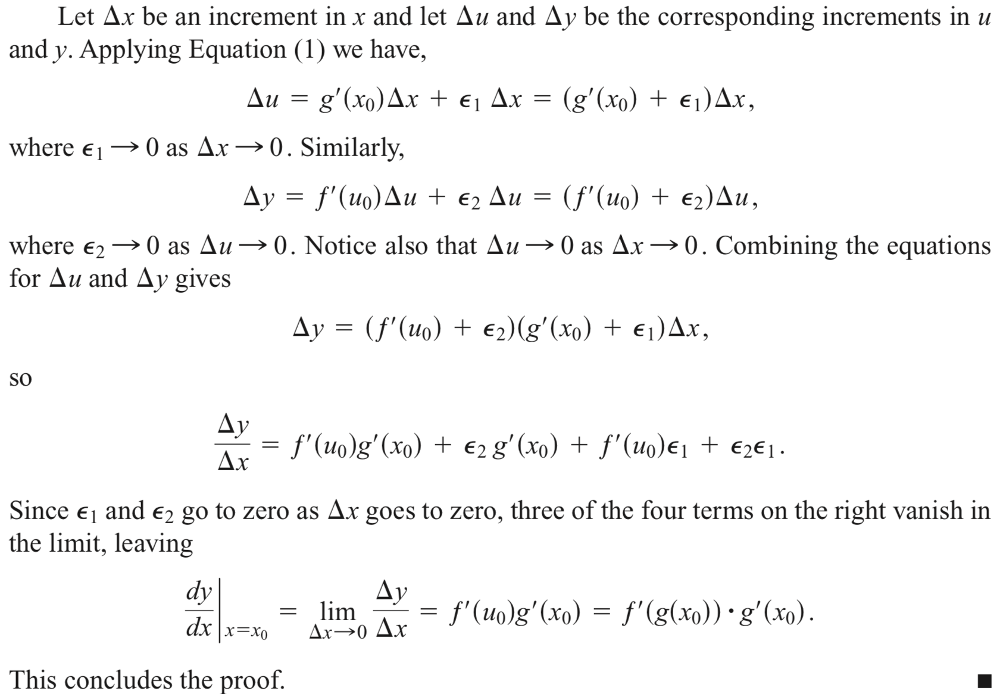
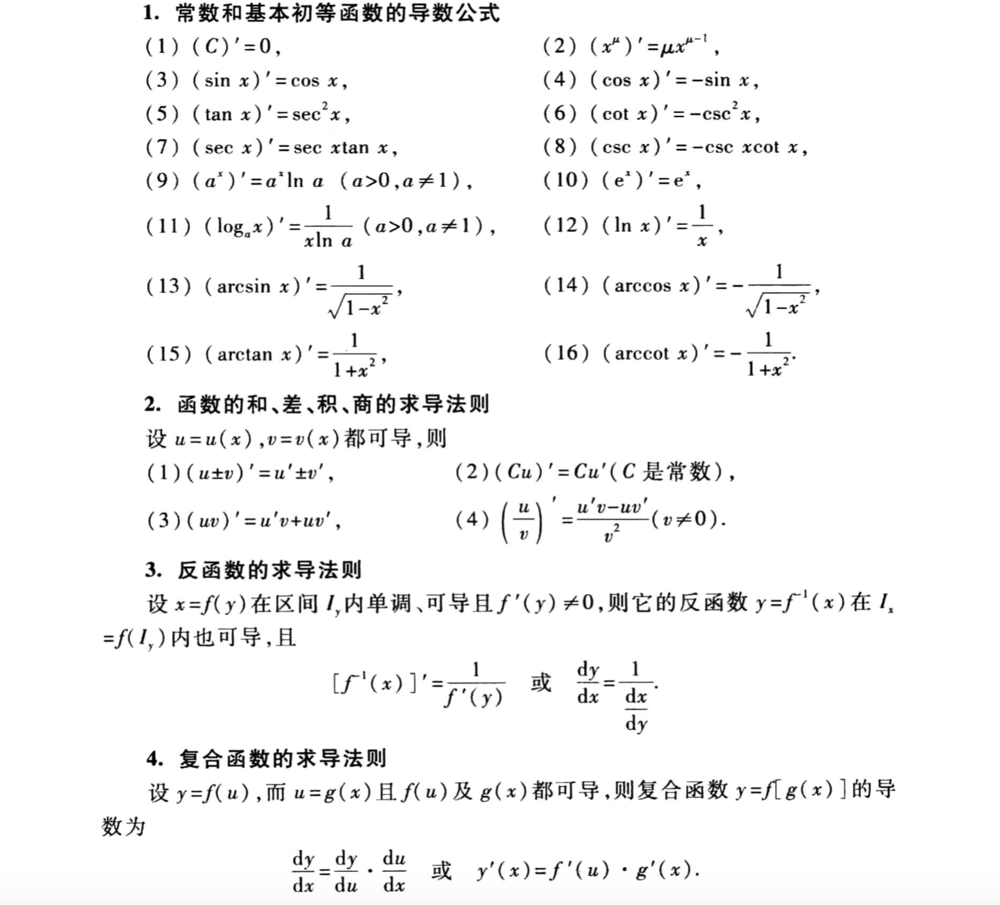
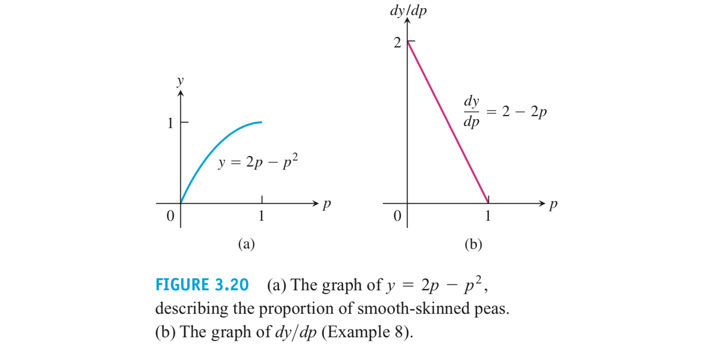
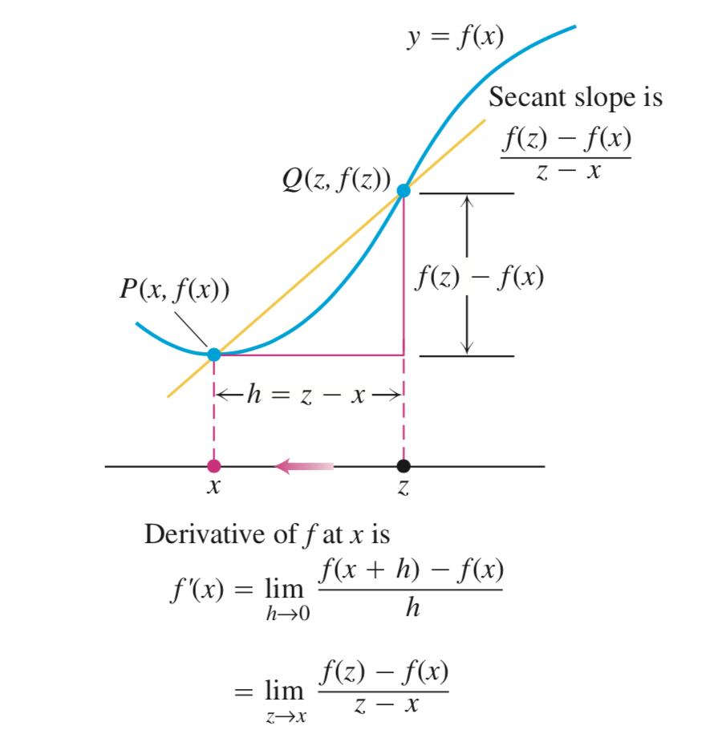
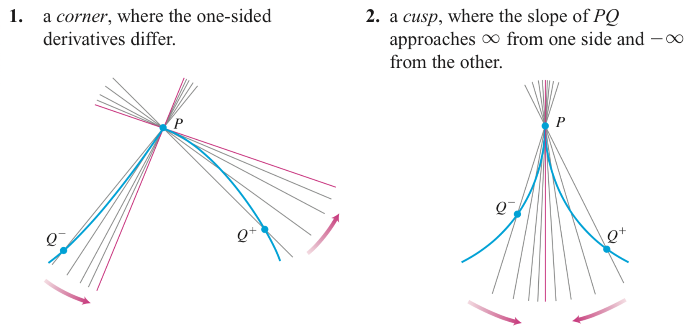
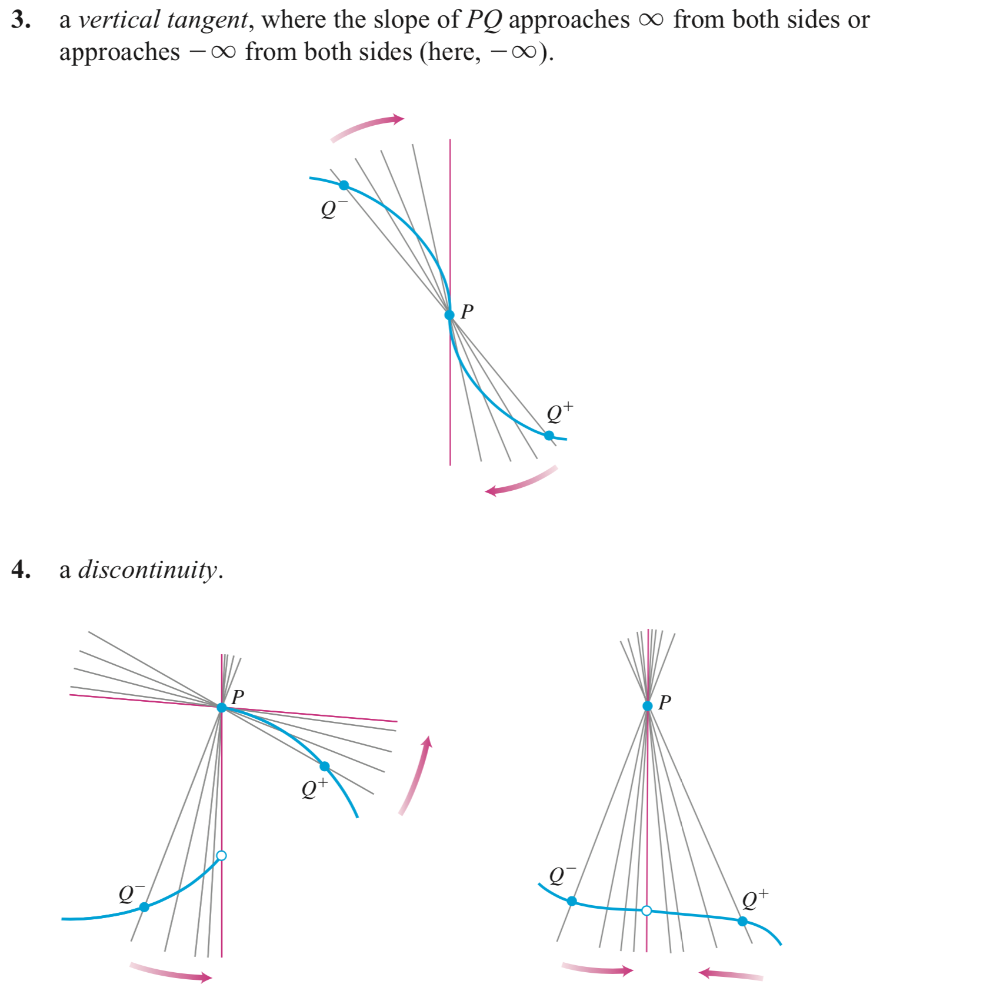
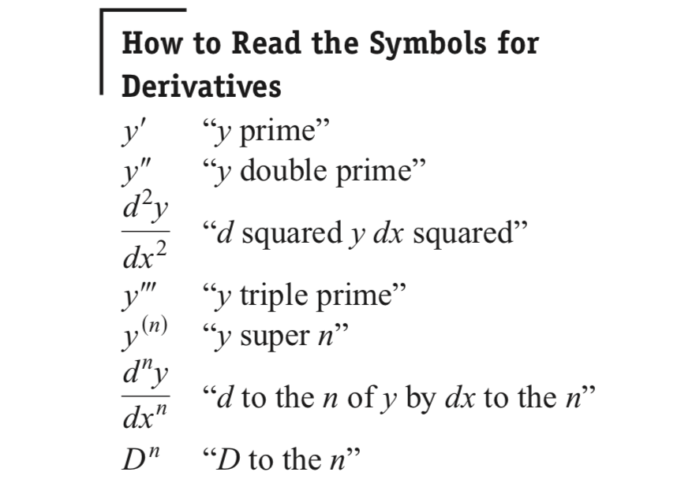

# WHY

# HOW

## 利用定义求导数

## 证明函数在某点处不可导

- 证明两侧极限不相等：例如证明f(x) = |x|在x = 0处不可导
- 证明单侧极限不存在：例如证明$f(x) = \sqrt{x}$在x = 0处不可导（$\lim\limits_{h\rightarrow 0^+}\frac{f(0+h)-f(0)}{h} = \lim\limits_{h\rightarrow 0^+}\frac{1}{\sqrt{h}} = \infin$）

## 基本元素的求导

- 常数函数f(x) = c的导函数为0

## 求导法则

利用导数的定义，不难证明或推导以下的求导法则

- **Power Rule for Positive Integers**：若n是正整数，则$\frac{d}{dx}x^n = nx^{n-1}$
- **Constant Multiple Rule**：若u关于x可导，且c为常数，则$\frac{d}{dx}cu = c\frac{d}{dx}u$
- **Derivative Sum Rule**：若u、v关于x可导，则$\frac{d}{dx}(u+v) = \frac{d}{dx}u + \frac{d}{dx}v$
- **Derivative Product Rule**：若u、v关于x可导，则$\frac{d}{dx}(uv) = u\frac{dv}{dx} + v\frac{du}{dx}$
- **Derivative Quotient Rule**：若u、v关于x可导，则$\frac{d}{dx}(\frac{u}{v}) = \frac{v\frac{du}{dx} - u\frac{dv}{dx}}{v^2}$
- **Power Rule for Negative Integers**：若n是正整数，且$x\ne0$，则$\frac{d}{dx}x^n = nx^{n-1}$
- **Power Rule for Rational Powers**：若$\frac{p}{q}$是有理数，则$\frac{d}{dx}x^{p/q} = \frac{p}{q}x^{p/q-1}$

## 复合函数求导

链式法则：当y = f(u)在u处可导，u = g(x)在x处可导，那么

$\frac{dy}{dx} = \frac{dy}{du}\frac{du}{dx}$

## 参数方程求导

若三个导数都存在并且$\frac{dx}{dt} \ne 0$，则

$\frac{dy}{dx} = \frac{dy/dy}{dx/dt}$

## 反函数求导

$\frac{dy}{dx} = \frac{1}{dx/dy}$

## 隐函数求导

- 将y看成对x可导的函数
- 等式两侧同时对x求导
- 解出$\frac{dy}{dx}$

## 标准线性近似

若f在x = a处可导，那么f在x = a处可以被近似为

L(x) = f(a) + f'(a)(x - a)

L被称为f在a处的标准线性近似，a被称为近似的中心

## 微分

dy = f'(x)dx

这里dy是由x和dx共同决定的

## 微分误差

设f在x = a处可导，$dx = \Delta x$

$\Delta f - df = f(a+\Delta x) - f(a) - f'(x)\Delta x$

$ = (\frac{f(a+\Delta x) - f(a)}{\Delta x} - f'(x))\Delta x$

$ = \epsilon \Delta x$

当$\Delta x \rightarrow 0$时$\frac{f(a+\Delta x) - f(a)}{\Delta x} \rightarrow f'(x)$，即$\epsilon \rightarrow 0$

可用来证明链式法则：

## 求导技巧总结

## 物理应用

用导数来定义或求物理量

- 速度（Velocity）：若位移s = f(t)，则$v(t) = \frac{ds}{dt} = \lim\limits_{\Delta t\rightarrow 0}\frac{f(t+\Delta t)-f(t)}{\Delta t} $

- 速率（Speed）：$speed = |v(t)| = |\frac{ds}{dt} |$
- 加速度（Acceleration）：$a(t) = \frac{dv}{dt} = \frac{d^2s}{dt^2}$
- Jerk：$j(t) = \frac{da}{dt} = \frac{d^3s}{dt^3}$

## 经济学应用

生产成本：生产一个单位的产品的成本，经济学家通常用一个三次函数表示

$c(x) = \alpha x^3 + \beta x^2 + \gamma x + \delta$

其中$\delta$$表示固定成本，例如租金，供暖，设备资本和管理成本。 其他项表示可变成本，例如原材料，税金和人工成本。 固定成本与生产的单位数量无关，而可变成本取决于生产的数量。 通常，三次多项式足够复杂，可以捕获有关数量区间上的成本行为

生产边际成本：生产成本的导数。表示生产产品时，每多生产一个产品，需要额外产生的成本

生产收益：生产一个单位的产品的收益，通常表示为r(x)

生产边际收益：生产收益的导数。表示生产产品时，每多生产一个产品，可以额外获得的收入

## 生物学应用

奥地利的修士门德尔从事与豌豆和其他植物相关的工作，为杂交提供了第一个科学解释。他的仔细记录表明，如果p（介于0和1之间的数字）是豌豆中光滑外皮的基因的频率，而1-p是豌豆中皱褶外皮的基因的频率，则下一代豌豆中光滑外皮的比例为

$y ＝ 2p(1-p) + p^2 ＝ 2p-p^2$

当p较小时，y的值对p的变化更敏感。 因此，在生物学中导数又有敏感度的意义

# WHAT

## 导函数

### 定义

导函数可以定义为函数图像上割线斜率的极限：

$f'(x)=\lim\limits_{h\rightarrow 0}\frac{f(x+h)-f(x)}{h}$

其定义域为f(x)的定义域上上述极限存在的部分

### 符号

导函数

导函数值

## 单侧导数

在函数曲线的边界点上，要区别割线逼近切线的方向，于是用单侧极限定义单侧导数：

- 右侧导数：$\lim\limits_{h\rightarrow 0^+}\frac{f(a+h)-f(a)}{h}$
- 左侧导数：$\lim\limits_{h\rightarrow 0^-}\frac{f(b+h)-f(b)}{h}$

## 函数可导

当函数在定义域内点上处处可导，在边界点上单侧可导，则称函数在闭区间[a, b]内可导

## 函数不可导的四种情形

函数不可导的清形可以归纳为：不连续（无定义，极限不存在，左右极限不相等）和割线斜率的极限不存在（单侧极限不存在或两侧极限不相等）

- 角：两侧导数不相等
- 尖顶：一侧割线的斜率趋向于正无穷而另一侧趋向于负无穷
- 竖直切线：两侧割线的斜率都趋向于正无穷或负无穷
- 不连续

## 可导与连续的关系

根据上述讨论可知：若函数在某点可导，那么函数定在该点连续

## 导数的介值定理

导数的介值定理：若f在某个区间上可导，任取区间上两点a, b，f'一定可以取到[f'(a), f'(b)]内的任意值

这个定理说明了，导数的过渡是平滑的。还说明了f'是实值函数的必要条件是f'满足导数的介值定理（比方说，跃阶函数一定不是某个函数在某个区间上的导函数）。之后我们会证明，任意连续函数都是某个函数在某个区间上的导函数。

## 二阶导数与高阶导数

二阶导数记号：

高阶导数记号：

导数英文读法：

