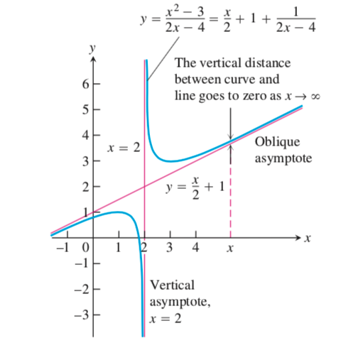
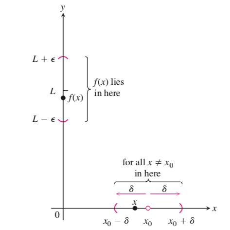
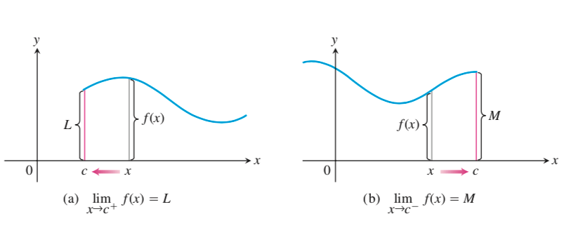
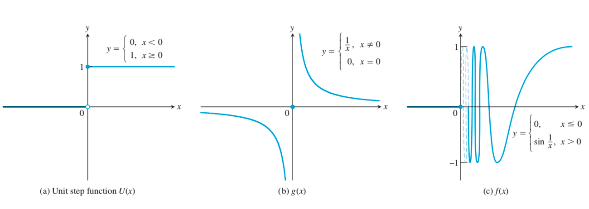
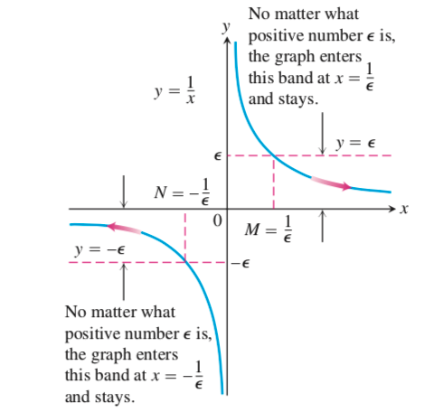

# WHY

- 极限是区别微积分与代数的中心概念
- 我们需要极限来精确地刻画函数的变化（例如连续，阶跃和震荡）
- 几何上，极限可以用来确定渐近线，可以用来定义函数在某点的变化率，还可以用来定义曲线与x轴所围面积

# HOW

## 如何计算$x_0$处的极限

先粗略定义$x_0$处的极限：令f(x)在$x_0$的去心邻域内有定义，若当f(x)任意趋近于L时x充分地趋近于$x_0$，则称L为f(x)在x趋近于$x_0$时的极限，记为$\lim\limits_{x\rightarrow x_0}f(x) = L$

### 基本元素的极限

如果把计算复杂极限比作建造砖房的话，基本元素的极限就如同红砖

- 对于常数k而言，$\lim\limits_{x\rightarrow c}k = k$
- $\lim\limits_{x\rightarrow c}x = c$

### 极限运算法则

如果把计算复杂极限比作建造砖房的话，极限的运算法则就如同水泥

假设L, M, c, k都是实数，并且

$\lim\limits_{x\rightarrow c}f(x) = L$

$\lim\limits_{x\rightarrow c}g(x) = M$

- 两函数的和，差，积的极限：

  - $\lim\limits_{x\rightarrow c}(f(x) + g(x)) = L + M$
  - $\lim\limits_{x\rightarrow c}(f(x) - g(x)) = L - M$
  - $\lim\limits_{x\rightarrow c}(f(x) \cdot g(x)) = L \cdot M$

- 常量积的极限：

  $\lim\limits_{x\rightarrow c}(k \cdot f(x)) = k \cdot L$

- 两函数的商的极限：

  $\lim\limits_{x\rightarrow c}\frac{f(x)}{g(x)} = \frac{L}{M}, M \ne 0$

- 幂的极限（设r, s是没有公因子的正整数，若s是偶数，则设L为正实数）：

  $\lim\limits_{x\rightarrow c}f(x)^{r/s} = L^{r/s}, M \ne 0$

### 多项式的极限

有了基本元素的极限和极限的运算法则，就可以计算多项式的极限了

- 多项式$P(x) = \sum\limits_{i=0}^n a_ix^i$

- $\lim\limits_{x\rightarrow c}P(x) = P(c)$
- 注意$a_i$, c都要是常实数

### 有理函数的极限

有了多项式的极限和极限的运算法则，就可以计算有理函数的极限了

- 有多项式P(x)和Q(x)
- $\lim\limits_{x\rightarrow c}\frac{P(x)}{Q(x)} = \frac{P(c)}{Q(c)}, Q(c) \ne 0$

当Q(c) = 0时，依然可以尝试计算极限：

- 当函数是有理函数时：分子分母都进行因式分解，以求约去0因子。可能会用到：
  - 平方差公式：$a^2 - b^2 = (a - b)(a + b)$
  - 立方差公式：$a^3 - b^3 = (a - b)(a^2 + ab + b^2)$
  - 多次方差公式：$a^n - b^n = (a - b)(a^{n-1}+a^{n-2}b+\dots+ab^{n-2} + b^{n-1})$
  - 配方法

同时，还可以利用等价无穷小：

- $x \rightarrow 0\Rightarrow (1+x)^a-1\sim ax$

### 无理函数的极限

根据极限的运算法则中的“幂的极限”，为多项式加上根号，结果依然成立。例如

$\lim\limits_{x\rightarrow -2}\sqrt{4x-3} = \sqrt{13}$

或者直接利用等价无穷小：

$\sqrt[n]{1+x} - 1 \sim \frac{1}{n}x$

还可以将有理函数的极限推广到无理函数

- 有无理函数P(x)和Q(x)
- $\lim\limits_{x\rightarrow c}\frac{P(x)}{Q(x)} = \frac{P(c)}{Q(c)}, Q(c) \ne 0$

当Q(c) = 0时，依然可以尝试计算极限：

- 当函数带有根号时：进行分子有理化或者分母有理化，以求构造出0因子，从而约去0因子

### 对数函数的极限

如果只有单纯的指数函数，那么其在$x_0$处的极限可以直接代入$x_0$。麻烦的是指数函数同其它类型函数复合而成的函数的极限。有以下方法可以处理：

- 利用等价无穷小（$x \rightarrow 0 $）：
  - $\ln(1+x) \sim x$

### 指数函数的极限

如果只有单纯的指数函数，那么其在$x_0$处的极限可以直接代入$x_0$。麻烦的是指数函数同其它类型函数复合而成的函数的极限。有以下方法可以处理：

- 换元法转化成对数函数
- 利用等价无穷小（$x \rightarrow 0$ ）：
  -  $e^x-1 \sim x$

### 幂指函数的极限

我们把可以表示为$y=f(x)^{g(x)}, \ (f(x)>0)$的函数称为幂指函数

- 如果f(x)和g(x)的极限分别存在且等于a, b的话，其极限就等于$a^b$
- 如果f(x)的极限为0，g(x)的极限为$\infin$ 的话，其极限等于0
- 如果其属于$\infin^0, 1^{\infin}, 0^0$ 这三种未定形：
  - $1^{\infin}$ 未定形：构造重要极限$\lim\limits_{x\rightarrow0}(1+x)^{\frac{1}{x}}=e$，具体地，$\lim(1+\alpha(x))^{\beta(x)}=\lim(1+\alpha(x))^{\frac{\alpha(x)}{\alpha(x)\beta(x)}}=\lim[(1+\alpha(x))^{\frac{1}{\alpha(x)}}]^{\alpha(x)\beta(x)}$，只要求出 $\alpha(x)\beta(x)$ 的极限就能求出原极限
  - 先对后指法：先取对数后取指数，$\lim\limits_{x\rightarrow0}f(x)^{g(x)}=\lim\limits_{x\rightarrow0}e^{g(x)\ln(f(x))}$，只要求出 $g(x)\ln(f(x))$ 的极限就能求出原极限
  - 利用等价无穷小，f(x)或g(x)都能替换成等价无穷小（可用先对后指法证明）

### 三角函数的极限

如果只有单纯的三角函数，那么其在$x_0$处的极限可以直接代入$x_0$。麻烦的是三角函数同其它类型函数复合而成的函数的极限。有以下方法可以处理：

- 利用夹逼准则：例如求$\lim\limits_{x \rightarrow 0}\frac{\sin(x)}{x}$。已知在区间$[-\frac{\pi}{2}, \frac{\pi}{2}]$ 上有$\sin(x) \le x \le tan(x)$ ，那么有$1 \le \frac{x}{\sin(x)} \le \frac{1}{\cos(x)}$，进而有$1 > \frac{\sin(x)}{x} > \cos(x)$，所以$\lim\limits_{x \rightarrow 0}\frac{\sin(x)}{x} = 1$

- 利用重要极限：利用夹逼准则计算出了$\lim\limits_{x \rightarrow 0}\frac{\sin(x)}{x} = 1$ 后，我们就可以将复杂些的函数构造出它的形态来简化计算，例如求$\lim\limits_{x\rightarrow0}\frac{1-\cos(x)}{x^2}$ ，分子分母同乘1+cos(x)后得原式=$\lim\limits_{x\rightarrow0}\frac{\sin^2(x)}{x^2}\frac{1}{1+\cos(x)}$，利用乘积和幂的极限得原式=$(\lim\limits_{x\rightarrow0}\frac{\sin(x)}{x})^2 \lim\limits_{x\rightarrow0} \frac{1}{1+\cos(x)} = \frac{1}{2}$
- 利用有界法（有界函数乘无穷小等于无穷小）：例如$\lim\limits_{x\rightarrow 0}\frac{1}{x}\sin(\frac{1}{x})=0$
- 利用等价无穷小（$x \rightarrow 0$）：
  - $\sin(x)\sim x$ 
  - $\tan(x)\sim x$
  - $1-\cos(x)\sim \frac{x^2}{2}$
  - $\sec(x)-1\sim \frac{x^2}{2}$

### 反三角函数的极限

反三角函数的极限的处理方法：

- 利用换元法，转化为三角函数的极限：例如求$\lim\limits_{x \rightarrow 0}\frac{\arcsin(x)}{x}$ ，令t=arcsin(x)，则原式=$\lim\limits_{t \rightarrow 0}\frac{t}{\sin(t)} = 1$  
-  利用等价无穷小（$x \rightarrow 0$）：
  - $\arcsin(x)\sim x$
  - $\arctan(x)\sim x$

## 如何计算$\infin$处的极限

先粗略定义一下$\infin$处的极限：若当f(x)任意趋近于L时x充分地从右侧趋近于$\infin$ ，则称L为f(x)在x趋近于$\infin$ 处的极限

（后文会用$\infin$ 来指代$\pm \infin$）

### 基本元素的极限

同样地，对于无穷处的极限，我们也从最基本的元素开始算起

- 对于常数k而言，$\lim\limits_{x\rightarrow \infin}k = k$
- $\lim\limits_{x\rightarrow \infin}\frac{1}{x} = 0$

### 极限运算法则

同样地，对于无穷处的极限，我们也可以定义一组运算法则。

若将趋近符号$x \rightarrow x_0$ 改成$x \rightarrow \infin$ ，就能直接继承$x_0$处的极限的运算法则。

### 有理函数的极限

这里我们将跳过多项式的极限，直接到有理函数的极限。原因是我们的基本元素给的是$\frac{1}{x}$ 的极限而不是x的极限，

- 有多项式P(x)和Q(x)，$f(x) = \frac{P(x)}{Q(x)}$
- 首先，如果我们要计算$\lim\limits_{x \rightarrow \infin} f(x)$ ，就要将f(x)​的分子分母同时除以P(x), Q(x)中x的最高次项
- 例如$f(x) = \frac{x^2 + 1}{x^3 + x + 1} = \frac{\frac{1}{x} + \frac{1}{x^3}}{1 + \frac{1}{x^2} + \frac{1}{x^3}}$
- 然后就可以根据基本元素的极限和极限的运算法则来计算极限

具体地，$f(x) = \frac{P(x)}{Q(x)}$可以分以下3种情况

- P中x的最高次数大于Q中x的最高次数：极限为正无穷
- P中x的最高次数等于Q中x的最高次数：极限为两个最高次数项的系数的比值
- P中x的最高次数小于Q中x的最高次数：极限为0

### 对数函数的极限

- 换元法配以对数性质构造重要极限

## 如何确定函数的渐近线

极限的一个几何应用是确定函数的渐近线

- 水平渐近线：当x趋向于正负无穷时函数的极限为b，则y = b就是函数的水平渐近线
- 竖直渐近线：当x从右侧趋向于a时函数趋向于正无穷或负无穷，且当x从左侧趋向于a时函数趋向于正无穷或负无穷，则x = a是函数的竖直渐近线
- 斜渐近线：当x趋向于正负无穷时，函数趋近于直线y = ax + b (a $\ne$ 0) ，则y = ax + b是函数的斜渐近线。例如对于 $f(x) = \frac{x^2 - 3}{2x - 4} = \frac{x}{2} + 1 + \frac{1}{2x-4}$ ，因此当x趋近于正负无穷时f(x)趋近于$\frac{x}{2} + 1$ ，因此$y = \frac{x}{2} + 1$ 是f(x)的斜渐近线

# WHAT

## $x_0$处极限

回顾一下粗略定义下的极限：令f(x)在$x_0$的去心邻域内有定义，若当f(x)任意趋近于L时x充分地趋近于$x_0$，则称L为f(x)在x趋近于$x_0$时的极限，记为$\lim\limits_{x\rightarrow x_0}f(x) = L$

现在我们将其翻译成数学语言：

- f(x)任意趋近L：对任意的$\epsilon$ > 0，有|f(x) - L| < $\epsilon$
- x充分地趋近于$x_0$：存在$\delta > 0$，使得0 < |x - $x_0$| < $\delta$ 对去心邻域内任意x都成立

有几个需要注意的问题：

- 任意的 $\epsilon$ 都对应着某个提问：存在能满足要求的 $\delta$ 吗？
- 之所以用去心邻域的概念是为了包含f(x)在$x_0$处无定义的情况（而去心邻域蕴藏着距离的概念，所以0 < |x - $x_0$| < $\delta$ 有绝对值符号）
- 之所以|f(x) - L| < $\epsilon$有绝对值符号，是因为f(x)可能从上侧趋近于L，也可能从下侧趋近于L
- 在表述“使得0 < |x - $x_0$| < $\delta$ 对去心邻域内**任意**x都成立”中，“任意”二字排除了函数在$x_0$处震荡的情况（如果不加“任意”二字，则情况有可能是在去心邻域内无限接近$x_0$的时候突然震荡，使得函数不趋近于确定的值）

## 单侧极限

为了更准确地描述函数在某点的行为，我们需要描述单侧极限。有时极限不存在的时候，单侧极限是可以存在的，此时可以用单侧极限来刻画函数在该点的行为。此处仅描述右侧极限，因为左侧极限与之类似

- 通俗地，令f(x)在$x_0$的去心邻域的右半部分有定义，若当f(x)任意趋近于L时x充分地从右侧趋近于$x_0$，则称L为f(x)在x趋近于$x_0$时的右侧
- 严谨地，若对任意的$\epsilon > 0$ 存在 $\delta > 0$ ，使得对所有满足$x_0 < x < x_0 + \delta$ 的x都有|f(x) - L| < $\epsilon$，则称L是f(x) 在$x_0$处的右侧极限，记为$\lim\limits_{x \rightarrow x_0^+}f(x) = L$
- 注意单侧极限的定义仅将极限定义中的0 < |x - $x_0$| < $\delta$ 改为$x_0 < x < x_0 + \delta$ ，这是因为后者只要求x充分地从右侧趋近于$x_0$

有以下两点需要注意：

- 单侧极限跟极限是有联系的，具体是**f(x)在$x_0$处的极限存在的充要条件是f(x)在$x_0$处的两个单侧极限存在并且相等**。这个联系可以被当作定义单侧极限的一个不错的收获
- 单侧极限可以继承极限的运算法则，多项式、有理数函数的极限计算法，以及夹逼准则

## $x_0$处不存在极限

根据在单侧极限中获得的极限存在的充要条件，我们可以列举出极限不存在的情况

- 跳跃：左右极限存在但不相等
- 无穷：左右极限不存在
- 震荡：左右极限不存在

## 无穷极限

为了能够用极限描述更多的内容（例如竖直渐近线），这里引入无穷极限这一概念。这里仅描述正无穷极限

- 通俗地，若当x趋向于$x_0$时，函数要多大有多大，则说函数在$x_0$处趋向于正无穷
- 严谨地，对任意的正实数B，存在对应的 $\delta > 0$ ，使得所有使0 < |x - $x_0$| < $\delta$ 成立的x都有f(x) > B，则称x趋向于$x_0$时f(x)趋向于正无穷，记为$\lim\limits_{x \rightarrow x_0} f(x) = +\infin$，或简写为$\lim\limits_{x \rightarrow x_0} f(x) = \infin$
- 注意，负无穷极限的定义须将“正实数B”改为“负实数-B”

## 竖直渐近线

有了单侧极限和无穷极限后就可以定义函数的竖直渐近线了

- 若$\lim\limits_{x \rightarrow a^+} f(x) = \pm\infin$ 且 $\lim\limits_{x \rightarrow a^-} f(x) = \pm\infin$ 则x = a时函数f(x) 的竖直渐近线
- 注意，函数的竖直渐近线可以有很多条

## 无穷处极限

模仿单侧极限，我们还可以继续定义当x趋向于无穷处的极限，此处仅定义x趋向于$+\infin$ 处的极限

- 通俗地，若当f(x)任意趋近于L时x充分地从右侧趋近于$+\infin$ ，则称L为f(x)在x趋近于$+\infin$ 处的极限
- 严谨地，若对任意的$\epsilon > 0$ 存在数M，使得对所有满足x > M的x都有|f(x) - L| < $\epsilon$，则称L是f(x) 在x趋近于$+\infin$ 处的极限，记为$\lim\limits_{x \rightarrow +\infin}f(x) = L$
- 注意单侧极限的定义仅将右侧极限定义中的$x_0 < x < x_0 + \delta$ 改成了x > M，这是因为后者要求对任意给定的误差$\epsilon$ 都有对应的x

## 水平渐近线

有了无穷处极限，我们就可以严格定义函数的水平渐近线了

- 通俗地，无论x趋向于正无穷还是负无穷，函数的极限都等于b，则y = b是函数的水平渐近线
- 严谨地，若 $\lim\limits_{x \rightarrow +\infin}f(x) = b$  且 $\lim\limits_{x \rightarrow -\infin}f(x) = b$ ，则y = b是函数f(x)的水平渐近线

## 夹逼准则

夹逼准则告诉我们，如果函数的极限不好计算，那么可以通过计算函数的上下界的极限来间接计算极限。有了夹逼准则，我们能够计算更多更复杂的极限了

### $x_0$ 处的极限

- 严谨地，假设对c的去心邻域内的所有x都有$g(x) \le f(x) \le h(x) $ 且 $\lim\limits_{x \rightarrow c}g(x) = \lim\limits_{x \rightarrow c}h(x) = L$，那么$\lim\limits_{x \rightarrow c}f(x) = L$

### $\infin$处的极限

无穷处的极限可以直接复用之前叙述过的夹逼准则

- 例如，因为$0 \le |\frac{\sin x}{x}| \le |\frac{1}{x}|$ ，所以$\lim\limits_{x \rightarrow \pm \infin} \frac{sinx}{x} = 0$

## 无穷小与无穷大

### 无穷大

无穷大就是前面定义的无穷极限

### 无穷小

无穷小量是数学分析中的一个概念，用以严格地定义诸如“最终会消失的量”、“绝对值比任何正数都要小的量”等非正式描述。在经典的微积分或数学分析中，无穷小量通常以函数、序列等形式出现

- 严谨地，如果函数$f(x)$当$x\rightarrow x_0$ （或$x\rightarrow \infin$）时的极限为零，那么称函数f(x)为当$x\rightarrow x_0$ （或$x\rightarrow \infin$）时的无穷小

- 无穷小同极限的关系：函数f(x)具有极限A $\Leftrightarrow f(x) = A+\alpha$ （$\alpha$是自变量变化过程与f(x)相同，即$x\rightarrow x_0$ （或$x\rightarrow \infin$），的无穷小）

### 无穷小与无穷大的关系

在自变量的同一变化过程中，如果f(x)为无穷大，那么$\frac{1}{f(x)}$ 为无穷小；反之，如果f(x)为无穷小，那么$\frac{1}{f(x)}$ 为无穷大

### 无穷小的比较

无穷小同无穷小之间的关系：

- 无穷小的和、差、积仍是无穷小
- 若商为0，则分子是分母的高阶无穷小
- 若商为$\infin$ ，则分子是分母的低阶无穷小
- 若商为常数，则分子是分母的同阶无穷小
- 若商为1，则分子是分母的等价无穷小

等价无穷小非常重要，具体表现在：

- 设$\alpha \sim \tilde{a}, \beta \sim \tilde{\beta}$，且$\lim\frac{\tilde{\beta}}{\tilde{\alpha}}$ 存在，则$\lim\frac{\beta}{\alpha} = \lim\frac{\tilde{\beta}}{\tilde{\alpha}}$ （$\lim\frac{\beta}{\alpha} = \lim(\frac{\beta}{\tilde{\beta}} \cdot \frac{\tilde{\beta}}{\tilde{\alpha}} \cdot \frac{\tilde{\alpha}}{\alpha}) = \lim\frac{\tilde{\beta}}{\tilde{\alpha}}$）
- 注意，不可以用等价无穷小替换和差项

# DO

1. 计算$\lim\limits_{x\rightarrow 4}\frac{4 - x}{5 - \sqrt{x^2 + 9}}$

   $\text{原式} = \lim\limits_{x\rightarrow 4}\frac{(4 - x)(5 + \sqrt{x^2+9})}{16 - x^2} = \lim\limits_{x\rightarrow 4}\frac{(4 - x)(5 + \sqrt{x^2+9})}{(4+x)(4-x)} = \lim\limits_{x\rightarrow 4}\frac{5 + \sqrt{x^2+9}}{4+x} = \frac{5}{4}$

2. 计算$\lim\limits_{x\rightarrow 4}\frac{x^3 - 8}{x^4 - 16}$

   $\text{原式} = \lim\limits_{x\rightarrow 4}\frac{(x-2)(x^2+2x+4)}{(x-2)(x^3+2x^2+4x+8)} = \lim\limits_{x\rightarrow 4}\frac{x^2+2x+4}{x^3+2x^2+4x+8} =\frac{7}{30}$

3. 计算$\lim\limits_{x\rightarrow 2}\frac{x^2-7x+10}{x-2}$

   $\text{原式} = \lim\limits_{x\rightarrow 2}\frac{(x-2)(x-5)}{x-2} = \lim\limits_{x\rightarrow 2}(x-5) = -3$

4. 计算$\lim\limits_{x \rightarrow +\infin}\frac{x^2 - 3}{2x - 4}$
   
   $\text{原式} = \lim\limits_{x \rightarrow +\infin}\frac{x - \frac{3}{x}}{2 - \frac{x}{4}} = \infin$
   
5. 计算$\lim\limits_{x \rightarrow +\infin}\frac{3x^2 - 2x - 3}{2x^2 + 2x - 4}$

   $\text{原式} = \lim\limits_{x \rightarrow +\infin} \frac{3 - \frac{2}{x} - \frac{3}{x^2}}{2 + \frac{2}{x} - \frac{4}{x^2}} = \frac{3}{2}$

6. 计算$\lim\limits_{x \rightarrow +\infin}\frac{x - 3}{5x^2}$

   $\text{原式} = \lim\limits_{x \rightarrow +\infin}\frac{\frac{1}{x} - \frac{3}{x^2}}{5} = 0$

7. 若$f(x)=
   \begin{cases}
   x^2& x \ne 2\\
   1& x = 2
   \end{cases}$，证明$\lim\limits_{x \rightarrow 2}f(x) = 4$

   

   在x = $x_0$ = 2的去心邻域内，对任意$\epsilon$ 若有 $|f(x) - 4| < \epsilon $ 则有 $ \sqrt{4-\epsilon} < x < \sqrt{4 + \epsilon}$

   现在要证明在这种情况下存在$\delta$ 使得$(2 - \delta, 2 + \delta)$在区间$(\sqrt{4-\epsilon}, \sqrt{4 + \epsilon})$中

   若$\sqrt{4-\epsilon}$与$x_0$的距离更近，我们就令$\delta$等于这个距离

   若$\sqrt{4+\epsilon}$与$x_0$的距离更近，我们就令$\delta$等于这个距离

   因此总是存在$\delta = \min\{\sqrt{4-\epsilon}, \sqrt{4+\epsilon} \}$，使得$(2 - \delta, 2 + \delta)$在区间$(\sqrt{4-\epsilon}, \sqrt{4 + \epsilon})$中

   原命题得证