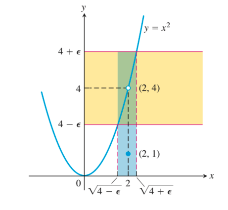

## WHY

- 极限是区别微积分与代数的中心概念
- 我们需要极限来精确地刻画函数的变化（例如连续，阶跃和震荡）
- 几何上，极限可以用来定义函数在某点的变化率，还可以用来定义曲线与x轴所围面积

## HOW

先粗略定义极限：令f(x)在$x_0$的去心邻域内有定义，若当f(x)任意趋近于L时x充分地趋近于$x_0$，则称L为f(x)在x趋近于$x_0$时的极限，记为$\lim\limits_{x\rightarrow x_0}f(x) = L$

### 基本元素的极限

如果把计算复杂极限比作建造砖房的话，基本元素的极限就如同红砖

- 对于常数k而言，$\lim\limits_{x\rightarrow c}k = k$
- $\lim\limits_{x\rightarrow c}x = c$

### 极限运算法则

如果把计算复杂极限比作建造砖房的话，极限的运算法则就如同水泥

假设L, M, c, k都是实数，并且

$\lim\limits_{x\rightarrow c}f(x) = L$

$\lim\limits_{x\rightarrow c}g(x) = M$

- 两函数的和，差，积的极限：

  - $\lim\limits_{x\rightarrow c}(f(x) + g(x)) = L + M$
  - $\lim\limits_{x\rightarrow c}(f(x) - g(x)) = L - M$
  - $\lim\limits_{x\rightarrow c}(f(x) \cdot g(x)) = L \cdot M$

- 常量积的极限：

  $\lim\limits_{x\rightarrow c}(k \cdot f(x)) = k \cdot L$

- 两函数的商的极限：

  $\lim\limits_{x\rightarrow c}\frac{f(x)}{g(x)} = \frac{L}{M}, M \ne 0$

- 幂的极限（设r, s是没有公因子的正整数，若s是偶数，则设L为正实数）：

  $\lim\limits_{x\rightarrow c}f(x)^{r/s} = L^{r/s}, M \ne 0$

### 多项式的极限

有了基本元素的极限和极限的运算法则，就可以计算多项式的极限了

- 多项式$P(x) = \sum\limits_{i=0}^n a_ix^i$

- $\lim\limits_{x\rightarrow c}P(x) = P(c)$
- 注意$a_i$, c都要是常实数

### 有理函数的极限

有了多项式的极限和极限的运算法则，就可以计算有理函数的极限了

- 有多项式P(x)和Q(x)
- $\lim\limits_{x\rightarrow c}\frac{P(x)}{Q(x)} = \frac{P(c)}{Q(c)}, Q(c) \ne 0$

根据极限的运算法则中的“幂的极限”，我们为多项式加上根号，结果依然成立。例如

$\lim\limits_{x\rightarrow -2}\sqrt{4x-3} = \sqrt{13}$

当Q(c) = 0时，依然可以尝试计算极限

- 当函数是有理函数时：分子分母都进行因式分解，以求约去0因子。可能会用到：
  - 平方差公式：$a^2 - b^2 = (a - b)(a + b)$
  - 立方差公式：$a^3 - b^3 = (a - b)(a^2 + ab + b^2)$
  - 多次方差公式：$a^n - b^n = (a - b)(a^{n-1}+a^{n-2}b+\dots+ab^{n-2} + b^{n-1})$
  - 配方法
- 当函数带有根号时：进行分子有理化或者分母有理化，以求构造出0因子，从而约去0因子

### 夹逼准则

夹逼准则告诉我们，如果函数的极限不好计算，那么可以通过计算函数的上下界的极限来间接计算极限。有了夹逼准则，我们能够计算更多更复杂的极限了

- 夹逼准则：假设对c的去心邻域内的所有x都有$g(x) \le f(x) \le h(x) $ 且 $\lim\limits_{x \rightarrow c}g(x) = \lim\limits_{x \rightarrow c}h(x) = L$，那么$\lim\limits_{x \rightarrow c}f(x) = L$
- 例如在区间$[-\frac{\pi}{2}, \frac{\pi}{2}]$ 上有$\sin(x) \le x \le tan(x)$ ，那么有$1 \le \frac{x}{\sin(x)} \le \frac{1}{\cos(x)}$，进而有$1 > \frac{\sin(x)}{x} > \cos(x)$，所以$\lim\limits_{x \rightarrow 0}\frac{\sin(x)}{x} = 1$

### 重要极限

### 等价无穷小

### 习题

1. 计算$\lim\limits_{x\rightarrow 4}\frac{4 - x}{5 - \sqrt{x^2 + 9}}$

   $\text{原式} = \lim\limits_{x\rightarrow 4}\frac{(4 - x)(5 + \sqrt{x^2+9})}{16 - x^2} = \lim\limits_{x\rightarrow 4}\frac{(4 - x)(5 + \sqrt{x^2+9})}{(4+x)(4-x)} = \lim\limits_{x\rightarrow 4}\frac{5 + \sqrt{x^2+9}}{4+x} = \frac{5}{4}$

2. 计算$\lim\limits_{x\rightarrow 4}\frac{x^3 - 8}{x^4 - 16}$

   $\text{原式} = \lim\limits_{x\rightarrow 4}\frac{(x-2)(x^2+2x+4)}{(x-2)(x^3+2x^2+4x+8)} = \lim\limits_{x\rightarrow 4}\frac{x^2+2x+4}{x^3+2x^2+4x+8} =\frac{7}{30}$

3. 计算$\lim\limits_{x\rightarrow 2}\frac{x^2-7x+10}{x-2}$

   $\text{原式} = \lim\limits_{x\rightarrow 2}\frac{(x-2)(x-5)}{x-2} = \lim\limits_{x\rightarrow 2}(x-5) = -3$

4. 

## WHAT

### $x_0$处极限

回顾一下粗略定义极限：令f(x)在$x_0$的去心邻域内有定义，若当f(x)任意趋近于L时x充分地趋近于$x_0$，则称L为f(x)在x趋近于$x_0$时的极限，记为$\lim\limits_{x\rightarrow x_0}f(x) = L$

现在我们将其翻译成数学语言：

- f(x)任意趋近L：对任意的$\epsilon$ > 0，有|f(x) - L| < $\epsilon$
- x充分地趋近于$x_0$：存在$\delta > 0$，使得0 < |x - $x_0$| < $\delta$ 对去心邻域内任意x都成立

有几个需要注意的问题：

- 任意的 $\epsilon$ 都对应着某个提问：存在能满足要求的 $\delta$ 吗？
- “f(x)任意趋近L”这个表述是不准确的。这个“任意”到底有多任意呢？天文学上0.1光年的误差可能足够小了，可对于机械制造来说这的的确确是个天文数字
- 之所以用去心邻域的概念是为了包含f(x)在$x_0$处无定义的情况
- 之所以0 < |x - $x_0$| < $\delta$ 有绝对值符号，？？？？？
- 之所以|f(x) - L| < $\epsilon$有绝对值符号，？？？？？
- 在表述“使得0 < |x - $x_0$| < $\delta$ 对去心邻域内**任意**x都成立”中，“任意”二字排除了函数在$x_0$处震荡的情况

不存在极限的情况：

- 

### 单侧极限

为了更准确地描述函数在某点的行为，我们需要描述单侧极限。有时极限不存在的时候，单侧极限是可以存在的，此时可以用单侧极限来刻画函数在该点的行为。此处仅描述右侧极限，因为左侧极限与之类似

- 通俗地，令f(x)在$x_0$的去心邻域的右半部分有定义，若当f(x)任意趋近于L时x充分地从右侧趋近于$x_0$，则称L为f(x)在x趋近于$x_0$时的右侧
- 严谨地，若对任意的$\epsilon > 0$ 存在 $\delta > 0$ ，使得对所有满足$x_0 < x < x_0 + \delta$ 的x都有|f(x) - L| < $\epsilon$，则称L是f(x) 在$x_0$处的右侧极限，记为$\lim\limits_{x \rightarrow x_0^+}f(x) = L$
- 注意单侧极限的定义仅将极限定义中的0 < |x - $x_0$| < $\delta$ 改为$x_0 < x < x_0 + \delta$ ，这是因为后者只要求x充分地从右侧趋近于$x_0$

有以下两点需要注意：

- 单侧极限跟极限是有联系的，具体是**f(x)在$x_0$处的极限存在的充要条件是f(x)在$x_0$处的两个单侧极限存在并且相等**。这个联系可以被当作定义单侧极限的一个不错的收获
- 单侧极限可以继承极限的运算法则，多项式、有理数函数的极限计算法，以及夹逼准则

### 无穷处极限

### 习题

1. 若$f(x)=
   \begin{cases}
   x^2& x \ne 2\\
   1& x = 2
   \end{cases}$，证明$\lim\limits_{x \rightarrow 2}f(x) = 4$

   

   在x = $x_0$ = 2的去心邻域内，对任意$\epsilon$ 若有 $|f(x) - 4| < \epsilon $ 则有 $ \sqrt{4-\epsilon} < x < \sqrt{4 + \epsilon}$

   现在要证明在这种情况下存在$\delta$ 使得$(2 - \delta, 2 + \delta)$在区间$(\sqrt{4-\epsilon}, \sqrt{4 + \epsilon})$中

   若$\sqrt{4-\epsilon}$与$x_0$的距离更近，我们就令$\delta$等于这个距离

   若$\sqrt{4+\epsilon}$与$x_0$的距离更近，我们就令$\delta$等于这个距离

   因此总是存在$\delta = \min\{\sqrt{4-\epsilon}, \sqrt{4+\epsilon} \}$，使得$(2 - \delta, 2 + \delta)$在区间$(\sqrt{4-\epsilon}, \sqrt{4 + \epsilon})$中

   原命题得证

