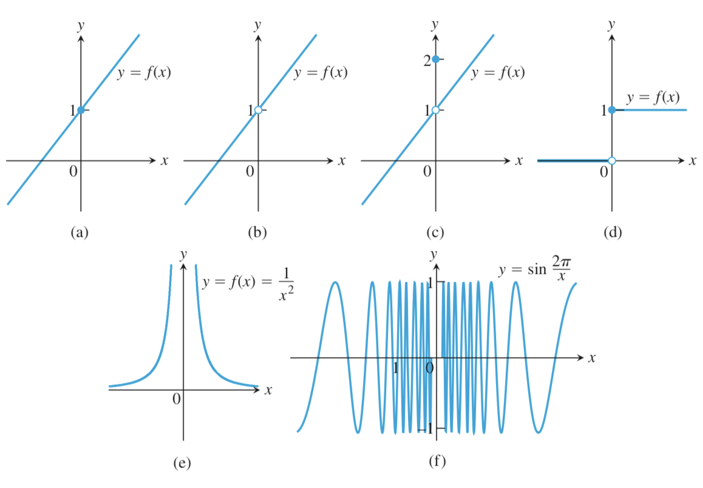
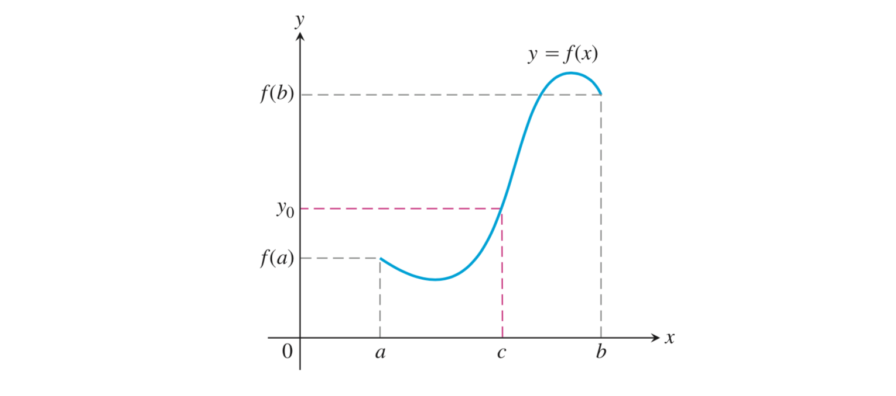

# WHY

极限刻画了函数的局部特征，有了极限就可以刻画函数的连续性

连续就是不间断，通俗地说，能够一笔画出来的函数就是连续的

连续函数有很多优良的性质，例如连续函数f在$x_0$的极限等于f($x_0$)

# HOW

## 函数在某点连续的判定

### 连续判定

f(x)在c处连续当且仅当以下条件成立：

- f(c)存在（函数在c处有定义）
- $\lim\limits_{x\rightarrow c}f(x)$ 存在（函数在c处有极限）
- $\lim\limits_{x\rightarrow c}f(x) = f(c)$ （极限等于函数值）

### 单侧连续判定

将连续判定中的极限改为单侧极限即可用来判定单侧连续

# WHAT

当自变量连续变化时，因变量也连续地变化

## 在某点连续

内点上：当$\lim\limits_{x\rightarrow c}f(x) = f(c)$时，函数y = f(x)在定义域的内点c上连续

边界点上：当$\lim\limits_{x\rightarrow a^+}f(x)=f(a)$ 或 $\lim\limits_{x\rightarrow b^-}f(x)=f(b)$ 时，函数y = f(x)在其定义域的左端点a或右端点b处连续

## 间断点

回忆一下极限不存在的情况

- 跳跃：左右极限存在但不相等
- 无穷：左右极限不存在
- 震荡：左右极限不存在

每中情况对应一类间断点，再加上由无定义或极限不等于函数值导致的间断，可以总结出四类间断点

- 可去间断点：无定义或极限不等于函数值导致的间断

- 跳跃间断点：极限不存在（两侧极限不相等）导致的间断

- 无穷间断点：极限不存在（无穷极限）导致的间断

- 震荡间断点：极限不存在导致的间断

## 连续函数

### 区间内连续

若函数在某个区间内处处连续，则说函数在某个区间内连续

### 连续函数

若函数在定义域内处处连续，则说函数是连续函数。

正比例函数、反比例函数（虽然它的定义域是中断的，但是它仍满足在定义域内处处连续）、正弦函数、余弦函数、正切函数、多项式函数、有理函数都是连续函数，绝对值函数不是连续函数

## 连续函数的性质

设函数f和函数g都在点c处连续，那么下列函数也在点c处连续：

- 两函数的和差积

  - f + g 
  - f - g
  - $f \cdot g$

- 两函数的商：

  f / g（已知 $g(c) \ne  0$ ）

- 函数的数量积：

   $k \cdot f$（对任意常数k）

- 函数的幂（设r, s是没有公因子的正整数，若s是偶数，则设L为正实数）：

  $f^{r/s}$

## 连续函数的复合

若f在c处连续，g在f(c)处连续，则$g\cdot f$ 在c处是连续的

## 连续函数的介值定理

### 介值定理

当函数在一个区间上连续时，它就有了一些非常好的性质。介值定理描述的就是其中一个

- 通俗地：若函数能够取得到两个值，那么这两个值之间的值都可以被这个函数取得到。

- 严谨地：函数y=f(x)在闭区间[a, b]上连续，则函数可以取到f(a)到f(b)中的任意值。或者说若y是介于f(a)和f(b)之间的任意值，则存在某个c，使得c在[a, b]中

### 零点定理

根据介值定理，可以推出零点定理。零点定理也是介值定理的一种特殊情况：

函数y=f(x)在闭区间[a, b]上连续。当f(a)与f(b)异号时，f(x)在开区间(a, b)上必有零点

### 不动点定理

若函数f(x)是[0, 1]上的连续函数，且对于定义域上的任意x都满足$f(x) \in [0, 1]$ 。那么至少存在一个$c \in [0, 1]$ 使得f(c) = c（c被称为f(x)的不动点）。

（不难证明，在这种情况下，f(x)与y = x必有交点）

