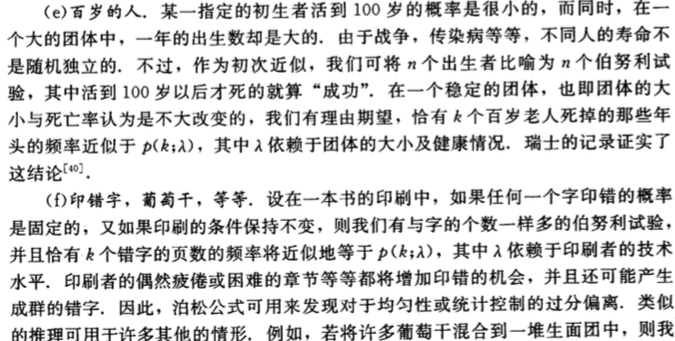

# 6 二项分布与泊松分布

## 6.1 伯努利试验序列

## 6.2 二项分布

**例6.2.1** 有n=10个工人间歇性的使用电力，假设任何一个给定时刻每个工人需要1个单位电力的概率都为$\frac{1}{5}$。如果工人们独立地进行工作，且至少有7个工人同时需要电能；那么在最多只能供应6个单位的电力的情况下，问用电超过负荷的概率是多少。

解：显然同一时刻需要电能的工人数是服从二项分布的。因此至少有7个工人同时需要电能的概率为：

$b(7; 10, 0.2) + \dots + b(10; 10, 0.2) \approx 0.00086$

也就是说用电超过负荷的概率是0.086%

## 6.3 中心项及尾项

## 6.4 大数定律

## 6.5 泊松逼近

## 6.6 泊松分布

## 6.7 符合泊松分布的观察结果

## 6.8 等待时间 负二项分布

## 6.9 多项分布

# 7 二项分布的正态逼近

## 7.1 正态分布

## 7.2 预备知识：对称分布

## 7.3 棣莫弗-拉普拉斯极限定理

## 7.4 例子

## 7.5 与泊松逼近的关系

