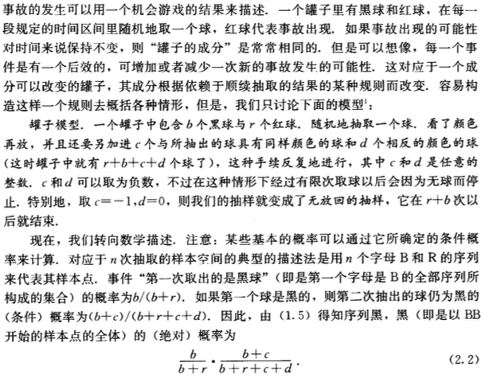
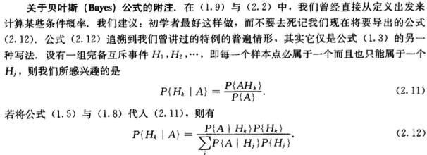

# 1 样本空间

## 1.1 经验背景

## 1.2 例子

## 1.3 样本空间 事件

## 1.4 事件之间的关系

## 1.5 离散样本空间

## 1.6 离散样本空间中的概率预备知识

## 1.7 基本定义和规则

# 2 组合分析概要

## 2.1 预备知识

**例2.1.1** 在桥牌中把4种花色和13中面值当作两组元素来看。每张牌都由它的花色和面值决定。问桥牌中共有多少牌。

解：共有$4 \times 13 = 52$ 种牌。

**例2.1.2** 考虑有r面不同颜色的旗帜挂在排成一行的n根旗杆上，，假定不限制一根旗杆所能挂的旗帜的面数，并且旗帜在同一个旗杆上的顺序不可被忽略，问共有多少种挂法。

解：这个过程相当于做了r次决定。显然

1. 第一次决定有n种选择
2. 第二次决定有n + 1种选择，因为第一次决定将第一根旗杆划分成了2部分
3. 第三次决定有n + 2种选择，因为前两次决定将前两根旗杆划分成了4部分
4. ……

因此共有$n(n+1)(n+2)\dots(n+r-1)$ 种不同的挂法。

## 2.2 有序样本

**例2.2.1** 在下列情形中总体中任何一个固定元素包含在大小为r的随机样本中的概率是多少。

1. 无放回抽样
2. 有放回抽样

解：

1. 样本空间的大小为$(n)_r$ ，选定固定元素后，只要在剩下的n - 1个元素中抽取r - 1个即可。因此概率为$\frac{(n - r)_{r - 1}}{(n)_r} = \frac{r}{n}$ （也可以用间接的解法：$1 - \frac{(n - r)_r}{(n)_r} = \frac{r}{n}$）
2. 样本空间的大小为$n^r$ ，选定固定元素后，r个样本可以包含1个，或2个，……，或r个该元素，这样不太好计数，故选用间接的解法。每次都抽不到该元素的组合数为$(n - 1)^r$ 。因此概率为$1 - \frac{(n - 1)^r}{n^r}$

## 2.3 例子

**例2.3.1** 在开始时载有7位乘客的电梯，在n = 10层的楼房上的每一层都停留，假设乘客离开电梯的各种安排有同等的概率，问没有2位乘客在同一层楼离开的概率是多少。

解：题给情形相当于有放回的抽样，样本空间的大小为$10^7$ ，没有2位乘客在同一层楼离开的组合数为$(10)_7$ ，所以其概率为$\frac{10^7}{(10)_7} = 0.06048$ （也可以直接套用公式(3.1)）。

**例2.3.2** 假设一年有365天，并且每个人的生日是随机的，问任意r个人（随机抽取r个样本）的生日都不相同的概率是多少。

解：根据公式(3.1)有：

$p = \frac{(365)_r}{365^r}$

（对23个人来说，至少有2人在同一天生日的概率超过1/2）

另外，在一些特殊情况下，有一些近似公式可以用：

当r比较小时，所有交叉乘积因子都可以忽略

$p \approx 1 - \frac{1 + 2 + \cdots (r - 1)}{365} = 1-\frac{r(r - 1)}{730}$

当r比较大时，根据$\log(1-x) \approx -x$ （当x为正且很小时），有

$\log p \approx \frac{1 + 2 + \cdots + (r - 1)}{365} = -\frac{r(r - 1)}{730}$

## 2.4 子总体和分划

## 2.6 超几何分布

## 2.7 等待时间的例子

## 2.8 二项式系数

## 2.9 斯特林公式

# 5 条件概率 随机独立性

## 5.1 条件概率

## 5.2 用条件概率所定义的概率 罐子模型

**例5.2.1** 考虑下列罐子模型

1. 波利亚罐子模型，传染病：当$d=0,c>0$时，求先取出$n_1$ 个黑球再取出$n_2$ 个红球($n_1 + n_2 = n$)的概率
2. 层迭的罐子模型，假传染：有两个罐子，它们存放的球的比例为1:5。第一个罐子有$r_1$个红球与$b_1$个黑球，第二个罐子含有$r_2$个红球与$b_2$个黑球。求随机有放回地抽取出序列红，红(RR)的概率
3. 拉普拉斯延续率：有N+1个罐子，每个罐子都有N个球，在第k号罐子中有k个红球和N-K个白球($k = 0, 1, 2, \cdots, N$)。从罐子中任选一罐，并从这个罐子中作有放回的n次抽取。假设取出的n个球都是红球（事件A）求在下次抽取中仍然抽取出红球（时间B）的（条件）概率

（除此之外，著名的罐子模型还包括：用$c=-1,d=1$描述两个隔离壁之间的热交换的埃伦费斯特模型；用$c=0,d>0$描述每当发生了事故安全运行就抓紧些，而每当没有的事故放生时，安全运行就放松些的安全运行模型）

解：

1. 从式子(2.2)可知，序列BB的概率为

   $P(BB) = P(B)P(B\mid B) = \frac{b}{b+r}\frac{b+c}{b+r+c}$

   序列B...B（$n_1$个B）的概率为

   $P(B\dots B) = \frac{b}{b+r}\frac{b+c}{b+r+c}\dots \frac{b+n_1c-c}{b+r+n_1c-c}$

   序列B...BR的概率为

   $P(B\dots BR)=P(B\dots B)P(R|B\dots B) = \frac{b}{b+r}\frac{b+c}{b+r+c}\dots \frac{b+n_1c-c}{b+r+n_1c-c}\cdot\frac{r}{b+r+n_1c-c}$

   序列B...BRR的概率为

   $P(B\dots BR)=P(B\dots B)P(R|B\dots B) = \frac{b}{b+r}\frac{b+c}{b+r+c}\dots \frac{b+n_1c-c}{b+r+n_1c-c}\cdot\frac{r}{b+r+n_1c-c}\frac{r+c}{b+r+(n_1+1)c-c}$

   序列B...BR...R（$n_1$ 个B，$n_2$ 个R）的概率为

   $P(B\dots BR\dots R) = \frac{b}{b+r}\frac{b+c}{b+r+c}\dots \frac{b+n_1c-c}{b+r+n_1c-c}\cdot\frac{r}{b+r+n_1c-c}\frac{r+c}{b+r+(n_1+1)c-c}\dots\frac{r+n_2c-c}{b+r+nc-c}$

   （分子分母同乘$\binom{n}{n_1}$ ，利用广义二项式系式可将式子简化成：$p_{n_1, n} = \frac{\binom{n_1-1+b/c}{n_1}\binom{n_2-1+r/c}{n_2}}{\binom{n-1+(b+r)/c}{n}}= \frac{\binom{-b/c}{n_1}\binom{-r/c}{n_2}}{\binom{-(b+r)/c}{n}}$）

2. 在第一个罐子中抽中红球的概率加上在第二个罐子中抽中红球的概率可得 $P(R) = \frac{1}{6}\frac{r_1}{b_1+r_1}+\frac{5}{6}\frac{r_2}{b_2+r_2}$

   同理$P(RR) = \frac{1}{6}(\frac{r_1}{b_1+r_1})^2+\frac{5}{6}(\frac{r_2}{b_2+r_2})^2$

3. 假设选中的是第k号罐子，那么在以后n次取球中都出现红球的概率是$(\frac{k}{N})^n$ 因此

   $P(A) = \frac{1}{N+1}\frac{1^n+2^n+\cdots+N^n}{N^n}$

   简单地增加n，可得

   $P(AB) = P(B) = \frac{1}{N+1}\frac{1^{(n+1)}+2^{(n+1)}+\cdots+N^{(n+1)}}{N^{(n+1)}}$

   所求概率为$P(B\mid A) = P(B) = \frac{P(B)}{P(A)}$

   当N相当大时，可以考虑用黎曼和来近似：

   $P(A) = \frac{1}{N+1}\frac{1^n+2^n+\cdots+N^n}{N^n} \approx \frac{1}{N^n(N+1)}\int_0^Nx^ndx = \frac{1}{N^n(N+1)}\frac{N^{n+1}}{n+1} = \frac{N}{(N+1)(n+1)} \approx \frac{1}{n+1}$

   $P(B) \approx \frac{1}{n+2}$

   $P(B\mid A) = \frac{n+1}{n+2}$

## 5.3 随机独立性

## 5.4 乘积空间 独立试验

