# 1 样本空间

## 1.1 经验背景

## 1.2 例子

## 1.3 样本空间 事件

## 1.4 事件之间的关系

## 1.5 离散样本空间

## 1.6 离散样本空间中的概率预备知识

## 1.7 基本定义和规则

# 2 组合分析概要

## 2.1 预备知识

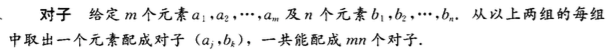

**例2.1.1** 在桥牌中把4种花色和13中面值当作两组元素来看。每张牌都由它的花色和面值决定。问桥牌中共有多少牌。

解：共有$4 \times 13 = 52$ 种牌。

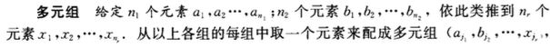

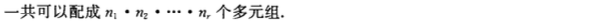

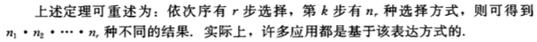

**例2.1.2** 考虑有r面不同颜色的旗帜挂在排成一行的n根旗杆上，，假定不限制一根旗杆所能挂的旗帜的面数，并且旗帜在同一个旗杆上的顺序不可被忽略，问共有多少种挂法。

解：这个过程相当于做了r次决定。显然

1. 第一次决定有n种选择
2. 第二次决定有n + 1种选择，因为第一次决定将第一根旗杆划分成了2部分
3. 第三次决定有n + 2种选择，因为前两次决定将前两根旗杆划分成了4部分
4. ……

因此共有$n(n+1)(n+2)\dots(n+r-1)$ 种不同的挂法。

## 2.2 有序样本

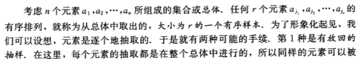

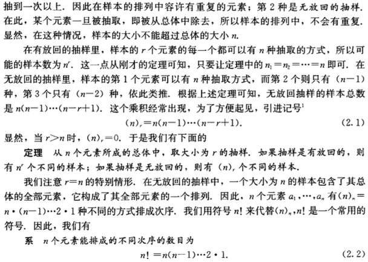

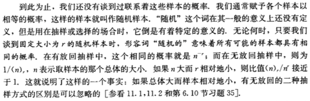

**例2.2.1** 在下列情形中总体中任何一个固定元素包含在大小为r的随机样本中的概率是多少。

1. 无放回抽样
2. 有放回抽样

解：

1. 样本空间的大小为$(n)_r$ ，选定固定元素后，只要在剩下的n - 1个元素中抽取r - 1个即可。因此概率为$\frac{(n - r)_{r - 1}}{(n)_r} = \frac{r}{n}$ （也可以用间接的解法：$1 - \frac{(n - r)_r}{(n)_r} = \frac{r}{n}$）
2. 样本空间的大小为$n^r$ ，选定固定元素后，r个样本可以包含1个，或2个，……，或r个该元素，这样不太好计数，故选用间接的解法。每次都抽不到该元素的组合数为$(n - 1)^r$ 。因此概率为$1 - \frac{(n - 1)^r}{n^r}$

## 2.3 例子

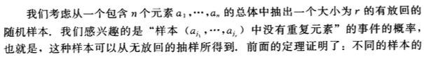

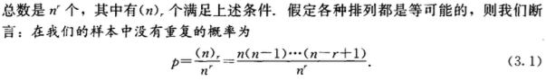

**例2.3.1** 在开始时载有7位乘客的电梯，在n = 10层的楼房上的每一层都停留，假设乘客离开电梯的各种安排有同等的概率，问没有2位乘客在同一层楼离开的概率是多少。

解：题给情形相当于有放回的抽样，样本空间的大小为$10^7$ ，没有2位乘客在同一层楼离开的组合数为$(10)_7$ ，所以其概率为$\frac{10^7}{(10)_7} = 0.06048$ （也可以直接套用公式(3.1)）。

**例2.3.2** 假设一年有365天，并且每个人的生日是随机的，问任意r个人（随机抽取r个样本）的生日都不相同的概率是多少。

解：根据公式(3.1)有：

$p = \frac{(365)_r}{365^r}$

（对23个人来说，至少有2人在同一天生日的概率超过1/2）

另外，在一些特殊情况下，有一些近似公式可以用：

当r比较小时，所有交叉乘积因子都可以忽略

$p \approx 1 - \frac{1 + 2 + \cdots (r - 1)}{365} = 1-\frac{r(r - 1)}{730}$

当r比较大时，根据$\log(1-x) \approx -x$ （当x为正且很小时），有

$\log p \approx \frac{1 + 2 + \cdots + (r - 1)}{365} = -\frac{r(r - 1)}{730}$

## 2.4 子总体和分划

## 2.6 超几何分布

## 2.7 等待时间的例子

## 2.8 二项式系数

## 2.9 斯特林公式

# 5 条件概率 随机独立性

## 5.1 条件概率

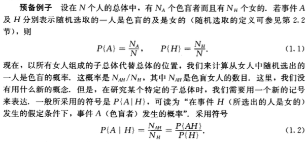

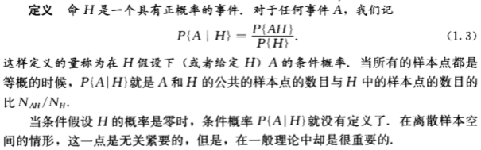

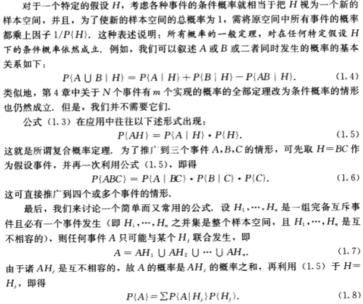

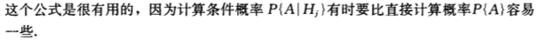

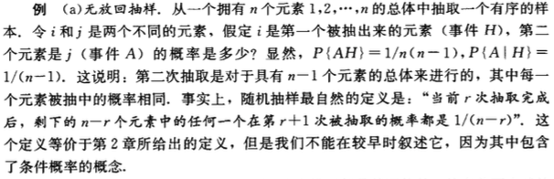

## 5.2 用条件概率所定义的概率 罐子模型

## 5.3 随机独立性

## 5.4 乘积空间 独立试验

