[toc]

## 4 向量空间

### 4.1 向量空间与子空间

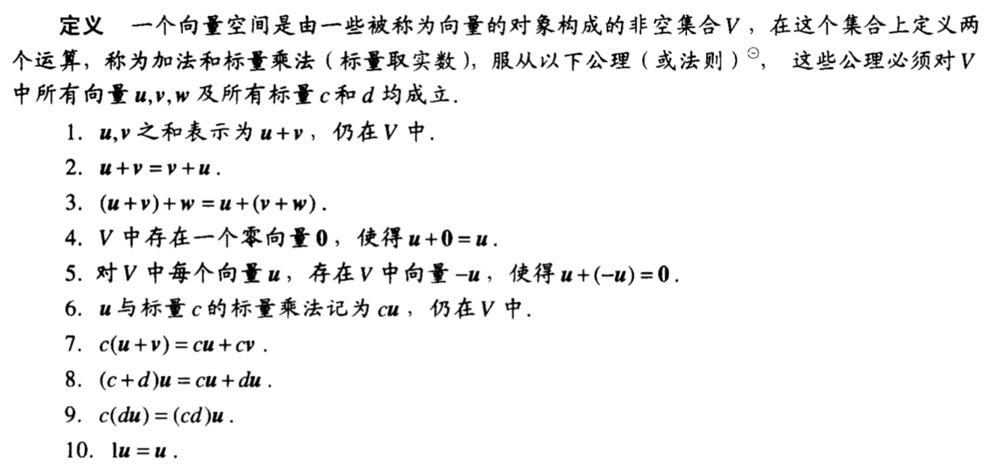

**例4.1.5**：设V是定义在集合D上的全实函数的集合（D的例子有实数集，实轴上的区间），加法的结果f+g仍为函数，在D中t点的值为f(t)+g(t)，同样，标量乘法的结果cf仍为函数，在t的值为cf(t)。例如，若$D=R,f(t)=1+\sin t,g(t)=2+0.5t$ ，则$(f+g)(t)=3+\sin 2t+0.5t, (2g)(t)=4+t$。证明V为一个向量空间。

证明：

1. f+g仍在V中（显然）
2. f+g=g+f（实数性质）
3. (f+g)+h=f+(g+h)（实数性质）
4. 零向量为f(t)=0
5. f的负向量为(-1)f
6. cf在V中（显然）
7. c(f+g)=cf+cg（实数性质）
8. (c+d)f=cf+df（实数性质）
9. c(df)=(cd)f（实数性质）
10. 1f=f（实数性质）

#### 子空间

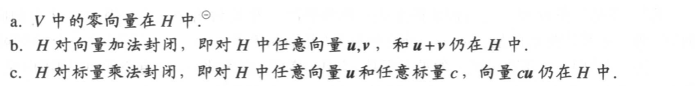

#### 由集合生成的子空间

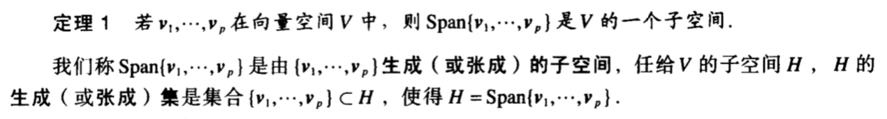

**例4.1.11**：令H是所有形如(a-3b, b-a, a, b)的向量的集合，这里a, b是任意数，即$H=\{(a-3b,b-a,a,b):a,b\in R\}$，证明H是$R^4$ 的一个子空间。

证明：$\left(\begin{matrix}a-3b\\b-a\\a\\b\end{matrix}\right)=a\left(\begin{matrix}1\\-1\\1\\0\end{matrix}\right)+b\left(\begin{matrix}-3\\1\\0\\1\end{matrix}\right) = av_1+bv_2$ ，因此$H=Span\{v_1, v_2\}$ ，根据定理1，H是$R^4$ 的子空间。

### 4.2 零空间、列空间和线性变换

#### 矩阵的零空间

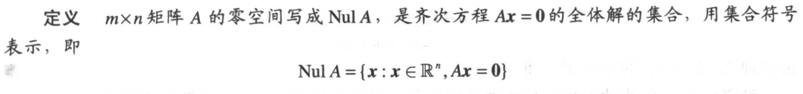

例4.2.1： $A = \left(\begin{matrix}1 & 2 & 3\\4 & 5 & 6\\7 & 8 & 9  \end{matrix}\right), u=\left(\begin{matrix}5\\3\\-2\end{matrix}\right)$ ，确认u是否属于A的零空间。

 解：Au = 0，故u属于A的零空间

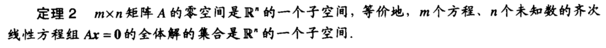

**例4.2.2**：令H是$R^4$ 中满足坐标a, b, c, d满足方程a-2b+5c=d且c-a=b的所有向量的集合，证明H是$R^4$ 的一个子空间。

解：上述方程等价于 $\left(\begin{matrix}1&-2&5&-1\\-1&-1&1&0\end{matrix}\right) \left(\begin{matrix}a\\b\\c\\d\end{matrix}\right) = 0$ ，因此H是$R^4$ 的一个子空间

**例4.2.3**：求矩阵$A = \left(\begin{matrix}-3&6&-1&1&-7\\1&-2&2&3&-1\\2&-4&5&8&-4\end{matrix}\right)$ 的零空间的生成集。

对增广矩阵施以行变换，得到简化阶梯形

$\left(\begin{matrix}1&-2&0&-1&3&0\\0&0&1&2&-2&0\\0&0&0&0&0&0\end{matrix}\right)$

自由变量为$x_2, x_3, x_4$ ，解集为

$x = \left(\begin{matrix}2\\1\\0\\0\\0\end{matrix}\right)x_2+\left(\begin{matrix}1\\0\\-2\\1\\0\end{matrix}\right)x_3+\left(\begin{matrix}-3\\0\\2\\0\\1\end{matrix}\right)x_4=ux_2+vx_3+wx_4$

因为u, v, w的任意线性组合都在Nul A中，所以Nul A的一个生成集为

{u, v, w}

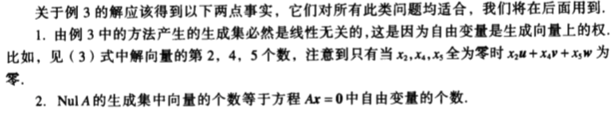

#### 矩阵的列空间

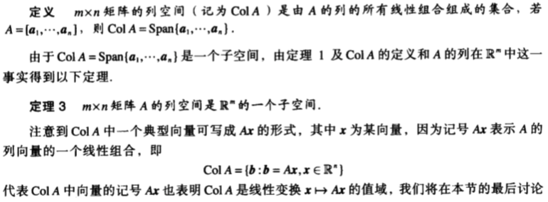

**例4.2.4**：求一个矩阵A使得W=Col A，其中

$W = \left\{\left(\begin{matrix}6a-b\\a+b\\-7a\end{matrix}\right):a,b\in R\right\}$

解：

$W = \left\{\left(\begin{matrix}6\\1\\-7\end{matrix}\right)a+\left(\begin{matrix}-1\\1\\0\end{matrix}\right)b:a,b\in R\right\} = Span\left\{\left(\begin{matrix}6\\1\\-7\end{matrix}\right), \left(\begin{matrix}-1\\1\\0\end{matrix}\right)\right\}$

可以看出，W为两个向量的线性组合，即

$W = Span\left\{\left(\begin{matrix}6\\1\\-7\end{matrix}\right), \left(\begin{matrix}-1\\1\\0\end{matrix}\right)\right\}$

用生成集中的向量作为A的列就有

$A = \left(\begin{matrix}6&-1\\1&1\\-7&0\end{matrix}\right)$

#### 线性变换的核与值域

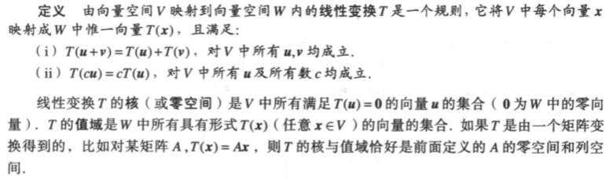

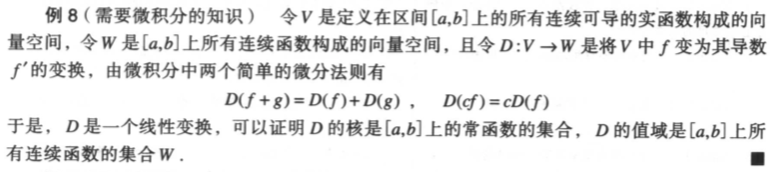

### 4.3 线性无关集和基

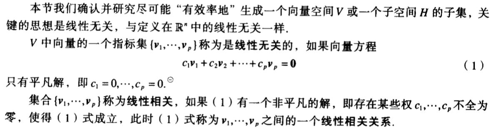

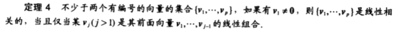

**例4.3.1**：$p_1(t)=1,p_2(t)=t,p_3(t)=4-t$ ，证明$\{p_1,p_2,p_3\}$ 线性相关。

证明：因为$p_3=4p_1-p_2$ ，故命题得证

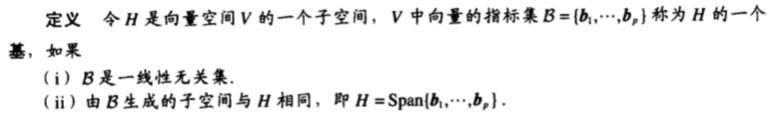

**例4.3.2**：令$v_1 = \left(\begin{matrix}3\\0\\-6\end{matrix}\right), v_2 = \left(\begin{matrix}-4\\1\\7\end{matrix}\right), v_3 = \left(\begin{matrix}-2\\1\\5\end{matrix}\right)$，判断$\{v_1, v_2, v_3\}$ 是$R^3$ 的一个基。

解：根据可逆矩阵定理，若 $A = (v_1\ v_2\ v_3)$ 可逆则能构成基。因为$Det A = 6 \ne 0$，所以 $\{v_1, v_2, v_3\}$ 是$R^3$ 的一个基

#### 生成集定理

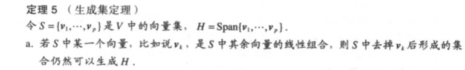

#### NulA和ColA的基

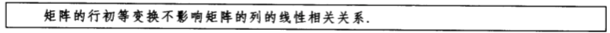

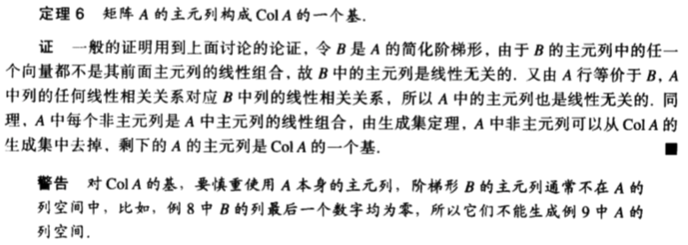

**例4.3.9**：已知$A = \left(\begin{matrix}a_1&a_2&a_3&a_4&a_5\end{matrix}\right) = \left(\begin{matrix}1&4&0&2&-1\\3&12&1&5&5\\2&8&1&3&2\\5&20&2&8&8\end{matrix}\right)$ ，求ColA的一个基

对A施以初等行变换，得到化简阶梯阵

$B= \left(\begin{matrix}b_1&b_2&b_3&b_4&b_5\end{matrix}\right) = \left(\begin{matrix}1&4&0&2&0\\0&0&1&-1&0\\0&0&0&0&1\\0&0&0&0&0\end{matrix}\right)$

故B的每个非主元列是主元列的线性组合，其中 $b_2=4b_1, b_4=2b_1-b_3$。

对应地，A的每个非主元列是主元列的线性组合，其中 $a_2=4a_1, a_4=2a_1-a_3$。

所以ColA的一个基为$\{a_1, a_3, a_5\}$

### 4.4 坐标系

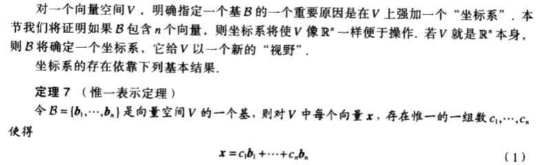

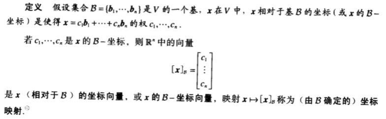

**例4.4.1**：考虑$R^2$ 上的基$B = \{b_1, b_2\} = \{\left(\begin{matrix}1 \\ 0\end{matrix}\right), \left(\begin{matrix}1 \\ 2\end{matrix}\right)\}$ ，假设$R^2$ 中一向量x具有坐标向量$[x]_B = \left(\begin{matrix}-2\\3\end{matrix}\right)$ ，求x。

解：将基按照坐标向量做线性组合即可得到原向量：

$x = -2 \cdot \left(\begin{matrix}1 \\ 0\end{matrix}\right)+ 3 \cdot \left(\begin{matrix}1 \\ 2\end{matrix}\right) = \left(\begin{matrix}1 \\ 6\end{matrix}\right)$ 

#### 坐标的几何意义

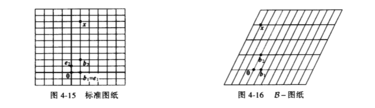

#### $R^n$中的坐标

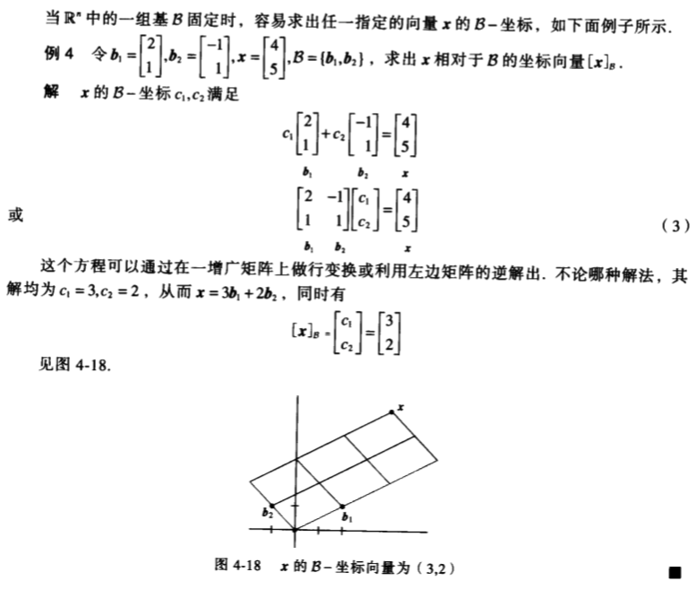

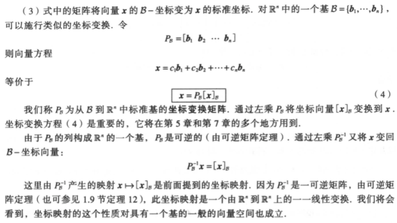

#### 坐标映射

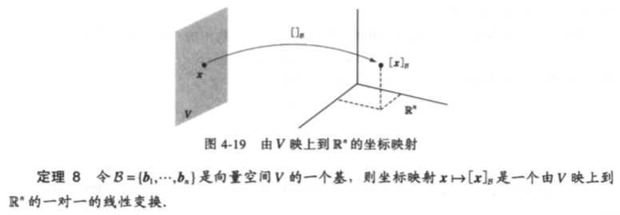

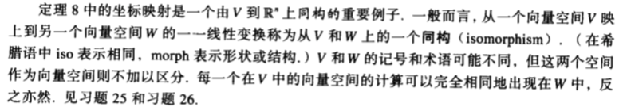

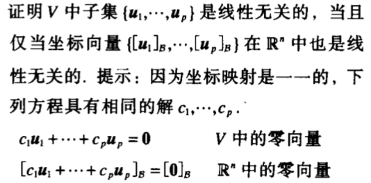

**例4.4.7**：令$v_1 = \left(\begin{matrix}3\\6\\2\end{matrix}\right), v_2 = \left(\begin{matrix}-1\\0\\1\end{matrix}\right), x = \left(\begin{matrix}3\\12\\7\end{matrix}\right), B = \{v_1, v_2\}$ ，则B是$H = Span\{v_1, v_2\}$ 的一个基，判定x是否在H中。若在，求x相对于B的坐标向量。

解：若x在H中，则下列方程是相容的，并且其解就是x的B-坐标：

$\left(\begin{matrix}3&-1\\6&0\\2&1\end{matrix}\right) \left(\begin{matrix}c_1\\c_2\end{matrix}\right) = \left(\begin{matrix}3\\12\\7\end{matrix}\right)$

写出增广矩阵，并施以行变换

$\left(\begin{matrix}3&-1&3\\6&0&12\\2&1&7\end{matrix}\right) \sim \left(\begin{matrix}1&0&2\\0&1&3\\0&0&0\end{matrix}\right)$

可以看出方程确实是相容的，并且

$[x]_B = \left(\begin{matrix}2\\3\end{matrix}\right)$

H是$R^3$中与$R^2$同构的平面，由B确定的H上的坐标系如下图所示：

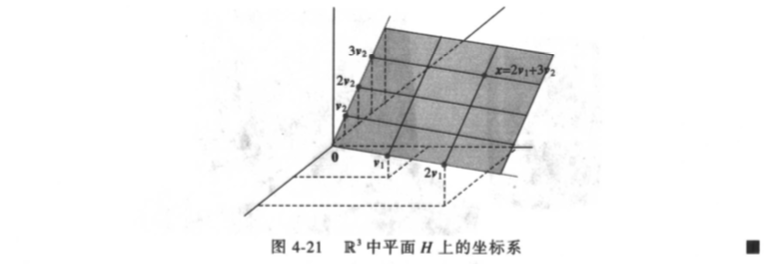

### 4.5 向量空间的维数

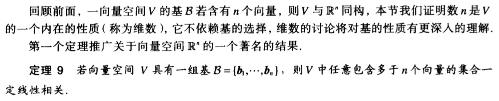

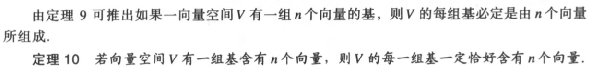

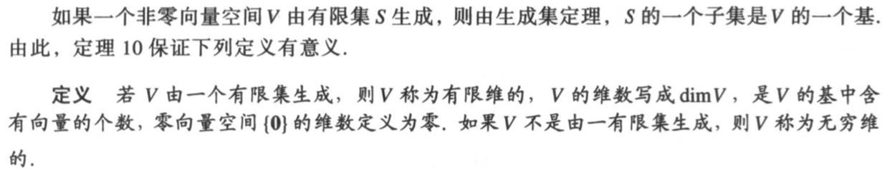

**例4.5.3**：求下列子空间的维数：

$H = \left\{\left(\begin{matrix}a-3b+6c\\5a+4d\\b-2c-d\\5d\end{matrix}\right):a,b, c, d\in R\right\}$

解：显然$H = Span\{v_1, v_2, v_3, v_4\}$，其中

$v_1 = \left(\begin{matrix}1\\5\\0\\0\end{matrix}\right), v_2 = \left(\begin{matrix}-3\\0\\1\\0\end{matrix}\right), v_3 = \left(\begin{matrix}6\\0\\-2\\0\end{matrix}\right), v_4 = \left(\begin{matrix}0\\4\\-1\\5\end{matrix}\right)$

由于$v_2$不是$v_1$ 的倍数，$v_3$ 是$v_2$ 的倍数，$v_4$ 不是$v_1, v_2$ 的线性组合。根据定理5（生成集定理），$H = Span\{v_1, v_2, v_3, v_4\} = Span\{v_1, v_2,  v_4\}$，根据基的定义，$\{v_1, v_2,  v_4\}$ 线性无关，因此它们是H的基，进而dim H = 3。

#### 有限维空间的子空间

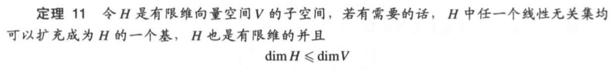

（扩充的意思是向集合中添加向量）

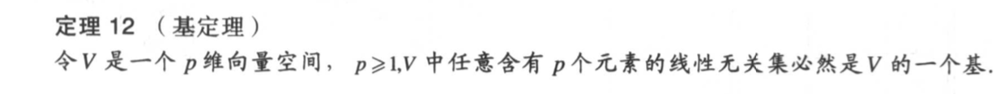

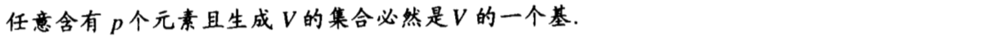

#### Nul A和 Col A的维数

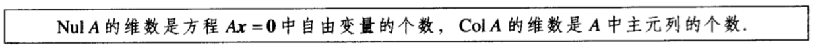

**例4.5.3**：求A的零空间和列空间的维数

$A = \left(\begin{matrix}-3&6&-1&1&-7\\1&-2&2&3&-1\\2&-4&5&8&-4\end{matrix}\right)$ 

解：将增广矩阵行化简成阶梯形得：

$\left(\begin{matrix}1&-2&2&3&-1&0\\0&0&1&2&-2&0\\0&0&0&0&0&0\end{matrix}\right)$

可以看出其中有3个自由变量和2个主元列，因此dim Nul A = 3, dim Col A = 2

### 4.6 秩

#### 行空间

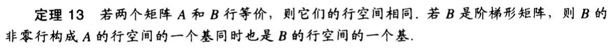

**例4.5.3**：求A的零空间和列空间的基

$A = \left(\begin{matrix}-2&-5&8&0&-17\\1&3&-5&1&5\\3&11&-19&7&1\\1&7&-13&5&-3\end{matrix}\right)$ 

解：将A行化简成阶梯型

$A \sim B = \left(\begin{matrix}1&3&-5&1&5\\0&1&-2&2&-7\\0&0&0&-4&20\\0&0&0&0&0\end{matrix}\right)$ 

通过B的非零行得到Row A的基

$\{\left(\begin{matrix}1&3&-5&1&5\end{matrix}\right), \left(\begin{matrix}0&1&-2&2&-7\end{matrix}\right), \left(\begin{matrix}0&0&0&-4&20\end{matrix}\right)\}$

 通过观察B，可知主元列为1，2，4列，从而A的第1，2，4列构成Col A的一个基

$\{\left(\begin{matrix}-2\\1\\3\\1\end{matrix}\right), \left(\begin{matrix}-5\\3\\11\\7\end{matrix}\right), \left(\begin{matrix}0\\1\\7\\5\end{matrix}\right)\}$

将B进一步行化简成简化阶梯形

$B \sim C = \left(\begin{matrix}1&0&1&0&1\\0&1&-2&0&3\\0&0&0&1&-5\\0&0&0&0&0\end{matrix}\right)$ 

解方程Cx = 0得

$x = x_2\left(\begin{matrix}-1\\2\\1\\0\\0\end{matrix}\right)+x_5 \left(\begin{matrix}-1\\-3\\0\\5\\1\end{matrix}\right)$

因此得到Nul A的基

$\{\left(\begin{matrix}-1\\2\\1\\0\\0\end{matrix}\right),  \left(\begin{matrix}-1\\-3\\0\\5\\1\end{matrix}\right)\}$

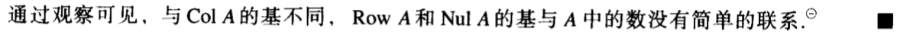

#### 秩定理

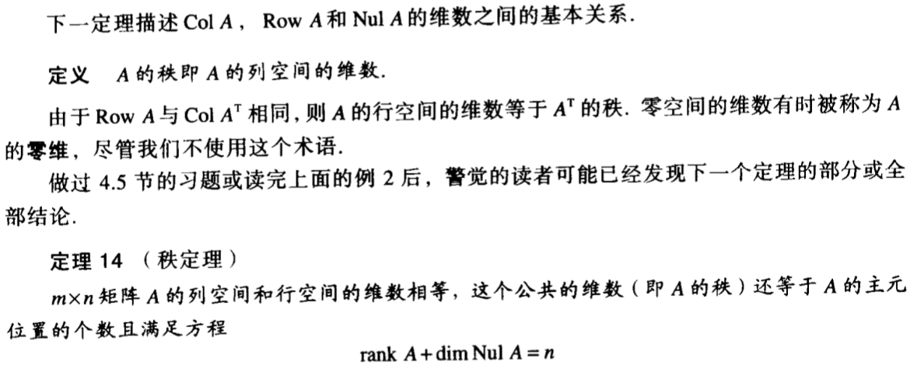

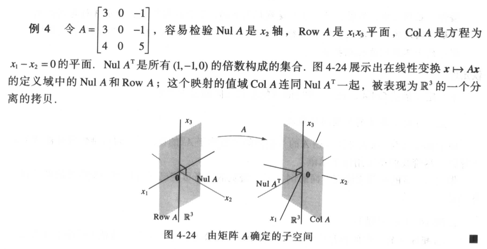

### 4.7 基的变换

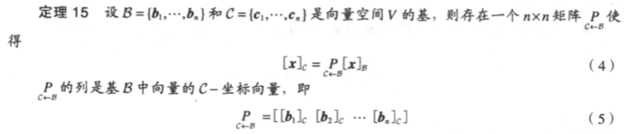

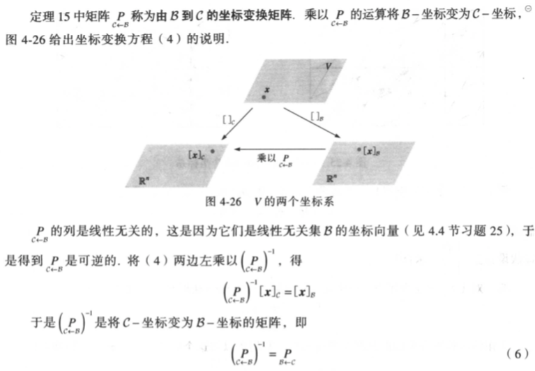

**例4.7.1**：对一个向量空间V，考虑两个基$B=\{b_1, b_2\}, C=\{c_1, c_2\}$ ，满足

$b_1 = 4c_1+c_2\\b_2=-6c_1+c_2$

假设$x=3b_1+b_2$ ，也就是说$[x]_B=\left(\begin{matrix}3\\1\end{matrix}\right)$，求$[x]_C$

解：$[x]_C = [3b_1+b_2]_C = 3[b_1]_C+[b_2]_C$

$b_1 = 4c_1+c_2$ 给出了$[b_1]_C = \left(\begin{matrix}4\\1\end{matrix}\right)$

$b_2=-6c_1+c_2$ 给出了$[b_2]_C = \left(\begin{matrix}-6\\1\end{matrix}\right)$

因此$[x]_C = \left(\begin{matrix}4&-6\\1&1\end{matrix}\right)\left(\begin{matrix}3\\1\end{matrix}\right) = \left(\begin{matrix}6\\4\end{matrix}\right)$

（其中 $\left(\begin{matrix}4&-6\\1&1\end{matrix}\right)$ 就是$P_{C\leftarrow B}$）

#### $R^n$ 中的基变换

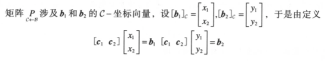

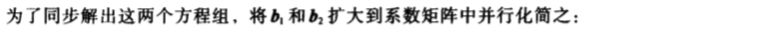

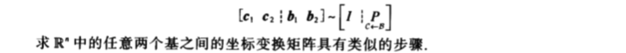

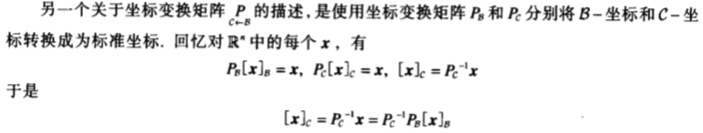

（对大矩阵而言，第一种方法会更快）

**例4.7.3**：设$b_1 = \left(\begin{matrix}1\\-3\end{matrix}\right), b_2 = \left(\begin{matrix}-2\\4\end{matrix}\right), c_1 = \left(\begin{matrix}-7\\9\end{matrix}\right), c_2 = \left(\begin{matrix}-5\\7\end{matrix}\right)$，考虑$R^2$ 中的基$B = \{b_1, b_2\}, C = \{c_1, c_2\}$ 

a. 求C到B的坐标变换矩阵

b. 求B到C的坐标变换矩阵

解：

a. 由$\left(\begin{matrix}b_1&b_2&c_1&c_2\end{matrix}\right) = \left(\begin{matrix}1&-2&7&5\\-3&4&9&7\end{matrix}\right) \sim \left(\begin{matrix}1&0&5&3\\0&1&6&4\end{matrix}\right)$ 得$P_{B\leftarrow C} = \left(\begin{matrix}5&3\\6&4\end{matrix}\right)$

b. 因为坐标变换矩阵一定是可逆的，所以$P_{C\leftarrow B} = P^{-1}_{B\leftarrow C} = \frac{1}{2}\left(\begin{matrix}4&-3\\-6&5\end{matrix}\right)= \left(\begin{matrix}2&-3/2\\-3&5/2\end{matrix}\right)$

### 4.8 差分方程中的应用

#### 离散时间信号

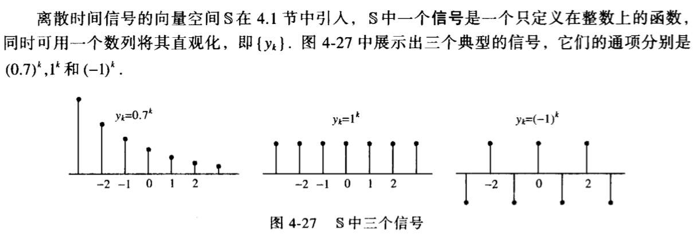

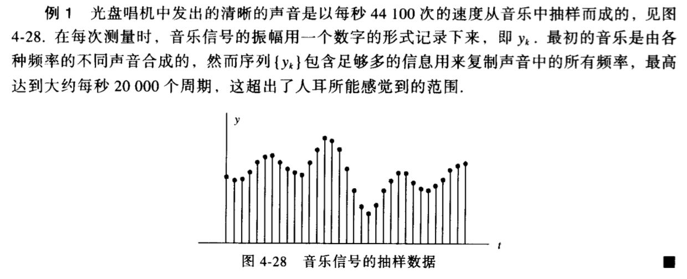

#### 信号空间S中的线性无关性

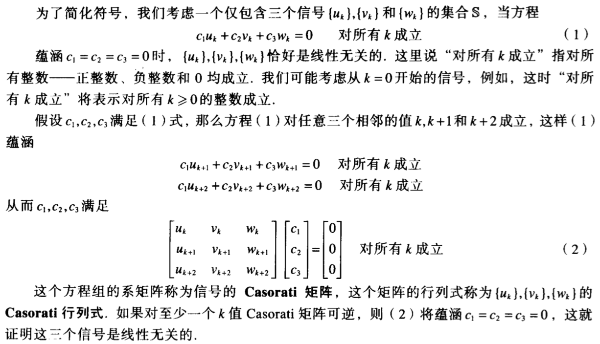

**例4.8.2**：证明$1^k, (-2)^k, 3^k$ 是线性无关的信号

解：列出它们的Casorati矩阵，并施以行变换

$\left(\begin{matrix}1^k&(-2)^k&3^k\\1^{k+1}&(-2)^{k+1}&3^{k+1}\\1^{k+2}&(-2)^{k+2}&3^{k+2}\end{matrix}\right) \sim \left(\begin{matrix}1^k&(-2)^k&3^k\\0&(-3)(-2)^{k+1}&2\cdot3^{k+1}\\0&0&10\cdot3^{k+2}\end{matrix}\right)$

显然矩阵是可逆的，因此题中三个信号是线性无关的信号

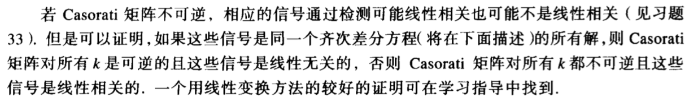

#### 线性差分方程

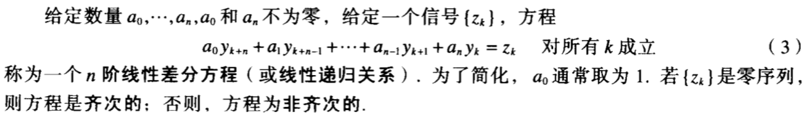

**例4.8.4**：齐次差分方程的解通常具有形式$y_k=r^k$ 对某r成立，求下列方程的解

$y_{k+3}-2y_{k+2}-5y_{k+1}+6y_k=0$ ，对所有的k成立

解：用$r^k$ 代替方程中的$y_k$ ，可得到

$r^{k+3}-2r^{k+2}-5r^{k_1}+6r^k=0$

提公因式并对式子因式分解，可得到

$r^k(r-1)(r+2)(r-3)=0$

于是$y_k = 1^k, (-2)^k, 3^k$ 都是方程的解

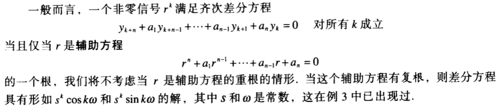

#### 线性差分方程的解集

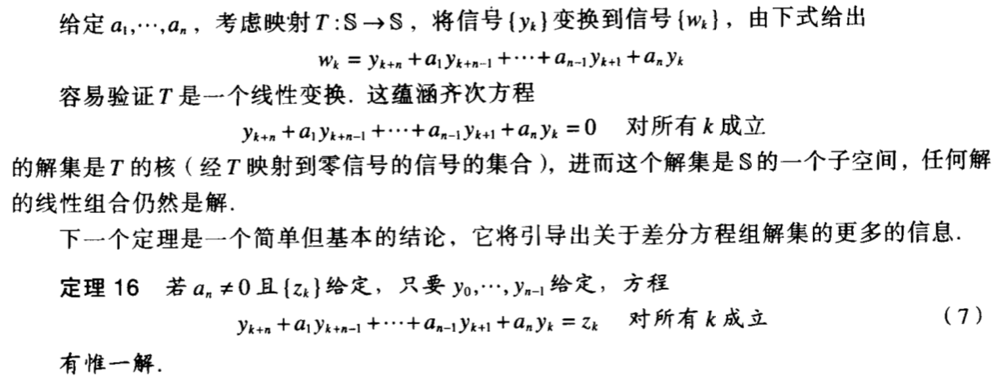

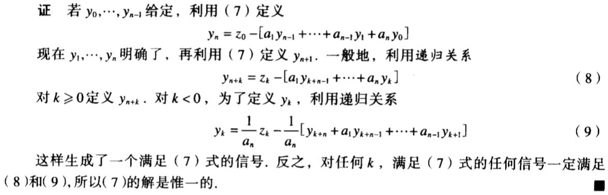

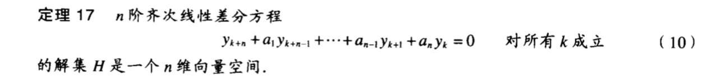

**例4.8.5**：齐次差分方程的解通常具有形式$y_k=r^k$ 对某r成立，求下列方程的解集的一个基

$y_{k+3}-2y_{k+2}-5y_{k+1}+6y_k=0$ ，对所有的k成立

解：根据例4.8.4，$y_k = 1^k, (-2)^k, 3^k$ 都是方程的解。根据例4.8.2，这三个信号是线性无关的。根据4.12节中的基定理，n维向量空间中，任意n个线性无关的向量就是这个空间基。因此方程的解集的基就是$1^k, (-2)^k, 3^k$ 

#### 非齐次方程

**例4.8.6**：设a和b是非零数，定义映射$T\{y_k\}=\{w_k\}$，其中$w_k=y_{k+2}+ay_{k+1}+by_k$ ，证明T是一个由S到S的线性变换。

证明：设$\{y_k\}, \{z_k\}$ 都在S中，r为任意常数。那么有：

$T(\{y_k\}+\{z_k\}) = T\{y_k +z_k\}$
 $=\{(y_{k+2} +z_{k+2})+a(y_{k+1} + z_{k+1})+b(y_k +z_k)\}$

$=\{(y_{k+2} +ay_{k+1} +by_k)+(z_{k+2} +az_{k+1} +bz_k)\}$

$=\{y_{k+2} +ay_{k+1} +by_k\}+\{z_{k+2} +az_{k+1} +bz_k\}$

$=T\{y_k\}+T\{z_k\}$

$T(r\{y_k\}) =T\{ry_k\}$

$=\{ry_{k+2} +a(ry_{k+1})+b(ry_k)\}$

$= r\{y_{k+2} +ay_{k+1} +by_k\}$ 
$ = rT\{y_k\}$

因此T是一个由S到S的线性变换。

**例4.8.7**：证明信号$y_k = k^2$ 满足差分方程

$y_{k+2}-4y_{k+1}+3y_k=-4k$，对所有k成立

然后给出这个方程所有解的一个刻画。

解：将$k^2$ 代入式子左端的$y_k$ ，得

$(k+2)^2+4(k+1)^2+3k^2 = -4k$

即得到了式子右端，故信号满足差分方程，同时也得到了一个特解。接着解齐次方程

$y_{k+2}-4y_{k+1}+3y_k=0$

辅助方程为

$r^2-4r+3=(r-1)(r-3)=0$

所以其次方程的两个解为$1^k$ 和$3^k$ ，显然它们彼此不是倍数关系，所以他们是线性无关信号（也可以用Casorati检验）。根据定理17，齐次方程的解空间是2维度的，故这两个解构成了解集的基，进而可以得到非齐次方程的通解：

$k^2+c_11^k+c_23^k$ 或$k^2+c_1+c_23^k$

#### 化简成一阶方程组

**例4.8.8**：将下列差分方程写成一个一阶方程组：

$y_{k+3}-2_{k+2}-5y_{k+1}+6y_k = 0$ ，对所有k成立

解：对每个k，设

$x_k = \left(\begin{matrix}y_k\\y_{k+1}\\y_{k+2}\end{matrix}\right)$

由差分方程得

$\left(\begin{matrix}y_{k+1}\\y_{k+2}\\y_{k+3}\end{matrix}\right) = \left(\begin{matrix}0&1&0\\0&0&1\\-6&5&2\end{matrix}\right)\left(\begin{matrix}y_k\\y_{k+1}\\y_{k+2}\end{matrix}\right)$

即$x_{k+1}=Ax_k$ 对所有的k成立，这里$A = \left(\begin{matrix}0&1&0\\0&0&1\\-6&5&2\end{matrix}\right)$

### 4.9 马尔可夫链中的应用

解：根据$M, x_0$ 可得：

$x_1 = Mx_0 = \left(\begin{matrix}0.582\\0.481\end{matrix}\right)$

$x_2 = Mx_1 = \left(\begin{matrix}0.565\\0.435\end{matrix}\right)$ 

#### 稳态向量

**例4.9.5**：令$P = \left(\begin{matrix}0.6&0.3\\0.4&0.7\end{matrix}\right)$ ，求P的稳态向量

解：解方程Px = x，即解方程(P - I)x = 0。将方程的增广矩阵施以行化简：

$\left(\begin{matrix}-0.4&0.3&0\\0.4&-0.3&0\end{matrix}\right) \sim \left(\begin{matrix}1&-3/4&0\\0&0&0\end{matrix}\right)$ 

于是$x=x_2\left(\begin{matrix}3/4\\1\end{matrix}\right)$ 为(P - I)x = 0的通解，其中$x_2$ 为自由变量。

取$x_2 = 4$，然后将所得特解归一化后得到稳态向量：

$q=\left(\begin{matrix}3/7\\4/7\end{matrix}\right)$ 

## 6 正交性和最小二乘法

### 6.1 内积，长度和正交性

#### 内积

#### 向量的长度

#### $R^n$ 空间中的距离

#### 正交向量

#### $R^2$ 空间和$R^3$ 空间的角度

### 6.2 正交集

**例6.2.2**：$u_1 = \left(\begin{matrix}3\\1\\1\end{matrix}\right), u_2 = \left(\begin{matrix}-1\\2\\1\end{matrix}\right), u_3 = \left(\begin{matrix}-1/2\\-2\\7/2\end{matrix}\right)$，$S = \{u_1, u_2, u_3\}$ 是$R^3$ 中的一个正交基，将向量$y = \left(\begin{matrix}6\\1\\-8\end{matrix}\right)$ 表示称S中向量的线性组合

解：$c_1 = \frac{y\cdot u_1}{u_1\cdot u_1} = 1, c_2 = \frac{y\cdot u_2}{u_2\cdot u_2} = -2, c_3 = \frac{y\cdot u_3}{u_3\cdot u_3} = -2$，根据定理5有$y = u_1-2u_2-2u_3$

#### 正交投影

**例6.2.2**：假设$y = \left(\begin{matrix}7\\6\end{matrix}\right), u = \left(\begin{matrix}4\\2\end{matrix}\right)$，找出y在u上的正交投影，然后将y写成两个正交向量之和，一个在 $Span\{u\}$ 中，另一个与u正交。并且计算y到u所在直线的距离。

解：y在u上的正交投影是

$\hat{y} = \frac{y\cdot u}{u\cdot u} \cdot u =\left(\begin{matrix}8\\4\end{matrix}\right)$ 

y垂直于u的分量为

$z = y - \hat{y} =\left(\begin{matrix}-1\\2\end{matrix}\right)$

y到u所在直线的距离为

$||z|| = \sqrt{5}$ 

#### 单位正交集

**例6.2.6**：若$U = \left(\begin{matrix}1/\sqrt2&2/3\\1/\sqrt2&-2/3\\0&1/3\end{matrix}\right), x = \left(\begin{matrix}\sqrt2\\3\end{matrix}\right)$，注意到U具有单位正交列，且$U^TU=I$ ，验证$\|Ux\|=\|x\|$

解：$Ux = \left(\begin{matrix}3\\-1\\1\end{matrix}\right), \|Ux\| = \sqrt{(Ux)\cdot(Ux)}=\sqrt{11}, \|x\| = \sqrt{x\cdot x}=\sqrt{11}$，故$\|Ux\|=\|x\|$

### 6.3 正交投影

**例6.3.2**：假设$u_1 = \left(\begin{matrix}2\\5\\-1\end{matrix}\right), u_2 = \left(\begin{matrix}-2\\1\\1\end{matrix}\right), y = \left(\begin{matrix}1\\2\\3\end{matrix}\right)$ ，注意到$\{u_1, u_2\}$ 是$W=Span\{u_1, u_2\}$ 的正交基，将y写成属于W的向量与正交于W的向量之和。

解：属于W的向量为$\hat y = \frac{y\cdot u_1}{u_1 \cdot u_1}u_1 + \frac{y\cdot u_2}{u_2 \cdot u_2}u_2 = \frac{3}{10}\left(\begin{matrix}2\\5\\-1\end{matrix}\right) + \frac{1}{2}\left(\begin{matrix}-2\\1\\1\end{matrix}\right) = \left(\begin{matrix}-2/5\\2\\1/5\end{matrix}\right)$

正交于W的向量为：$y - \hat y = \left(\begin{matrix}7/5\\0\\14/5\end{matrix}\right)$

#### 正交投影的性质

**例6.3.3**：如果 $u_1 = \left(\begin{matrix}2\\5\\-1\end{matrix}\right), u_2 = \left(\begin{matrix}-2\\1\\1\end{matrix}\right), y = \left(\begin{matrix}1\\2\\3\end{matrix}\right)$ ，求W中离y最近的点

解：根据最佳逼近定理，最接近y的$\hat y = \frac{y\cdot u_1}{u_1 \cdot u_1}u_1 + \frac{y\cdot u_2}{u_2 \cdot u_2}u_2 = \left(\begin{matrix}-2/5\\2\\1/5\end{matrix}\right)$

### 6.4 格拉姆-施密特方法

#### 标准正交基

**例6.4.2**：假设 $x_1 = \left(\begin{matrix}1\\1\\1\\1\end{matrix}\right), x_2 = \left(\begin{matrix}0\\1\\1\\1\end{matrix}\right), x_3=\left(\begin{matrix}0\\0\\1\\1\end{matrix}\right)$ 。已知 $\{x_1, x_2, x_3\}$ 线性无关，且构成$R^4$ 中子空间W的一个基，试构造W的一个正交基。

解：

1. 取$v_1 = x_1$ 和$W_1 = Span\{x_1\}=Span\{v_1\}$ 
2. 取$v_2$ 为$x_2$ 在$W_1$ 的正交补中的分量，即$v_2=x_2-proj_{W_1}x_2 = x_2-\frac{x_2\cdot v_1}{v_1\cdot v_1}v_1 = \left(\begin{matrix}-3/4\\1/4\\1/4\\1/4\end{matrix}\right), W_2 = Span\{v_1, v_2\}$
3. （可选）重新度量$v_2$：$v_2' = 4v_2 = \left(\begin{matrix}-3\\1\\1\\1\end{matrix}\right), W_2 = Span\{v_1, v_2'\}$
4. 取$v_3$ 为$x_3$ 在$W_2$ 的正交补中的分量，即$v_3=x_3-proj_{W_2}x_3 = x_3-\frac{x_3\cdot v_1}{v_1\cdot v_1}v_1 - \frac{x_3\cdot v_2}{v_2\cdot v_2}v_2 = \left(\begin{matrix}0\\-2/3\\1/3\\1/3\end{matrix}\right)$
5. （可选）重新度量$v_3$ ：$v_3'= 3v_3 =  \left(\begin{matrix}0\\-2\\1\\1\end{matrix}\right)$

$\{v_1, v_2', v_3'\}$ 即W的一个正交基

#### 矩阵的QR分解

**例6.4.4**：证明QR分解定理，并求$A = \left(\begin{matrix}1&0&0\\1&1&0\\1&1&1\\1&1&1\end{matrix}\right)$的一个QR分解。

证明：若A列线性无关，那么A的列向量形成Col A的一个基$\{x_1, \dots, x_n\}$，构造W = Col A的标准正交基$\{u_1, \dots, u_n\}$ ，并取$Q = \left(\begin{matrix}u_1&\cdots&u_n\end{matrix}\right)$。

考虑A的第k个列向量，我们有$x_k$ 属于$Span\{x_1, \cdots, x_k\}$，即属于$Span\{u_1, \cdots, u_k\}$，进而$x_k$ 能被表示为 $\{u_1, \cdots, u_k\}$ 的线性组合（不妨令 $r_{kk} \ge 0$ ，若$r_{kk} < 0$ ，则对$r_{kk}$和$u_k$ 都乘-1，Q的列仍能构成标准正交基）：

$x_k=r_{1k}u_1+\dots+r_{kk}u_k = Q\left(\begin{matrix}r_{1k}&\dots&r_{kk}&0&\dots&0\end{matrix}\right)^T$

设$r_k = \left(\begin{matrix}r_{1k}&\dots&r_{kk}&0&\dots&0\end{matrix}\right)^T$，$R = \left(\begin{matrix}r_1&\cdots&r_n\end{matrix}\right)$，于是对全体$\{x_1, \dots, x_n\}$ 构成的A就有

$A = \left(\begin{matrix}x_1&\cdots&x_n\end{matrix}\right) = Q\left(\begin{matrix}r_{11}\\0\\\vdots\\0\end{matrix}\right) + \dots +Q\left(\begin{matrix}r_{1n}\\r_{2n}\\\vdots\\r_{nn}\end{matrix}\right) = QR$

显然R是上三角矩阵，且根据假设，其主对角线上的元素都是非负数。证明R可逆的方法（Rx = 0等式两侧左乘Q后解的结构不会发生改变吗？）：

既然R可逆，则其主对角线上的元素都是正数（考虑上三角矩阵的行列式）。

解：通过格拉姆-施密特方法可得矩阵A的正交基为

$v_1 = \left(\begin{matrix}1\\1\\1\\1\end{matrix}\right), v_2 = \left(\begin{matrix}-3\\1\\1\\1\end{matrix}\right), v_3=\left(\begin{matrix}0\\-2\\1\\1\end{matrix}\right)$

将这三个向量单位化得到$u_1, u_2, u_3$ ，且用这些向量组成Q的列

$Q = \left(\begin{matrix}1/2&-3/\sqrt 12&0\\1/2&1/\sqrt 12&-2/\sqrt 6\\1/2&1/\sqrt 12&1/\sqrt 6\\1/2&1/\sqrt 12&1/\sqrt 6\end{matrix}\right)$

根据定理12，$A=QR$，Q又是单位矩阵，那么$Q^TQ=I$，进而有

$R=Q^TA = \left(\begin{matrix}2&3/2&1\\0&3/\sqrt 12&2/\sqrt{12}\\0&0&2/\sqrt 6\end{matrix}\right)$

### 6.5 最小二乘问题

（在Col A中找一个最接近b的向量$A\hat{x}$）

#### 一般最小二乘问题的解

**例6.5.1**：求不相容方程Ax=b的最小二乘解，其中

$A = \left(\begin{matrix}4&0\\0&2\\1&1\end{matrix}\right), b = \left(\begin{matrix}2\\0\\11\end{matrix}\right)$

解：先计算$A^TA$ 的逆

$A^TA = \left(\begin{matrix}17&1\\1&5\end{matrix}\right)$

$(A^TA)^{-1} = \frac{1}{84} \left(\begin{matrix}5&-1\\-1&17\end{matrix}\right)$

再计算$A^Tb$

$A^Tb = \left(\begin{matrix}19\\11\end{matrix}\right)$

最后计算结果

$\hat{x} = (A^TA)^{-1}A^Tb = \left(\begin{matrix}1\\2\end{matrix}\right)$

**例6.5.1**：证明当$x\in R^n$ 时Ax = 0的充分必要条件时$A^TAx=0$ ，也就是证明$Nul A=Nul A^TA$

证明：先证明若Ax=0则$A^TAx = 0$ 。因为$Ax = 0$ 所以$A^TAx=A^T0 = 0$ 。

再z恒明若$A^TAx=0$则Ax=0。因为$A^TAx=0$ ，所以$x^TA^TAx=x^T0=0$，也就是$(Ax)^TAx=0$ ，这说明了$\|Ax\| = 0$ ，即Ax = 0。 

**例6.5.2**：证明定理14

证明：先证明若 $m\times n$ 矩阵A满足 $A^TA$ 可逆则A的列线性无关。根据上例，Nul A = Nul $A^TA$ ，当$A^TA$ 可逆时，Nul A = Nul $A^TA$ = {0}，因此A的列线性无关。

再证明若 $m\times n$ 矩阵A满足A的列线性无关，则$A^TA$ 可逆。同样根据上例，Nul A = Nul $A^TA$ ，当A的列线性无关时，Nul $A^TA$  = Nul A = {0}，根据矩阵可逆定理，$A^TA$ 可逆

**例6.5.3**：已知$A^TA$ 不可逆，求不相容方程组Ax=b的最小二乘解，其中

$A = \left(\begin{matrix}1&1&0&0\\1&1&0&0\\1&0&1&0\\1&0&1&0\\1&0&0&1\\1&0&0&1\end{matrix}\right), b = \left(\begin{matrix}-3\\-1\\0\\2\\5\\1\end{matrix}\right)$

解：由$(b - \hat{b}) \perp Col A$ 可得出方程：

$A^TA\hat{x} = A^Tb$

解这个方程可避免求$A^TA$的逆

$A^TA = \left(\begin{matrix}6&2&2&2\\2&2&0&0\\2&0&2&0\\2&0&0&2\end{matrix}\right), A^Tb = \left(\begin{matrix}4\\-4\\2\\6\end{matrix}\right)$

构造方程的增广矩阵，并施以行变换

$\left(\begin{matrix}A^TA&A^Tb\end{matrix}\right) = \left(\begin{matrix}6&2&2&2&4\\2&2&0&0&-4\\2&0&2&0&2\\2&0&0&2&6\end{matrix}\right) \sim \left(\begin{matrix}1&0&0&1&3\\0&1&0&-1&-5\\0&0&1&-1&-2\\0&0&0&0&0\end{matrix}\right)$

从而得到解

$\hat{x} = \left(\begin{matrix}3\\-5\\-2\\0\end{matrix}\right) + x_4 \left(\begin{matrix}-1\\1\\1\\1\end{matrix}\right)$

#### 最小二乘解的另一个计算

**例6.5.3**：用先计算$\hat{b}$的方式找出Ax=b的最小二乘解，其中

 $A = \left(\begin{matrix}1&-6\\1&-2\\1&1\\1&7\end{matrix}\right), b = \left(\begin{matrix}-1\\2\\1\\6\end{matrix}\right)$

解：由于A的两列相互正交，b在Col A上的正交投影可以被计算出来：

$\hat{b}=\frac{b\cdot a_1}{a_1\cdot a_1}\cdot a_1+\frac{b\cdot a_2}{a_1\cdot a_1}\cdot a_2 = \left(\begin{matrix}-1\\1\\5/2\\11/2\end{matrix}\right)$

于是解$A\hat{x} = \hat{b}$ 得：

$\hat{x} = \left(\begin{matrix}2\\1/2\end{matrix}\right)$

### 6.6 线形模型中的应用

#### 最小二乘直线

**例6.6.1**：求方程$y=\beta_0+\Beta_1x$ 的最小二乘直线，最佳拟合数据点为$(2, 1), (5, 2), (7, 3), (8, 3)$。

解：用数据的x坐标构造X，用数据的y坐标向量y：

 $X = \left(\begin{matrix}1&2\\1&5\\1&7\\1&8\end{matrix}\right), y = \left(\begin{matrix}1\\2\\3\\3\end{matrix}\right)$

对$X\beta=y$ 的最小二乘解，只需解法方程

$X^TX\beta=X^Ty$

解之可得

 $\beta = \left(\begin{matrix}2/7\\5/14\end{matrix}\right)$

因此最小二乘直线的方程为$y=\frac{2}{7}+\frac{5}{14}x$

#### 其它曲线的最小二乘拟合

#### 多重回归

### 6.7 内积空间

**例6.7.2**：设$t_0, \dots, t_n$是不同的实数，证明对于属于$P_n$中的多项式（向量）p和q

$<p, q>=p(t_0)q(t_0) + \dots +p(t_n)q(t_n)$

定义了一个内积

证明：容易验证内积公理1-3，对公理4:

$<p, p>=[p(t_0)]^2 + \dots + [p(t_n)]^2 \ge 0$

同时也有<0, 0> = 0，从而命题得证

#### 长度、距离和正交性

#### 格拉姆-施密特方法

**例6.7.5**：若V是具有例6.7.2中定义的内积的$P_4$，包含多项式在-2，-1，0，1和2处的值，且$P_2$ 作为V的一个子空间，应用格拉姆施密特方法于多项式$1, t, t^2$ ，构造$P_2$ 的一个正交基。

解：因为内积仅依赖于多项式在5处的值，所以我们可以用$R^5$ 来描述多项式，并显式写出多项式的向量值，例如：

- 多项式1的向量值：$\left(\begin{matrix}1&1&1&1&1\end{matrix}\right)^T$
- 多项式t的向量值：$\left(\begin{matrix}-2&-1&0&1&2\end{matrix}\right)^T$
- 多项式$t^2$ 的向量值：$\left(\begin{matrix}4&1&0&1&4\end{matrix}\right)^T$

假设所求正交基为$p_0, p_1, p_2$ 。显然t与常数函数1正交，所以取 $p_0(t)=1, p_1(t)=t$，对$p_2$ 利用$R^5$ 中的向量，计算$t^2$ 在$Span\{p_0, p_1\}$ 上的投影

$<t^2, p_0> = <t^2, 1> = 4+1+0+1+4=10$

$<p_0, p_0> = <1, 1> = 5$

$<t^2, p_1> = <t^2, t> = -8-1+0+1+8=0$ 

由此可得$t^2$ 在$Span\{p_0, p_1\}$ 上的正交投影

$\frac{<t^2, p_0>}{<p_0, p_0>}p_0+\frac{<t^2, p_1>}{<p_1, p_1>}p_1 = 2$

和$t_2$在$Span\{p_0, p_1\}$的正交补上的分量

$p_2(t)=t^2-2$

V的子空间$P_2$ 的一个正交基是：

- 多项式$p_0 = 1$，向量值：$\left(\begin{matrix}1&1&1&1&1\end{matrix}\right)^T$
- 多项式$p_1=t$，向量值：$\left(\begin{matrix}-2&-1&0&1&2\end{matrix}\right)^T$
- 多项式$p_2=t^2-2$ ，向量值：$\left(\begin{matrix}2&-1&-2&-1&2\end{matrix}\right)^T$

#### 内积空间的最佳逼近

**例6.7.6**：设V是$P_4$ ，具有例6.7.5中定义的内积和子空间$P_2$ 的正交基$p_0, p_1, p_2$ ，求出$ P_2$ 中的多项式对$p(t)=5-\frac{1}{2}t^4$的最佳逼近。

解：为了求p与各向量的内积，需先计算出p在$R^5$ 上相应的向量值：(-3, 9/2, 5, 9/2, -3)。

然后可求出$P_2$ 中的多项式对V中p的最佳逼近是

$\hat{p} = proj_{P_2}p=\frac{<p, p_0>}{<p_0, p_0>}p_0+\frac{<p, p_1>}{<p_1, p_1>}p_1+\frac{<p, p_2>}{<p_2, p_2>}p_2=\frac{8}{5}p_0+\frac{-31}{14}p_2=\frac{8}{5}-\frac{31}{4}(t^2-2)$

#### 两个不等式

#### C[a, b]上的一个内积

**例6.7.8**：设V表示内积用例7定义的内积空间C[0, 1]，W是多项式$p_1(t)=1, p_2(t)=2t-1, p_3(t)=12t^2$ 所生成的子空间，利用格拉姆-施密特方法，求W的一个正交基。

解：设所求正交基为$q_1, q_2, q_3$ ，取$q_1=p_1$ ，计算

$<p_2, q_1>=\int_0^1(2t-1)(1)dt=(t^2-t)\mid_0^1=0$

因此$p_2, q_1$ 正交，进而可取$q_2=p_2$ ，对$p_3$ 在$W_2=Span\{q_1, q_2\}$ 上的投影，我们计算

$proj_{W_2}p_3=\frac{<p_3, q_1>}{<q_1, q_1>}q_1+\frac{<p_3, q_2>}{<q_2, q_2>}q_2=\frac{\int_0^112t^2dt}{\int_0^11dt}q_1+\frac{\int_0^112t^2(2t-1)dt}{\int_0^1(2t-1)^2}q_2 = 4q_1+6q_2$

那么

$q_3=p_3-proj_{W_2}p3=p_3-4q_1-6q_2$

因此，作为一个函数，$q_3(t)=12t^2-12t+2$ ，子空间的正交基是$\{q_1, q_2, q_3\}$

### 6.8 内积空间的应用

#### 加权最小二乘法

**例6.8.1**：求最小二乘直线$y=\beta_0+\beta_1x$ ，最佳拟合数据为$(-2, 3), (-1, 5), (-, 5), (1, 4), (2, 3)$ ，假设后面两组数据中，y值的测量误差比其余数据的误差大，这些数据的权值只有其与数据权值的一半。

解：写出矩阵A对应的X，向量x对应的$\beta$，我们得到

$X=\left(\begin{matrix}1&-2\\1&-1\\1&0\\1&1\\1&2\end{matrix}\right), \beta=\left(\begin{matrix}\beta_0\\\beta_1\end{matrix}\right), y=\left(\begin{matrix}3\\5\\5\\4\\3\end{matrix}\right)$

根据题意，权矩阵有

$W=\left(\begin{matrix}2&0&0&0&0\\0&2&0&0&0\\0&0&2&0&0\\0&0&0&1&0\\0&0&0&0&1\end{matrix}\right)$

根据标准方程，计算

$(WX)^TWX=\left(\begin{matrix}14&-9\\-9&25\end{matrix}\right), (WX)^TWy=\left(\begin{matrix}59\\34\end{matrix}\right)$

解标准方程得

$\beta=\left(\begin{matrix}4.3\\0.20\end{matrix}\right)$

#### 数据趋势分析

**例6.8.2**：用二次函数拟合数据(-2, 3), (-1, 5), (0, 5), (1, 4), (2, 3)

解：显然，数据向量g对应的向量值为

$\left(\begin{matrix}3&5&5&4&3\end{matrix}\right)^T$

根据数据格式，在$t = -2, -1, 0, 1, 2$ 处采样，得到$R^5$ 上 $1, t, t^2$ 对应的向量值：

- 1的向量值：$\left(\begin{matrix}1&1&1&1&1\end{matrix}\right)^T$
- t的向量值：$\left(\begin{matrix}-2&-1&0&1&2\end{matrix}\right)^T$
- $t^2$ 的向量值：$\left(\begin{matrix}4&1&0&1&4\end{matrix}\right)^T$

通过格拉姆-施密特方法，可以得到$R^5$ 的子空间$P_2$ 的一个正交基：

- $p_0 = 1$的向量值：$\left(\begin{matrix}1&1&1&1&1\end{matrix}\right)^T$
- $p_1=t$的向量值：$\left(\begin{matrix}-2&-1&0&1&2\end{matrix}\right)^T$
- $p_2=t^2-2$ 的向量值：$\left(\begin{matrix}2&-1&-2&-1&2\end{matrix}\right)^T$

用正交基表示g

$\hat{p}=\frac{<g, p_0>}{<p_0, p_0>}p_0+\frac{<g, p_1>}{<p_1, p_1>}p_1+\frac{<g, p_2>}{<p_2, p_2>}p_2=\frac{20}{5}p_0-\frac{1}{10}p_1-\frac{7}{14}p_2$

函数的表达式也可以被求出

$\hat{p}(t)=4-0.1t-0.5(t^2-2)$

#### 傅里叶级数

**例6.8.3**：空间$C[0, 2\pi]$ 具有形如$<f, g>=\int_0^{2\pi}f(t)g(t)dt$ 的内积，并且m和n是不想等的正整数，证明cosmt和costnt正交。

证明：$<\cos mt, \cos nt>$

$ = \int_0^{2\pi}\cos mt \cos nt dt$

$ = \frac{1}{2}\int_0^{2\pi}[\cos (mt+nt) + \cos (mt-nt) ]dt$

$ = \frac{1}{2}[\frac{\sin(mt+nt)}{m+n} + \frac{\sin(mt-nt)}{m-n}]\mid_0^{2\pi}$

 = 0

**例6.8.3**：求函数f(t)=t在区间$[0, 2\pi]$ 上的n阶傅里叶逼近。

解：先计算f(t)在常数函数1上的投影

$\frac{a_0}{2} = \frac{1}{2}\frac{1}{\pi}\int_0^{2\pi}tdt=\frac{1}{2\pi}[\frac{1}{2}t^2\mid_0^{2\pi}] = \pi$

当k > 0时，利用分部积分

$a_k=\frac{1}{\pi}\int_0^{2\pi}t\cos ktdt=\frac{1}{\pi}[\frac{1}{k^2}\cos kt+\frac{t}{k}\sin kt]_0^{2\pi} = 0$

$b_k=\frac{1}{\pi}\int_0^{2\pi}t\sin ktdt=\frac{1}{\pi}[\frac{1}{k^2}\sin kt+\frac{t}{k}\cos kt]_0^{2\pi} = -\frac{2}{k}$

这样，f(t)=t的n阶傅里叶逼近是

$\pi-2\sin t-\sin 2t-\dots-\frac{2}{n}\sin nt$

