[toc]

## 1 线形方程组

### 1.1 线性方程组

#### 矩阵记号

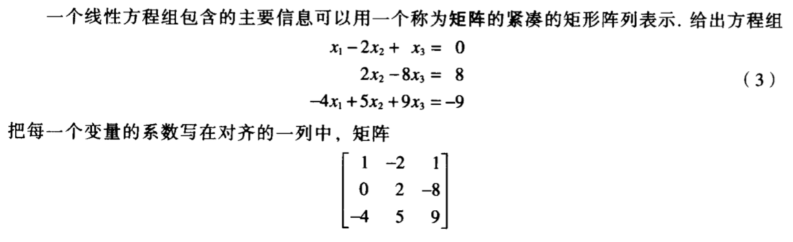

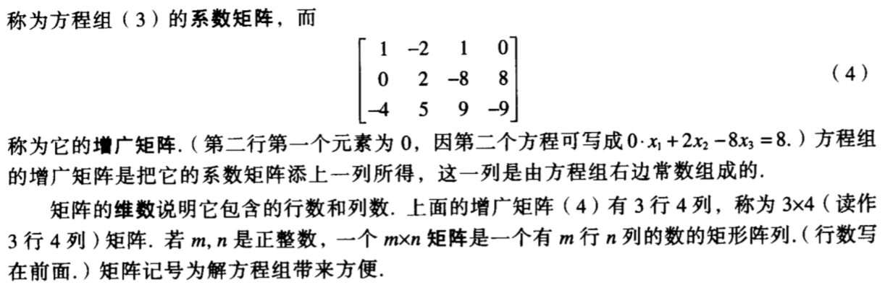

#### 线性方程组的解法

**例 1.1.1**：解下列方程组：

$x_1-2x_2+x_3=0\\2x_2-8x_3=8\\-4x_1+5x_2+9x_3=-9$

解：将方程组对应的增广矩阵写出：

$\left(\begin{matrix}1&-2&1&0\\0&2&-8&8\\-4&5&9&-9\end{matrix}\right)$

仅保留方程1中的$x_1$，将其它方程中的$x_1$ 消去。也就是将方程1乘4，并将其加到第三个方程上：

$\left(\begin{matrix}1&-2&1&0\\0&2&-8&8\\0&-3&13&-9\end{matrix}\right)$

为方便接下来的运算，将方程2乘1/2，使$x_2$ 的系数变为1

$\left(\begin{matrix}1&-2&1&0\\0&1&-4&4\\0&-3&13&-9\end{matrix}\right)$

利用方程2中的$x_2$小区方程3中的$x_2$，此时得到的矩阵由三角形状：

$\left(\begin{matrix}1&-2&1&0\\0&1&-4&4\\0&0&1&3\end{matrix}\right)$

为了更方便地看出解，最好把方程1中的$x_2, x_3$ 消去，然后把方程2中的$x_3$也消去。利用方程3中的$x_3$ 消去其它方程中的$x_3$ ：

$\left(\begin{matrix}1&-2&0&-3\\0&1&0&16\\0&0&1&3\end{matrix}\right)$

利用方程2中的$x_2$ 消去其它方程中的$x_2$ ：

$\left(\begin{matrix}1&0&0&29\\0&1&0&16\\0&0&1&3\end{matrix}\right)$

这个增广矩阵对应的方程组为

$x_1=29\\x_2=16\\x_3=3$

这就得出了方程组的解$(29, 16, 3)$

#### 存在与唯一性问题

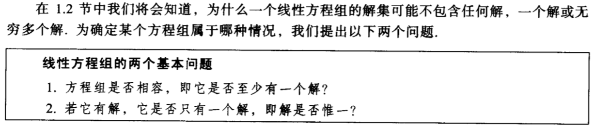

**例 1.1.3**：确定下列方程组是否相容：

$x_2-4x_3=8\\2x_1-3x_2+2x_3=1\\5x_1-85x_2+7x_3=1$

解：将方程组对应的增广矩阵写出：

$\left(\begin{matrix}0&1&-4&8\\2&-3&2&1\\5&-8&7&1\end{matrix}\right)$

对其施以初等行变换可以得到

$\left(\begin{matrix}2&-3&2&1\\-&1&-4&8\\0&0&0&5/2\end{matrix}\right)$

新方程组的方程3对应的方程式为

$0x_1+0x_2+0x_3=5/2$ 

这显然是矛盾的，所以愿方程组是不相容的

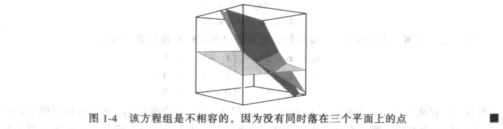

### 1.2 行化简与阶梯形矩阵

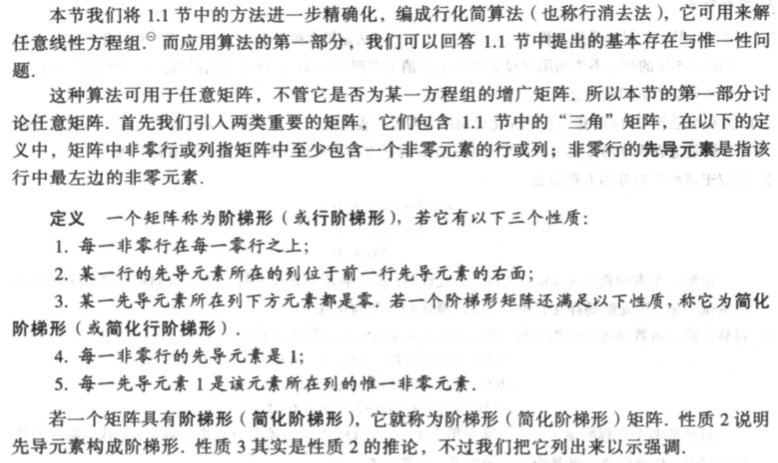

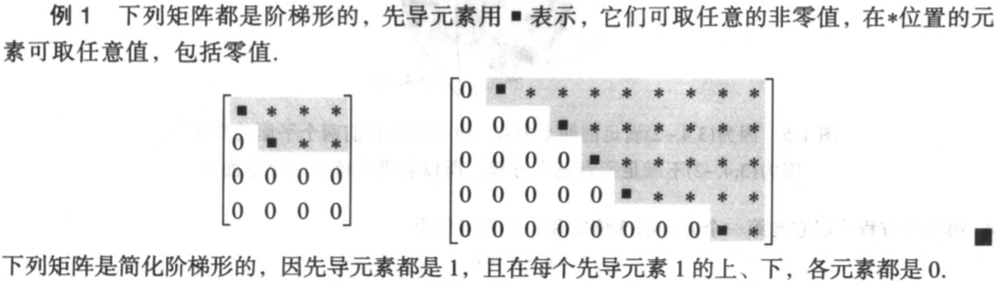

##### 定理1（简化阶梯形矩阵的唯一性）

#### 主元位置

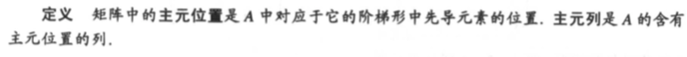

#### 行化简算法

#### 线性方程组的解

**例1.2.4**：求方程组的解，该方程组的增广矩阵已经化为

$\left(\begin{matrix}1&6&2&-5&-2&-4\\0&0&2&-8&-1&3\\0&0&0&0&1&7\end{matrix}\right)$

解：将其化为简化阶梯形：

$\left(\begin{matrix}1&6&0&3&0&0\\0&0&1&-4&0&5\\0&0&0&0&1&7\end{matrix}\right)$

主元列为1，3，5列，基本变量为$x_1, x_3, x_5$，自由变量为：$x_2, x_4$，其对应的方程组为：

$x_1+6x_2+3x_4=0\\x_3-4x_4=5\\x_5=7$

通解为

$x_1+6x_2+3x_4=0$

$x_2$ 为自由变量

$x_3-4x_4=5$

$x_4$ 为自由变量

$x_5=7$

#### 存在与唯一性问题

##### 定理2（存在与唯一性定理）

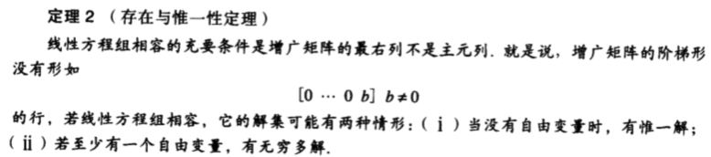

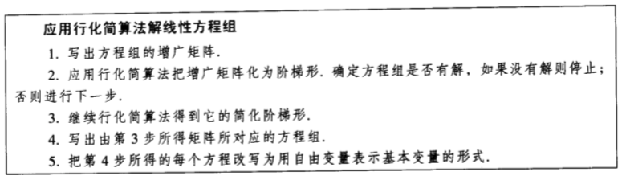

**例1.2.5**：确定方程组的解是否存在且唯一。方程组的增广矩阵化简为：

$\left(\begin{matrix}3&-9&12&-9&6&15\\0&2&-4&4&2&-6\\0&0&0&0&1&4\end{matrix}\right)$

解：因为没有不相容的方程组，所以方程组有解。因为存在自由变量，所以方程组的解不是唯一的。

### 1.3 向量方程

#### $R^2$ 中的向量

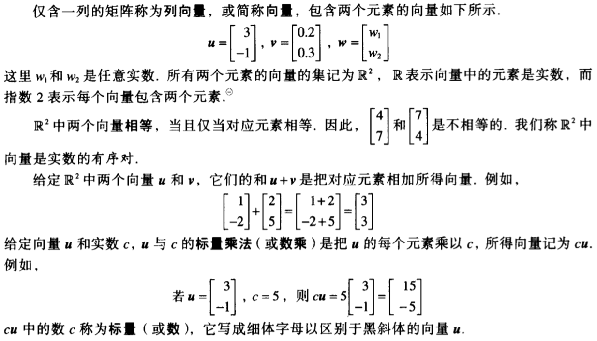

#### $R^2$ 的几何表示

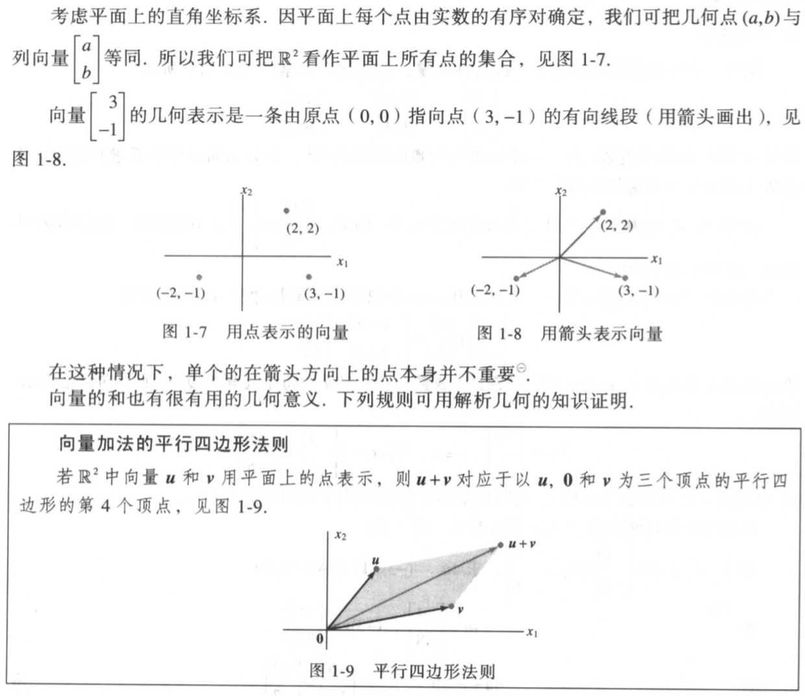

#### $R^n$ 中的向量

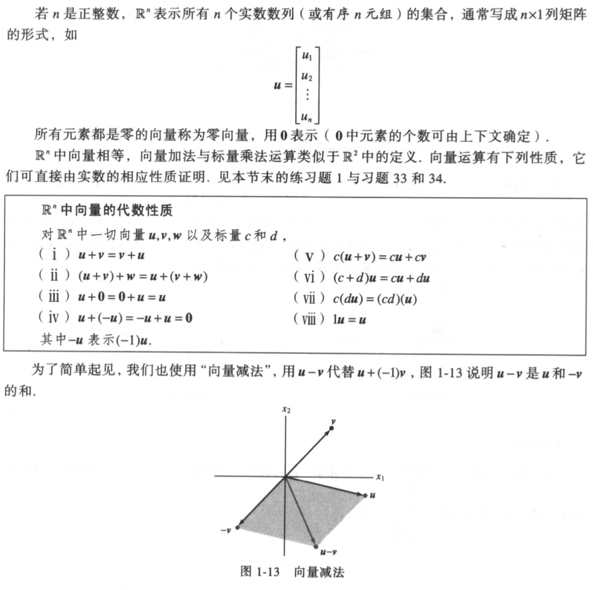

#### 线性组合

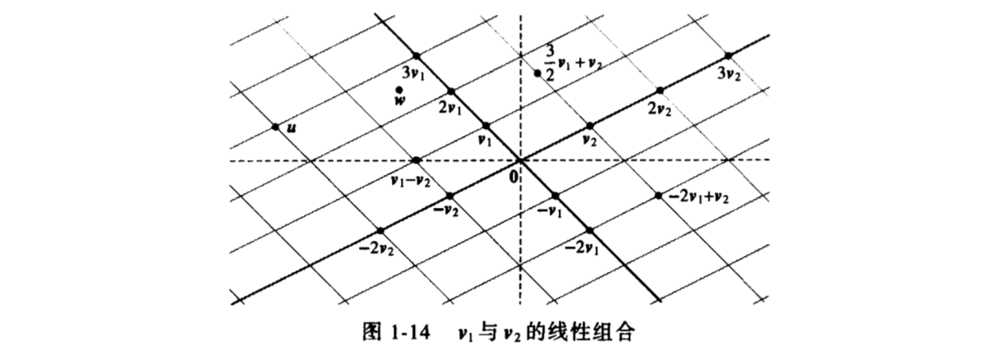

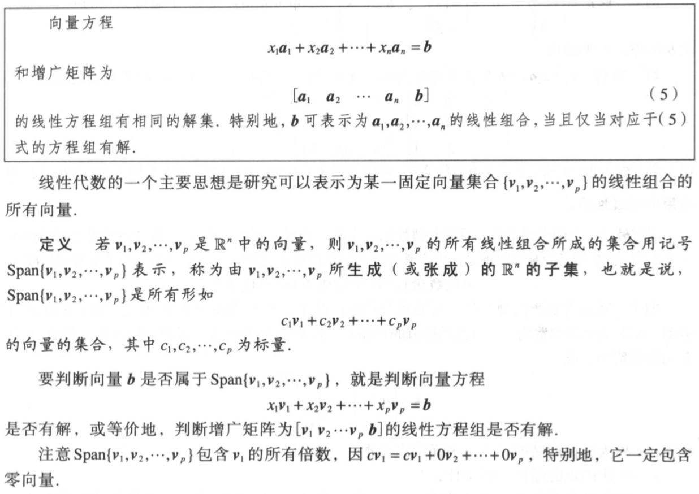

#### Span{v}与Span{u, v}的几何解释

#### 应用中的线性组合

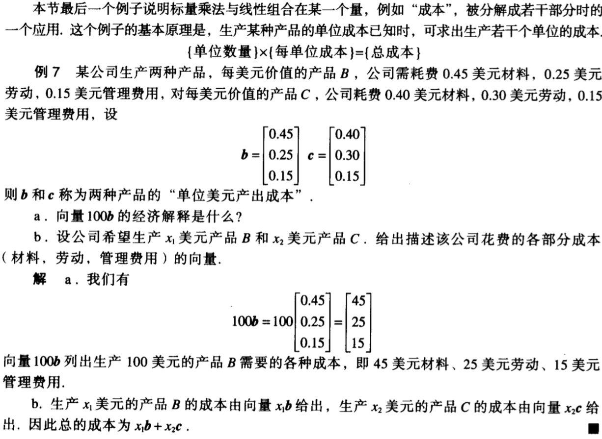

### 1.4 矩阵方程Ax=b

##### 定理3

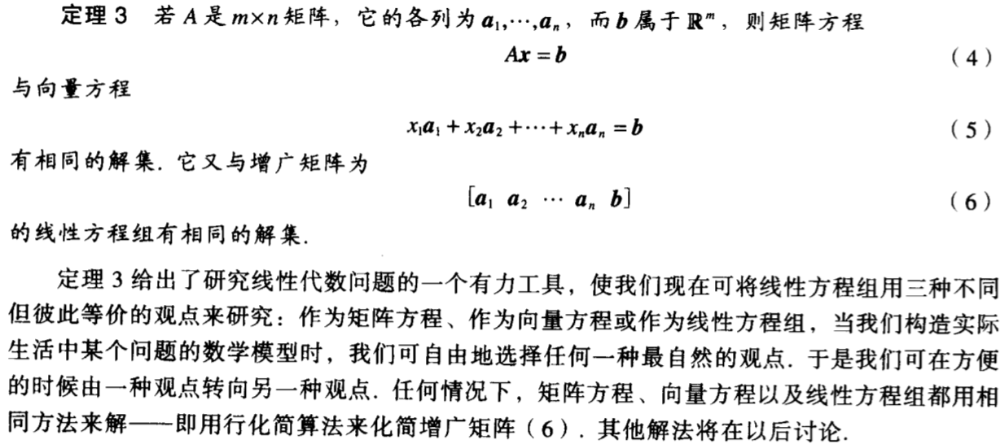

#### 解的存在性

##### 定理4

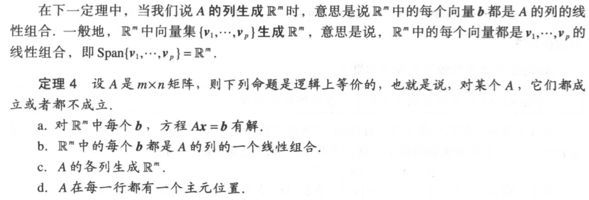

#### Ax的计算

#### 矩阵-向量积Ax的性质

##### 定理5

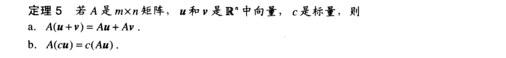

### 1.5 线性方程组的解集

#### 齐次线性方程组

**例1.5.1**：确定下列其次线性方程组是否有平凡解，并描述他的子集

$3x_1+5x_2-4x_3=0\\-3x_1-2x_2+4x_3=0\\6x_1+x_2-8x_3=0$

解：写出增广矩阵(A 0)

$\left(\begin{matrix}3&5&-4&0\\-3&-2&4&0\\6&1&-8&0\end{matrix}\right)$

施以行变换，化为阶梯形

$\left(\begin{matrix}3&5&-4&0\\0&3&0&0\\0&0&0&0\end{matrix}\right)$

$x_3$ 是自由变量，因此Ax = 0有平凡解。继续施以行变换，化为简化阶梯形：

$\left(\begin{matrix}1&0&-\frac{4}{3}&0\\0&1&0&0\\0&0&0&0\end{matrix}\right)$

用自由变量表示基本变量

$x = \left(\begin{matrix}\frac{4}{3}\\0\\1\end{matrix}\right)x_3$

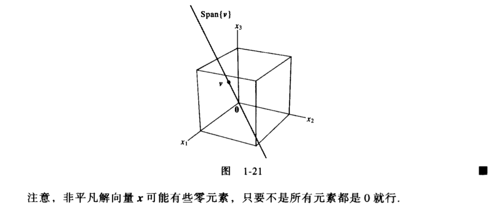

#### 非齐次线性方程组的解

**例1.5.3** ：描述Ax = b的解，其中

$A = \left(\begin{matrix}3&5&-4\\-3&-2&4\\6&1&-8\end{matrix}\right), b = \left(\begin{matrix}7\\-1\\-4\end{matrix}\right)$

解：写出增广矩阵(A b)

$\left(\begin{matrix}3&5&-4&7\\-3&-2&4&-1\\6&1&-8&4\end{matrix}\right)$

施以行变换，化为简化阶梯形

$\left(\begin{matrix}1&0&-\frac{4}{3}&-1\\0&1&0&2\\0&0&0&0\end{matrix}\right)$

$x_3$ 为自由变量，Ax = b的通解为

$x = \left(\begin{matrix}-1\\2\\0\end{matrix}\right) + \left(\begin{matrix}\frac{4}{3}\\0\\1\end{matrix}\right)x_3$

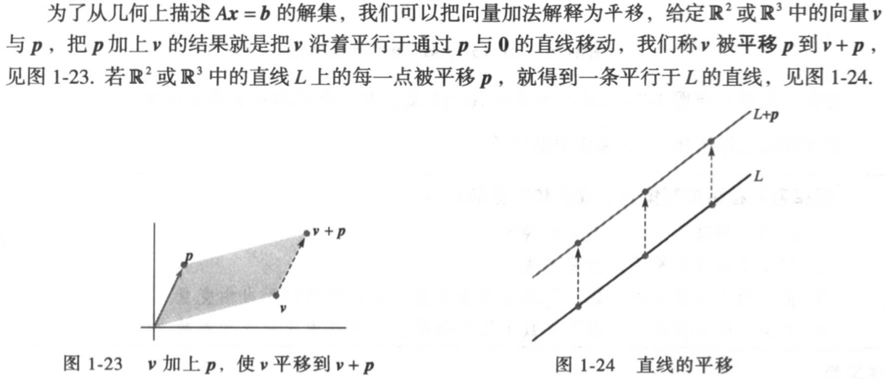

##### 定理6

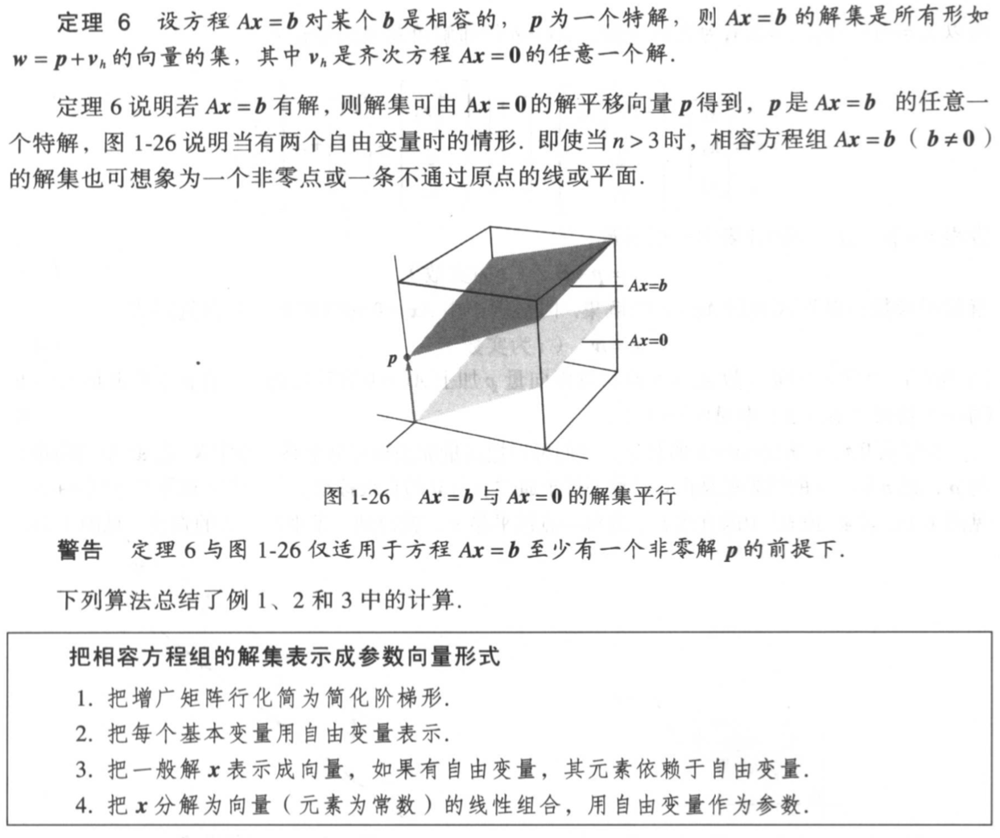

**习题1.5.25** ：证明定理6:

1. 设p是Ax=b的解，即Ap=b，设$v_h$ 为齐次方程$Ax=0$的解，$w=p+v_h$ 。证明w是Ax=b的解
2. 设w是Ax=b的任意解，定义$v_h=w-p$，证明$v_h$ 是$Ax=0$ 的解，这说明，Ax=b的任意解有形式$w=p+v_h$ ，p是Ax=b的特解，$v_h$ 是Ax=0的解

证明：

1. 因为$Ap=b, Av_h=0$ ，所以根据定理5有 $A(p+v_h)=Aw=b$ ，进而w是Ax=b的解
2. 因为根据定理5油 $Aw=A(p+v_h)=Ap+Av_h=b, Ap=b$，所以$Av_h=0$，进而$v_h$是Ax=0的解

### 1.6 线性方程组的应用

#### 经济学中的齐次线性方程组

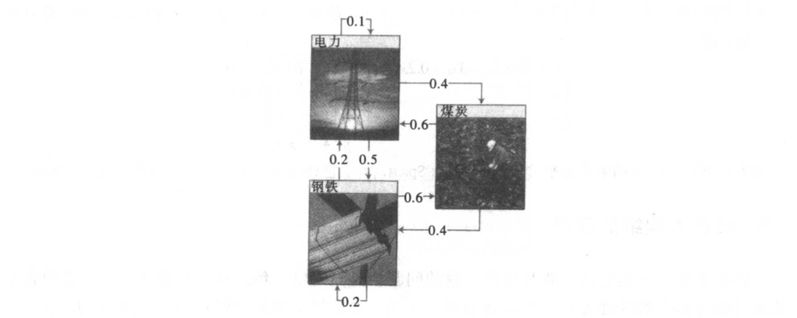

解：设煤炭，电力，钢铁的平衡价格为$x_1, x_2, x_3$。也就是说，三个部门的总产出和总收入都为$x_1, x_2, x_3$，也就是满足方程组：

$0.0x_1+0.4x_2+0.6x_3=x_1\\0.6x_1+0.1x_2+0.2x_3=x_2\\0.4x_1+0.5x_2+0.2x_3=x_3$

或者满足方程组

$1.0x_1-0.4x_2-0.6x_3=0\\0.6x_1-0.9x_2+0.2x_3=0\\0.4x_1+0.5x_2-0.8x_3=0$

将其增广矩阵列出后施以初等行变换

$\left(\begin{matrix}1.0&-0.4&-0.6&0\\0.6&-0.9&0.2&0\\0.4&0.5&-0.8&0\end{matrix}\right) \sim \left(\begin{matrix}1&0&-0.94&0\\0&1&-0.85&0\\0&0&0&0\end{matrix}\right)$

然后可以得到通解

$x = \left(\begin{matrix}x_1\\x_2\\x_3\end{matrix}\right) = x_3 \left(\begin{matrix}0.94\\0.85\\1\end{matrix}\right)$

#### 配平化学方程式

### 网络流

解：根据$A, B, C, D$的流量守恒，可列方程组：

$300+500=x_1+x_2\\x_2+x_4=300+x_3\\100+400=x_4+x_5\\x_1+x_5=600$

解之可得

$x = \left(\begin{matrix}x_1\\x_2\\x_3\\x_4\\x_5\end{matrix}\right) = \left(\begin{matrix}600\\200\\400\\500\\0\end{matrix}\right) + x_5\left(\begin{matrix}-1\\1\\0\\-1\\1\end{matrix}\right)$

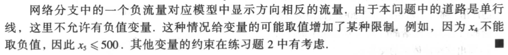

### 1.7 线性无关

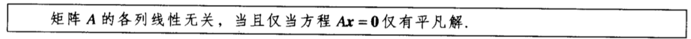

**例1.7.2** ：确定矩阵 $A = \left(\begin{matrix}0&1&4\\1&2&-1\\5&8&0\end{matrix}\right)$ 是否线性无关。

解：研究Ax=0，将其增广矩阵施以行变换：

 $\left(\begin{matrix}0&1&4&0\\1&2&-1&0\\5&8&0&0\end{matrix}\right) \sim \left(\begin{matrix}1&2&-1&0\\0&1&4&0\\0&0&13&0\end{matrix}\right)$ 

可见方程有3个基本变量，没有自由变量。因此方程仅有平凡解，A的各列是线性无关的。

##### 定理7（线性相关集的特征）

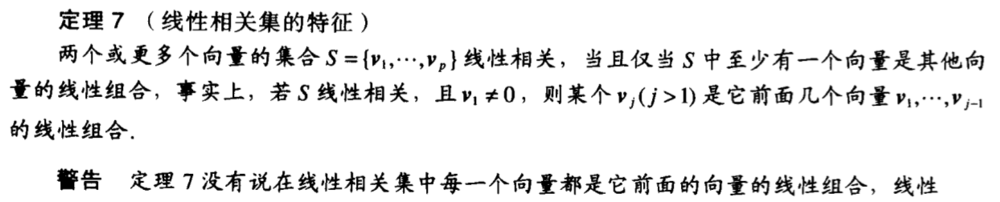

##### 定理8

##### 定理9

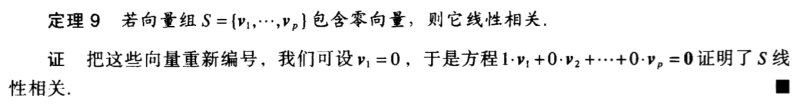

**例1.7.6** ：用观察法确定下列向量组是否线性相关

a. $\left(\begin{matrix}1\\7\\6\end{matrix}\right), \left(\begin{matrix}2\\0\\9\end{matrix}\right), \left(\begin{matrix}3\\1\\5\end{matrix}\right), \left(\begin{matrix}4\\1\\8\end{matrix}\right)$

b. $\left(\begin{matrix}2\\3\\5\end{matrix}\right), \left(\begin{matrix}0\\0\\0\end{matrix}\right), \left(\begin{matrix}1\\1\\8\end{matrix}\right)$

a. $\left(\begin{matrix}-2\\4\\6\\10\end{matrix}\right), \left(\begin{matrix}3\\-6\\-9\\15\end{matrix}\right)$

解：

根据定理8，a中向量数大于元素个数，故线性相关

根据定理9，b中出现零向量，故线性相关

根据定理7，c中第一个向量不是零向量，第二个向量不是前一个的倍数，故线性无关

### 1.8 线性变换介绍

#### 矩阵变换

#### 线性变换

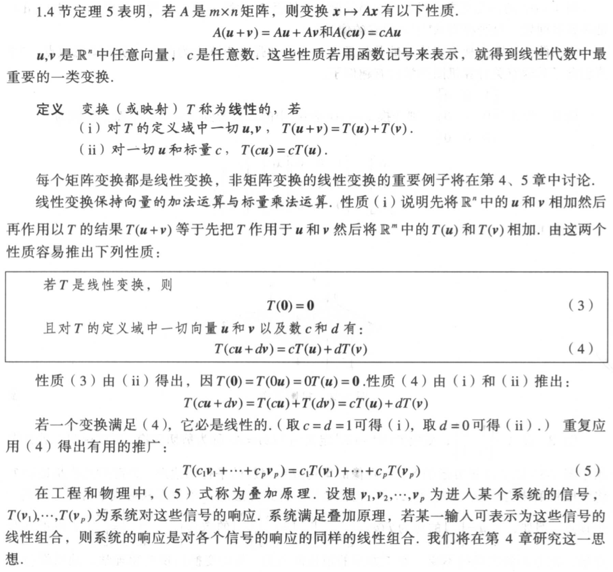

### 1.9 线性变换的矩阵

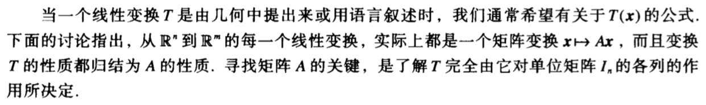

##### 定理10

**习题1.9.33**：证明定理10中A的唯一性。

 证明：设A为线性变换T的标准矩阵，由 $A = \left(\begin{matrix}T(e_1)&\dots&T(e_n)\end{matrix}\right)$ 定义，B满足T(x) = Bx。那么

$A = \left(\begin{matrix}T(e_1)&\dots&T(e_n)\end{matrix}\right) = \left(\begin{matrix}b_1&\dots&b_n\end{matrix}\right) = B$

因此，任意满足T(x) = Bx的矩阵B都与A相等，命题得证。

**例1.9.3** ：设$T: R^2\rightarrow R^2$ 为把$R^2$ 中每个点逆时针旋转角度$\varphi$ 的变换。我们可以证明这个变换是线性变换，求出这个变换的标准矩阵

解：因为 $\left(\begin{matrix}1\\0\end{matrix}\right)$ 旋转为 $\left(\begin{matrix}\cos\varphi\\\sin\varphi\end{matrix}\right)$， $\left(\begin{matrix}0\\1\end{matrix}\right)$ 旋转为 $\left(\begin{matrix}-\sin\varphi\\\cos\varphi\end{matrix}\right)$，所以根据定理10，这个变换的标准矩阵

 $A = \left(\begin{matrix}cos\varphi&-\sin\varphi\\\sin\varphi&\cos\varphi\end{matrix}\right)$

#### $R^2$ 中的几何线性变换

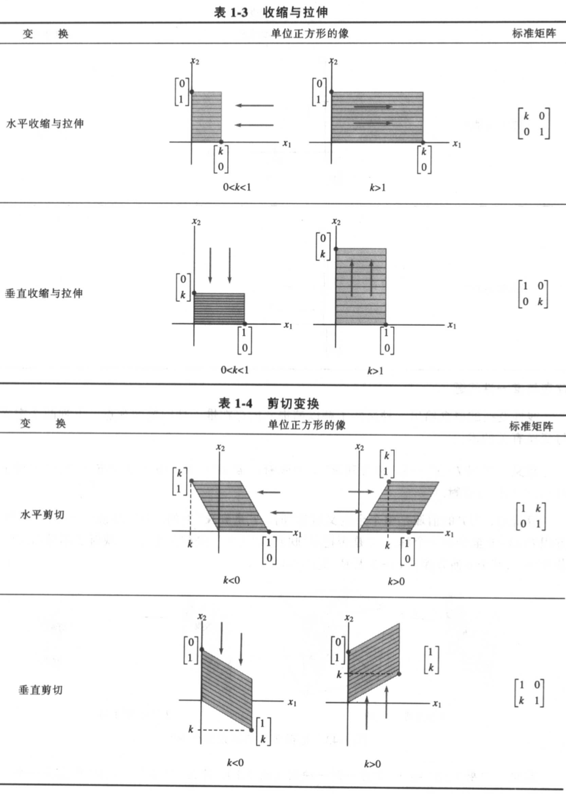

#### 存在与唯一性问题

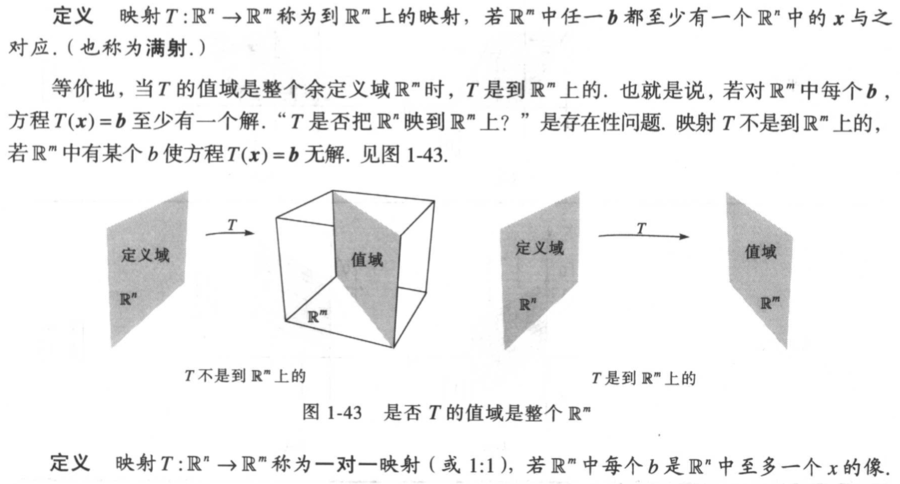

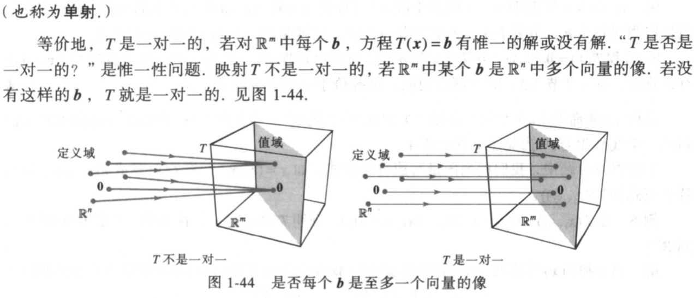

**例1.9.4** ：设T是线性变换，其标准矩阵如下。问T是否把$R^4$ 映上到$R^3$ ？T是否是一对一映射？

 $A = \left(\begin{matrix}1&-4&8&1\\0&2&-1&3\\0&0&0&5\end{matrix}\right)$

解：显然A已经是阶梯形，那么根据定理2，对任意的$R^3$ 中的b，Ax=b都是相容的。也就是T是满设，或者说T把$R^4$ 映上到$R^3$。从阶梯形的A中还可以看出，Ax=b中存在自由变量，那么根据定理2，Ax=b的解不唯一，也就是说T不是一对一的。

##### 定理11

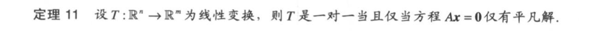

##### 定理12

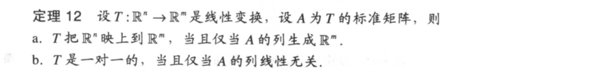

### 1.10 经济学、科学和工程中的线性模型

#### 构造有营养的减肥食谱

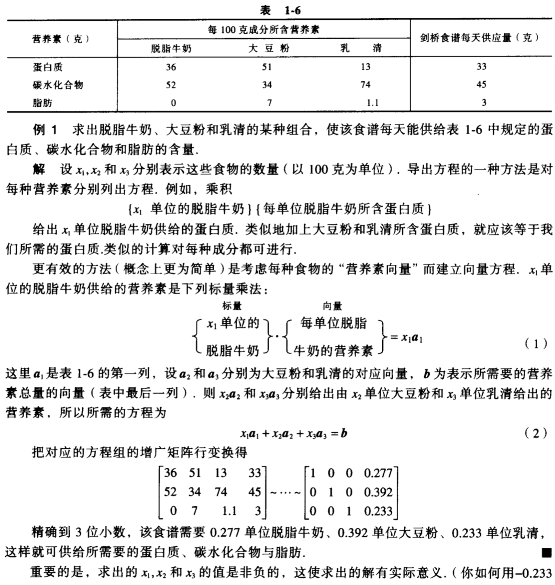

#### 线性方程与电路网络

**例1.10.2** ：确定图1-47中的回路电流$I_1, I_2, I_3$ 。

解：对回路1，电流$I_1$ 通过3个电阻的电压降为$11I_1$，回路2的电流流过回路1的那部分电压降为$-3I_2$ ，因此回路1的电动势满足

$11I_1-3I_2=30$

同样地，回路2的电动势满足

$-3I_1+6I_2-I_3=5$

回路3的电动势满足

$-I_2+3I_3=-25$

解方程组可得$I_1=3,I_2=1,I_3=-8$。

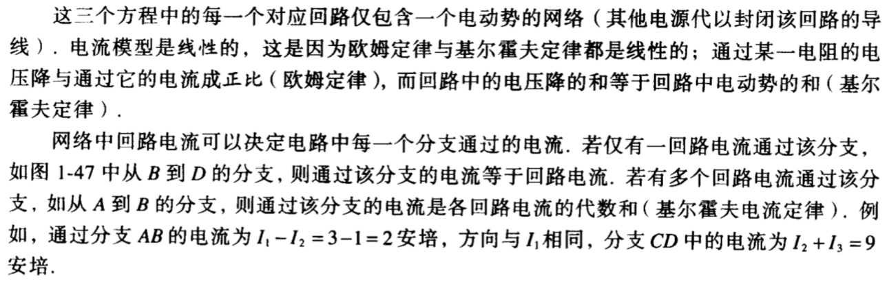

#### 差分方程

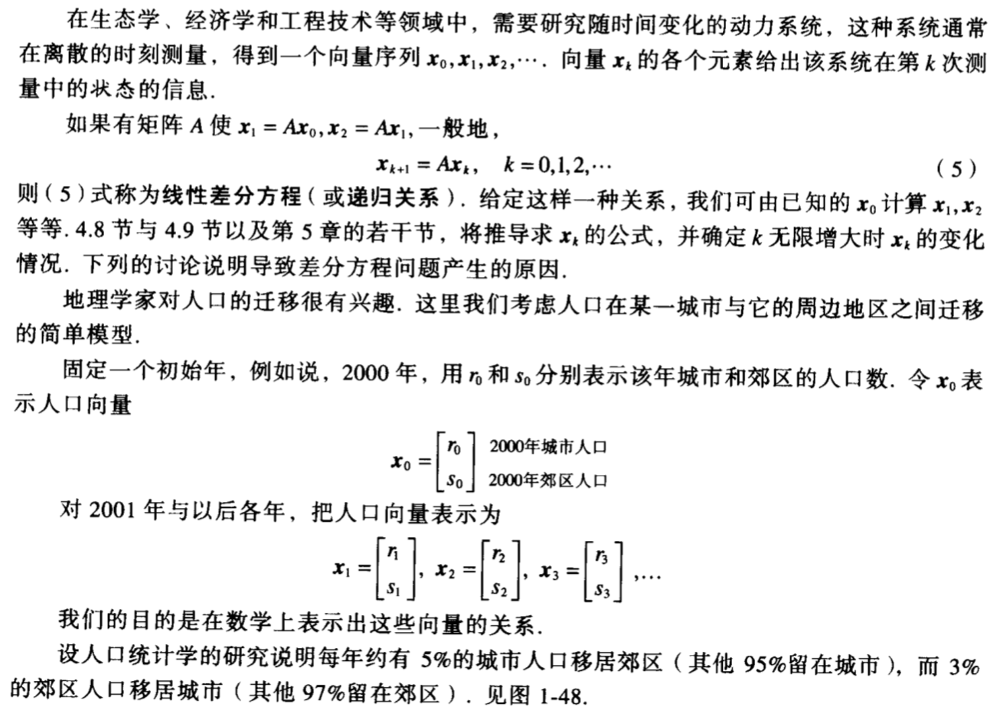

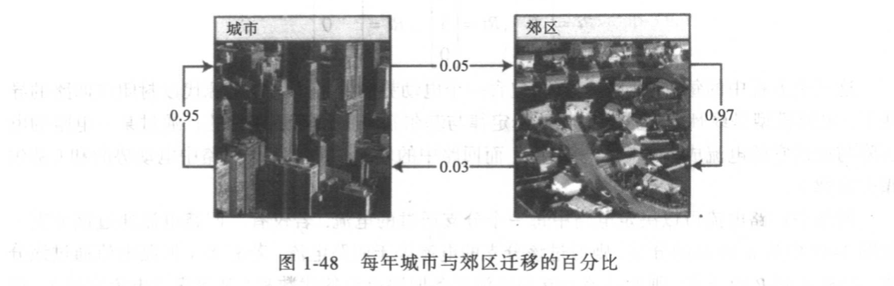

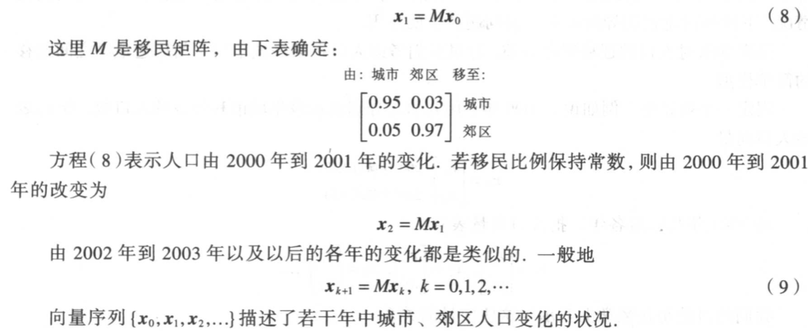

**例1.10.3** ：设2000年城市人口为600 000，郊区人口为400 000，求上述区域2001年和2002年的人口

解：200年的人口向量为 $x_0= \left(\begin{matrix}600000\\4000 00\end{matrix}\right)$ 

$x_1 = Mx_0 = \left(\begin{matrix}582000\\4180 00\end{matrix}\right)$

$x_2 = Mx_1 = \left(\begin{matrix}565440\\434560\end{matrix}\right)$

## 2 矩阵代数

### 2.1 矩阵运算

#### 和与标量乘法

##### 定理1

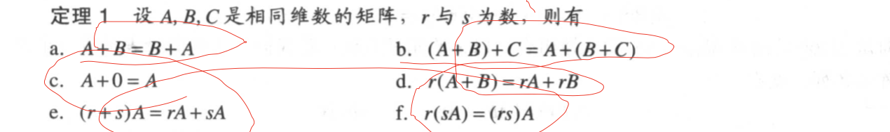

#### 矩阵乘法

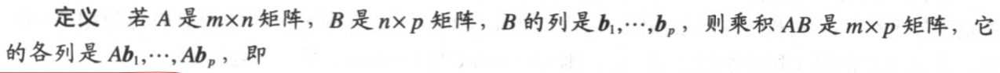

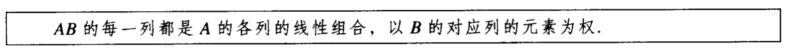

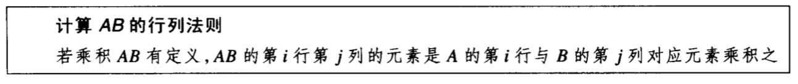

#### 矩阵乘法的性质

##### 定理2

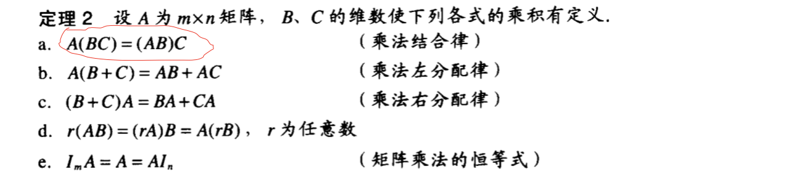

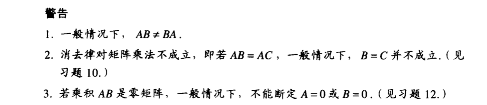

**习题 2.1.10** ：证明虽然AB=AC但$B\ne C$，其中

$A = \left(\begin{matrix}2&-3\\-4&6\end{matrix}\right), B = \left(\begin{matrix}8&4\\5&5\end{matrix}\right), C = \left(\begin{matrix}5&-2\\3&1\end{matrix}\right)$

证明：$AB = \left(\begin{matrix}1&-7\\-2&14\end{matrix}\right), AC = \left(\begin{matrix}1&-7\\-2&14\end{matrix}\right)$，显然AB=AC但$B\ne C$ 

 **习题 2.1.11** ：计算AD和DA，说明当A右乘或左乘D时，A的行或列如何变化。求出$3\times 3$ 对角矩阵B，不是单位矩阵或零矩阵，使得AB=BA。其中

$A = \left(\begin{matrix}1&1&1\\1&2&3\\1&4&5\end{matrix}\right), D = \left(\begin{matrix}2&0&0\\0&3&0\\0&0&5\end{matrix}\right)$

解：A右乘D时，A的第j列会变为原来的$D_{jj}$倍。A左乘D时，A的第i行会变为原来的$D_{ii}$ 倍。设矩阵B为

$B = \left(\begin{matrix}x_1&0&0\\0&x_2&0\\0&0&x_3\end{matrix}\right)$

由AB = BA可得$x_1=x_2=x_3$ ，于是任何对角线元素相等的对角矩阵B都能令AB = BA。这时无论A时左乘B还是右乘B，都等价于让A的所有元素都乘上一个相同的标量（下一节说明了左乘、右乘矩阵与初等行变换、列变换的关系）。

**习题 2.1.12** ：求$2\times 2$ 矩阵B使AB=0，要求B有两个不同的非零列，其中

$A = \left(\begin{matrix}3&-6\\-1&2\end{matrix}\right)$

解：AB = 0等价于：对B的两列$b_1, b_2$，有$Ab_1 = 0, Ab_2 = 0$。根据题意，我们应该在A的零空间内寻找两个不相同的向量解Ax = 0得

$x = \left(\begin{matrix}2\\1\end{matrix}\right)x_2$

于是B可以是$\left(\begin{matrix}2&4\\1&2\end{matrix}\right)$

#### 矩阵的乘幂

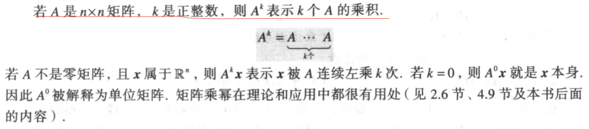

#### 矩阵的转置

##### 定理3

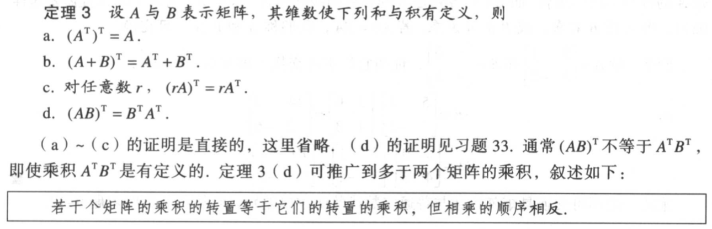

**习题 2.1.33** ：证明定理3d

证明：设有矩阵A，B，其中$a_i$为A的第i列，$b_j$ 为B的第j列。

 $(AB)^T$ 的第j行是$AB$ 的第j列，也就是$Ab_j$ ，$Ab_j$ 的第i个元素是$a_i^Tb_j$。

$B^TA^T$ 的第j行是$b_j^TA^T$，$b_j^TA^T$ 的第i个元素为$b_j^Ta_i$ 。

显然$a_i^Tb_j=b_j^Ta_i$ ，故$Ab_j=b_j^TA^T$ ，进而$(AB)^T=B^TA^T$。

### 2.2 矩阵的逆

##### 定理4

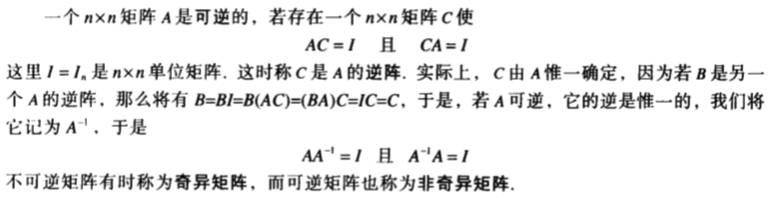

**例2.2.2** ：求 $A = \left(\begin{matrix}3&4\\5&6\end{matrix}\right)$ 的逆。

解：$det A = -2 \ne 0$ ，故A可逆，且

$A^{-1} = -\frac{1}{2}\left(\begin{matrix}6&-4\\-5&3\end{matrix}\right) = \left(\begin{matrix}-3&2\\\frac{5}{2}&-\frac{3}{2}\end{matrix}\right)$ 

##### 定理5

**例2.2.4** ：解方程：

$3x_1+4x_2=3\\5x_1+6x_2=7$

解：

方程可以写成矩阵的形式：

 $Ax = \left(\begin{matrix}3&4\\5&6\end{matrix}\right)\left(\begin{matrix}x_1\\x_2\end{matrix}\right)=\left(\begin{matrix}3\\7\end{matrix}\right) = b$ 

$x = A^{-1}b = \left(\begin{matrix}-3&2\\\frac{5}{2}&-\frac{3}{2}\end{matrix}\right)\left(\begin{matrix}3\\7\end{matrix}\right) = \left(\begin{matrix}5\\-3\end{matrix}\right)$ 

##### 定理6

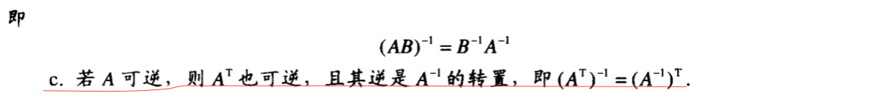

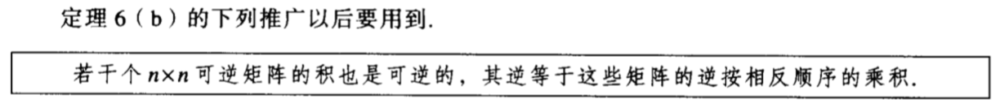

#### 初等矩阵

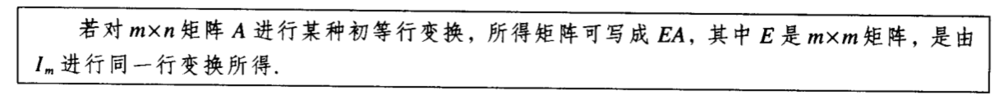

**例2.2.6**：求$E = \left(\begin{matrix}1&0&0\\0&1&0\\-4&0&1\end{matrix}\right)$ 的逆

解：为把E变成I，需要对E施加的初等行变换为：将第1行的4倍加到第3行中去，其对应的初等矩阵即E的逆：

$E^{-1} = \left(\begin{matrix}1&0&0\\0&1&0\\4&0&1\end{matrix}\right)$

##### 定理7


  **例2.2.7** 证明定理7

证明：

1. 若方阵A是可逆的，根据定理5，Ax=b必有唯一解，进而根据第一章1.4节的定理4，A的每行都有主元。根据主元的定义，因为A是每行都有主元方阵，所以A的主元都在其对角线上，进而A的简化阶梯形是$I_n$ ，即$A\sim I_n$

2. 若$A\sim I_n$，，根据上面方框中的事实，存在一系列可逆的初等矩阵，使得

   $E_p\dots E_1 A = I_n \tag{1}$

   等式两边同时乘初等矩阵的逆矩阵可得

   $A = (E_p\dots E_1)^{-1} \tag{2}$

    于是A是可逆的，根据定理6，它的逆为$E_p\dots E_1$ 

3. 等式(2)的两侧同时取逆再乘$I_n$可得

   $A^{-1} = (E_p\dots E_1)I_n \tag{3}$

   综合等式(1)和(3)，可知把A变为$I_n$ 的一系列初等行变换可以同时把$I_n$ 变成$A^{-1}$

#### 求$A^{-1}$ 的算法 


  **例2.2.8**：若矩阵 $ \left(\begin{matrix}0&1&2\\1&0&3\\4&-3&8\end{matrix}\right)$ 的逆存在的话，求其逆

解： $ \left(\begin{matrix}A&I\end{matrix}\right) = \left(\begin{matrix}0&1&2&1&0&0\\1&0&3&0&1&0\\4&-3&8&0&0&1\end{matrix}\right) \sim \left(\begin{matrix}1&0&0&-9/2&7&-3/2\\0&1&0&-2&4&-1\\0&0&1&3/2&-2&1/2\end{matrix}\right)$

根据定理7，因为$A \sim I$ 所以A可逆，且

$A^{-1} = \left(\begin{matrix}-9/2&7&-3/2\\-2&4&-1\\3/2&-2&1/2\end{matrix}\right)$

#### 逆矩阵的另一个观点


### 2.3 可逆矩阵的特征

##### 定理8


#### 可逆线性变换

##### 定理9


### 2.4 分块矩阵

#### 分快矩阵的乘法


##### 定理10


**例2.4.5**：求分块上三角可逆矩阵  $ \left(\begin{matrix}A_{11}&A_{12}\\0&A_{22}\end{matrix}\right)$  的逆，其中$A_{11}$ 是$p\times p$ 矩阵，$A_{22}$ 是$q\times q$ 矩阵。

解：用B表示$A^{-1}$ ，有

$AB = \left(\begin{matrix}A_{11}&A_{12}\\0&A_{22}\end{matrix}\right) \left(\begin{matrix}B_{11}&B_{12}\\B_{21}&B_{22}\end{matrix}\right) = \left(\begin{matrix}I_p&0\\0&I_q\end{matrix}\right) \tag{1}$

也就是说

$A_{11}B_{11} + A_{12}B_{21} = I_p \tag{2}$

 $A_{11}B_{12} + A_{12}B_{22} = 0 \tag{3}$

 $A_{22}B_{21} = 0 \tag{4}$

$A_{22}B_{22} = I_q \tag{5}$

根据可逆矩阵定理，利用5式可得

$B_{22} = A_{22}^{-1}$

上式说明$A_{22}$ 是可逆的，利用4式可得

$B_{21} = A_{22}^{-1}0 = 0$

进而根据可逆矩阵定理，利用2式可得

$B_{11} = A_{11}^{-1}$

上式说明$A_{11}$是可逆的，最后利用3式可得

$B_{12}^{-1} = -A_{11}^{-1}A_{12}A_{22}^{-1}$

于是

$A^{-1} = \left(\begin{matrix}A_{11}&A_{12}\\0&A_{22}\end{matrix}\right)^{-1} = \left(\begin{matrix}A_{11}^{-1}&-A_{11}^{-1}A_{12}A_{22}^{-1}\\0&A_{22}^{-1}\end{matrix}\right)$

### 2.5 矩阵因式分解

#### LU分解


**例2.5.1**：可以证明

$A = \left(\begin{matrix}3&-7&-2&2\\-3&5&1&0\\6&-4&0&-5\\-9&5&-5&12\end{matrix}\right) = \left(\begin{matrix}1&0&0&0\\-1&1&0&0\\2&-5&1&0\\-3&8&3&1\end{matrix}\right) \left(\begin{matrix}3&-7&-2&2\\0&-2&-1&2\\0&0&-1&1\\0&0&0&-1\end{matrix}\right) = LU$

应用A的LU分解来解Ax=b ，其中$b = \left(\begin{matrix}-9\\5\\7\\11\end{matrix}\right)$

解：Ax=b也就是矩阵方程组Ly = b，Ux=y。先解Ly = b

$\left(\begin{matrix}L&b\end{matrix}\right)  = \left(\begin{matrix}1&0&0&0&-9\\-1&1&0&0&5\\2&-5&1&0&7\\-3&8&3&1&11\end{matrix}\right) \sim \left(\begin{matrix}1&0&0&0&-9\\0&1&0&0&-4\\0&0&1&0&5\\0&0&0&1&1\end{matrix}\right) = \left(\begin{matrix}I&y\end{matrix}\right)$

再解Ux = y，

$\left(\begin{matrix}U&y\end{matrix}\right)  = \left(\begin{matrix}3&-7&-2&2&-9\\0&-2&-1&2&-4\\0&0&-1&1&5\\0&0&0&-1&1\end{matrix}\right) \sim \left(\begin{matrix}1&0&0&0&3\\0&1&0&0&4\\0&0&1&0&-6\\0&0&0&1&-1\end{matrix}\right) = \left(\begin{matrix}I&x\end{matrix}\right)$


#### LU分解算法


**习题2.5.19**：设A为下三角$n\times n$ 矩阵，对角线上元素非零，证明A可逆且$A^{-1}$ 是下三角矩阵。

证明：在将A行化简成阶梯阵的过程中

1. 因为A是对角线上元素非零的下三角方阵，所以第1行的主元在第1列
2. 在化简第1列时，因为第1行的第2到第n列上的元素全为0，所以对第1列的化简结束后，第2列到第n列的元素都不变，第2列的主元一定在第2行上
3. 在化简第i列时，因为第i行的第i + 1到第n列上的元素全为0，所以对第i列的化简结束后，第i + 1列到第n列的元素都不变，第i + 1列的主元一定在第i + 1行上

因此A有n个主元位置，根据逆矩阵定理，A可逆。

在对第i列的化简过程中，进行的初等行变换有

1. 对第i行进行倍乘变换
2. 将第i行倍加到第j行(i < j)

而这些操作都不会对主对角线上方的元素产生影响，所以根据定理7当对I进行同样的初等行变换时，得到的$A^{-1}$ 也会是下三角矩阵。


**例2.5.2**：求下列矩阵的LU分解

$A = \left(\begin{matrix}2&4&-1&5&-2\\-4&-5&3&-8&1\\2&-5&-4&1&8\\-6&0&7&-3&1\end{matrix}\right)$

解：因为U跟A一样是$4\times 5$ 的矩阵，所以L是$4\times4$ 的方阵。根据上述分析，L为下三角单位矩阵

$L = \left(\begin{matrix}1&0&0&0\\&1&0&0\\&&1&0\\&&&1\end{matrix}\right)$

L的第一列应该是A的第一列除以第一行的主元的值

$L = \left(\begin{matrix}1&0&0&0\\-2&1&0&0\\1&&1&0\\-3&&&1\end{matrix}\right)$

现在将A变换为阶梯阵U。首先对A的第一列进行化简

$A \sim  \left(\begin{matrix}2&4&-1&5&-2\\0&3&1&2&-3\\0&-9&-3&-4&10\\0&12&4&12&-5\end{matrix}\right) = A_1$

L的第二列应该是$A_1$ 的第二列除以第二行的主元的值

$L = \left(\begin{matrix}1&0&0&0\\-2&1&0&0\\1&-3&1&0\\-3&4&&1\end{matrix}\right)$

然后对$A_1$的第二列进行化简

$A_1 \sim  \left(\begin{matrix}2&4&-1&5&-2\\0&3&1&2&-3\\0&0&0&2&1\\0&0&0&4&5\end{matrix}\right) = A_2$

L的第三列应该是$A_2$ 的第四列除以第三行的主元的值

$L = \left(\begin{matrix}1&0&0&0\\-2&1&0&0\\1&-3&1&0\\-3&4&2&1\end{matrix}\right)$

最后把$A_2$ 化简完毕

$A_2 \sim  \left(\begin{matrix}2&4&-1&5&-2\\0&3&1&2&-3\\0&0&0&2&1\\0&0&0&0&5\end{matrix}\right) = U$

就得到了使得A的LU分解

#### 电子工程中的一个矩阵因式分解


**例2.5.3**：计算图2-14中梯级网络的传递矩阵，并设计一个传递矩阵为$\left(\begin{matrix}1&-8\\-0.5&5\end{matrix}\right)$ 的梯级网络。

解：设$A_1, A_2$ 分别为串联与并联电路的传递矩阵，则输入向量x首先被变换为$A_1x$ 然后被变换为$A_2A_1x$ ，因此梯级网络的传递矩阵即两个变换的复合矩阵

$A = A_2A_1 = \left(\begin{matrix}1&-R_1\\-\frac{1}{R^2}&1+\frac{R_1}{R_2}\end{matrix}\right)$

当$R_1, R_2$ 满足以下情形时我们说我们设计出了一个满足条件的梯级网络

$A = \left(\begin{matrix}1&-R_1\\-\frac{1}{R^2}&1+\frac{R_1}{R_2}\end{matrix}\right) = \left(\begin{matrix}1&-8\\-0.5&5\end{matrix}\right)$

不难算出$R_1 = 8\Omega, R_2 = 2\Omega$


#### 2.6 列昂惕夫投入产出模型


**例2.6.1**：如果制造业决定生产100单位的产品，它将消费多少各部门生产的产品？

解：中间需求为

$Cx = C\left(\begin{matrix}100\\0\\0\end{matrix}\right) = \left(\begin{matrix}50\\20\\10\end{matrix}\right)$


**例2.6.2**：考虑消耗矩阵为3式的经济，假设制造业，农业和服务业的最终需求分别是50单位，30单位和20单位，求生产水平x

解：根据题意

$d = \left(\begin{matrix}50\\30\\20\end{matrix}\right), (I - C) = \left(\begin{matrix}0.5&-0.4&-0.2\\-0.2&0.7&-0.1\\-0.1&-0.9&0.7\end{matrix}\right)$

解方程$(I-C)x=d$ 得

$x \approx \left(\begin{matrix}226\\119\\78\end{matrix}\right)$

##### 定理11


#### $(I-C)^{-1}$的公式


#### $(I-C)^{-1}$中元素的经济重要性


### 2.7 计算机图形学中的应用


#### 齐次坐标


#### 复合变换


#### 齐次三维坐标


#### 透视投影


### 2.8 $R^n$ 的子空间

### 2.9 维数与秩

## 3 行列式


### 3.1 行列式介绍


**例3.1.1**：计算det A，其中

$A = \left(\begin{matrix}1&5&0\\2&4&-1\\0&-2&0\end{matrix}\right)$

解：$\det A = a_{11}\det A_{11} - a_{12}\det A_{12} + a_{13}\det A_{13} = -2 - 0 + 0 = -2$

##### 定理1


**例3.1.2**：计算det A，其中

$A = \left(\begin{matrix}3&-7&8&9&6\\0&2&-5&7&3\\0&0&1&5&0\\0&0&2&4&-1\\0&0&0&-2&0\end{matrix}\right)$

解：观察矩阵A，发现第一列的0元素最多，因此按照第一列将det A 展开

$\det A = 3C_{11}$

观察$A_{11}$ ，发现第一列的0元素最多，因此按照第一列将$C_{11}$ 展开

$\det A = 3 \det A_{11} = 6 \det \left(\begin{matrix}1&5&0\\2&4&-1\\0&-2&0\end{matrix}\right)$

如法炮制，把等式最右侧的行列式按照第三列展开

$\det A = 6 \det \left(\begin{matrix}1&5&0\\2&4&-1\\0&-2&0\end{matrix}\right) = 6 \det \left(\begin{matrix}1&5\\0&-2\end{matrix}\right) = -12$

##### 定理2

### 3.2 行列式的性质

##### 定理3


**例3.2.1**：计算det A，其中

$A = \left(\begin{matrix}1&-4&2\\-2&8&-9\\-1&7&0\end{matrix}\right)$

解：利用定理3将行列式做行变换，得到三角阵的行列式，然后利用定理2计算行列式

$\det A = \det \left(\begin{matrix}1&-4&2\\0&0&-5\\0&3&2\end{matrix}\right) = -\det \left(\begin{matrix}1&-4&2\\0&3&2\\0&0&-5\end{matrix}\right) = 15$


##### 定理4


#### 列变换

##### 定理5


#### 行列式与矩阵乘积

##### 定理6（乘法的性质）


#### 行列式函数的一个线性性质


### 3.3. 克拉默法则、体积和线性变换

#### 克拉默法则

##### 定理7（克拉默法则）


**例3.3.1**：用克拉默法则解下列方程组

$3x_1-2x_2=6\\-5x_1+4x_2=8$

解：将此方程组视为Ax=b，则有

$A = \left(\begin{matrix}3&-2\\-5&4\end{matrix}\right), b = \left(\begin{matrix}6\\8\end{matrix}\right), A_1(b) = \left(\begin{matrix}6&-2\\8&4\end{matrix}\right), A_2(b) = \left(\begin{matrix}3&6\\-5&8\end{matrix}\right)$

根据克拉默法则

$x_1 = \frac{\det A_1(b)}{\det A} = \frac{40}{2} = 20$

$x_2 = \frac{\det A_2(b)}{\det A} = \frac{54}{2} = 27$

#### 在工程上的应用


#### 一个求$A^{-1}$ 的公式

##### 定理8（逆矩阵公式）


**例3.3.3**：求矩阵A的逆，其中

$A = \left(\begin{matrix}2&1&3\\1&-1&1\\1&4&-2\end{matrix}\right)$

解：先求A的行列式

$\det A = \det \left(\begin{matrix}0&3&1\\1&-1&1\\0&5&-3\end{matrix}\right) = -\det \left(\begin{matrix}3&1\\5&-3\end{matrix}\right) = 14$

再求余因子矩阵的元素

$C_{11} = -2, C_{12} = 3, C_{13} = 5$

$C_{21} = 14, C_{22} = -7, C_{23} = -7$

$C_{31} = 4, C_{32} = 1, C_{33} = -3$

然后求伴随矩阵（记得将余因子矩阵转置）

$adj A = \left(\begin{matrix}-2&14&4\\3&-7&1\\5&-7&-3\end{matrix}\right)$

最后求逆矩阵

$A^{-1} = \frac{1}{\det A}adjA = \left(\begin{matrix}-1/7&1&2/7\\3/14&-1/2&1/14\\5/14&-1/2&-3/14\end{matrix}\right)$

#### 用行列式表示面积或体积

##### 定理9


**例3.3.4**：计算由点$(-2, -2), (0, 3), (4, -1), (6, 4)$ 确定的平行四边形的面积

解：将四个点平移，使平行四边形的面积不变的同时，将其一角移至原点。不妨将每个顶点的坐标减去(-2, -2)。得到四个新的点：$(0, 0), (2, 5), (6, 1), (8, 6)$，令$A = \left(\begin{matrix}2&6\\5&1\end{matrix}\right)$，平行四边形的面积$S = |\det A| = 28$。


#### 线性变换

##### 定理10


