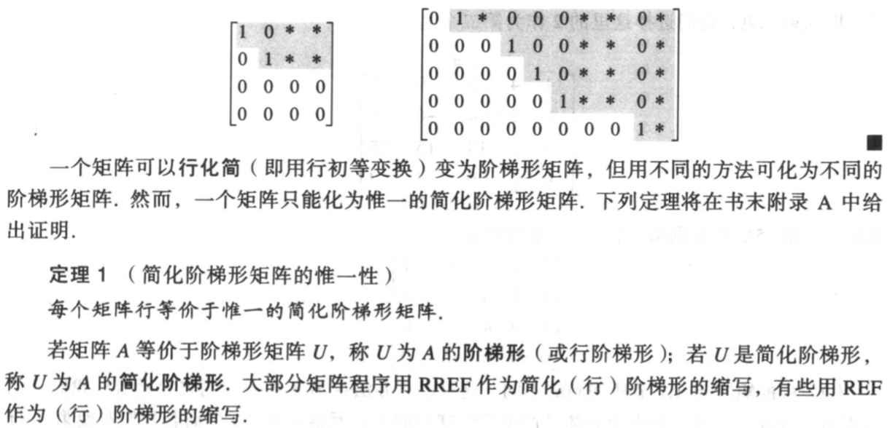
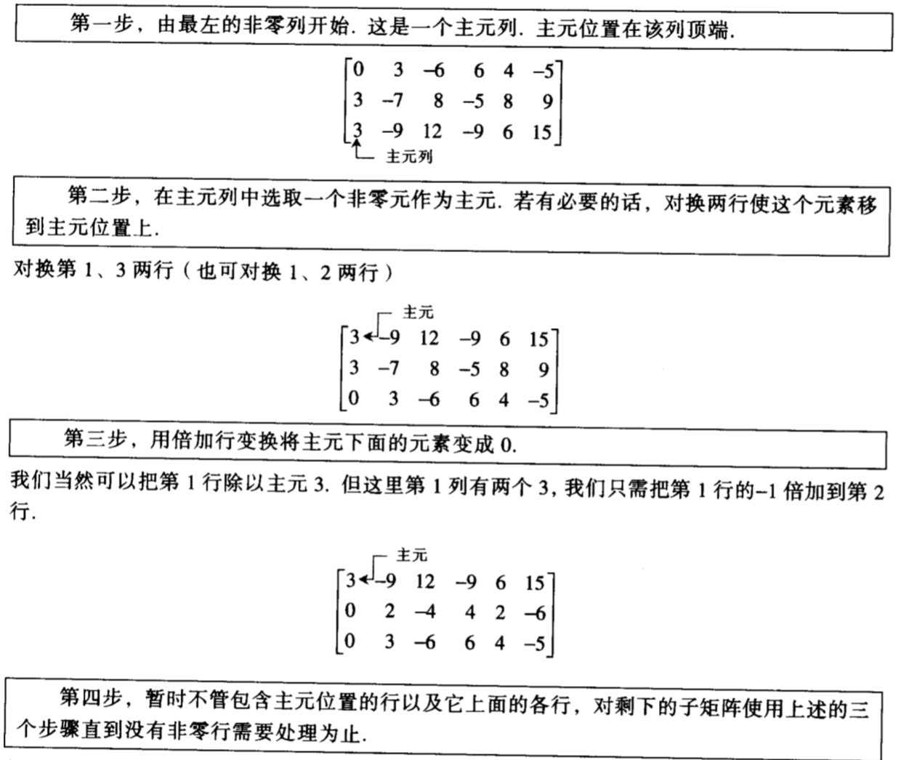

[toc]

## 1 线形方程组

### 1.1 线性方程组

#### 矩阵记号

#### 线性方程组的解法

**例 1.1.1**：解下列方程组：

$x_1-2x_2+x_3=0\\2x_2-8x_3=8\\-4x_1+5x_2+9x_3=-9$

解：将方程组对应的增广矩阵写出：

$\left(\begin{matrix}1&-2&1&0\\0&2&-8&8\\-4&5&9&-9\end{matrix}\right)$

仅保留方程1中的$x_1$，将其它方程中的$x_1$ 消去。也就是将方程1乘4，并将其加到第三个方程上：

$\left(\begin{matrix}1&-2&1&0\\0&2&-8&8\\0&-3&13&-9\end{matrix}\right)$

为方便接下来的运算，将方程2乘1/2，使$x_2$ 的系数变为1

$\left(\begin{matrix}1&-2&1&0\\0&1&-4&4\\0&-3&13&-9\end{matrix}\right)$

利用方程2中的$x_2$小区方程3中的$x_2$，此时得到的矩阵由三角形状：

$\left(\begin{matrix}1&-2&1&0\\0&1&-4&4\\0&0&1&3\end{matrix}\right)$

为了更方便地看出解，最好把方程1中的$x_2, x_3$ 消去，然后把方程2中的$x_3$也消去。利用方程3中的$x_3$ 消去其它方程中的$x_3$ ：

$\left(\begin{matrix}1&-2&0&-3\\0&1&0&16\\0&0&1&3\end{matrix}\right)$

利用方程2中的$x_2$ 消去其它方程中的$x_2$ ：

$\left(\begin{matrix}1&0&0&29\\0&1&0&16\\0&0&1&3\end{matrix}\right)$

这个增广矩阵对应的方程组为

$x_1=29\\x_2=16\\x_3=3$

这就得出了方程组的解$(29, 16, 3)$

#### 存在与唯一性问题

**例 1.1.3**：确定下列方程组是否相容：

$x_2-4x_3=8\\2x_1-3x_2+2x_3=1\\5x_1-85x_2+7x_3=1$

解：将方程组对应的增广矩阵写出：

$\left(\begin{matrix}0&1&-4&8\\2&-3&2&1\\5&-8&7&1\end{matrix}\right)$

对其施以初等行变换可以得到

$\left(\begin{matrix}2&-3&2&1\\-&1&-4&8\\0&0&0&5/2\end{matrix}\right)$

新方程组的方程3对应的方程式为

$0x_1+0x_2+0x_3=5/2$ 

这显然是矛盾的，所以愿方程组是不相容的

### 1.2 行化简与阶梯形矩阵

#### 主元位置

#### 行化简算法

#### 线性方程组的解

**例1.2.4**：求方程组的解，该方程组的增广矩阵已经化为

$\left(\begin{matrix}1&6&2&-5&-2&-4\\0&0&2&-8&-1&3\\0&0&0&0&1&7\end{matrix}\right)$

解：将其化为简化阶梯形：

$\left(\begin{matrix}1&6&0&3&0&0\\0&0&1&-4&0&5\\0&0&0&0&1&7\end{matrix}\right)$

主元列为1，3，5列，基本变量为$x_1, x_3, x_5$，自由变量为：$x_2, x_4$，其对应的方程组为：

$x_1+6x_2+3x_4=0\\x_3-4x_4=5\\x_5=7$

通解为

$x_1+6x_2+3x_4=0$

$x_2$ 为自由变量

$x_3-4x_4=5$

$x_4$ 为自由变量

$x_5=7$

#### 存在与唯一性问题

**例1.2.5**：确定方程组的解是否存在且唯一。方程组的增广矩阵化简为：

$\left(\begin{matrix}3&-9&12&-9&6&15\\0&2&-4&4&2&-6\\0&0&0&0&1&4\end{matrix}\right)$

解：因为没有不相容的方程组，所以方程组有解。因为存在自由变量，所以方程组的解不是唯一的。

### 1.3 向量方程

#### $R^2$ 中的向量

#### $R^2$ 的几何表示

#### $R^n$ 中的向量

#### 线性组合

#### Span{v}与Span{u, v}的几何解释

#### 应用中的线性组合

### 1.4 矩阵方程Ax=b

#### 解的存在性

#### Ax的计算

#### 矩阵-向量积Ax的性质

### 1.5 线性方程组的解集

#### 齐次线性方程组

**例1.5.1**：确定下列其次线性方程组是否有平凡解，并描述他的子集

$3x_1+5x_2-4x_3=0\\-3x_1-2x_2+4x_3=0\\6x_1+x_2-8x_3=0$

解：写出增广矩阵(A 0)

$\left(\begin{matrix}3&5&-4&0\\-3&-2&4&0\\6&1&-8&0\end{matrix}\right)$

施以行变换，化为阶梯形

$\left(\begin{matrix}3&5&-4&0\\0&3&0&0\\0&0&0&0\end{matrix}\right)$

$x_3$ 是自由变量，因此Ax = 0有平凡解。继续施以行变换，化为简化阶梯形：

$\left(\begin{matrix}1&0&-\frac{4}{3}&0\\0&1&0&0\\0&0&0&0\end{matrix}\right)$

用自由变量表示基本变量

$x = \left(\begin{matrix}\frac{4}{3}\\0\\1\end{matrix}\right)x_3$

#### 非齐次线性方程组的解

**例1.5.3** ：描述Ax = b的解，其中

$A = \left(\begin{matrix}3&5&-4\\-3&-2&4\\6&1&-8\end{matrix}\right), b = \left(\begin{matrix}7\\-1\\-4\end{matrix}\right)$

解：写出增广矩阵(A b)

$\left(\begin{matrix}3&5&-4&7\\-3&-2&4&-1\\6&1&-8&4\end{matrix}\right)$

施以行变换，化为简化阶梯形

$\left(\begin{matrix}1&0&-\frac{4}{3}&-1\\0&1&0&2\\0&0&0&0\end{matrix}\right)$

$x_3$ 为自由变量，Ax = b的通解为

$x = \left(\begin{matrix}-1\\2\\0\end{matrix}\right) + \left(\begin{matrix}\frac{4}{3}\\0\\1\end{matrix}\right)x_3$

**例1.5.4** ：证明定理6:

1. 设p是Ax=b的解，即Ap=b，设$v_h$ 为齐次方程$Ax=0$的解，$w=p+v_h$ 。证明w是Ax=b的解
2. 设w是Ax=b的任意解，定义$v_h=w-p$，证明$v_h$ 是$Ax=0$ 的解，这说明，Ax=b的任意解有形式$w=p+v_h$ ，p是Ax=b的特解，$v_h$ 是Ax=0的解

证明：

1. 因为$Ap=b, Av_h=0$ ，所以根据定理5有 $A(p+v_h)=Aw=b$ ，进而w是Ax=b的解
2. 因为根据定理5油 $Aw=A(p+v_h)=Ap+Av_h=b, Ap=b$，所以$Av_h=0$，进而$v_h$是Ax=0的解

### 1.6 线性方程组的应用

#### 经济学中的齐次线性方程组

解：设煤炭，电力，钢铁的平衡价格为$x_1, x_2, x_3$。也就是说，三个部门的总产出和总收入都为$x_1, x_2, x_3$，也就是满足方程组：

$0.0x_1+0.4x_2+0.6x_3=x_1\\0.6x_1+0.1x_2+0.2x_3=x_2\\0.4x_1+0.5x_2+0.2x_3=x_3$

或者满足方程组

$1.0x_1-0.4x_2-0.6x_3=0\\0.6x_1-0.9x_2+0.2x_3=0\\0.4x_1+0.5x_2-0.8x_3=0$

将其增广矩阵列出后施以初等行变换

$\left(\begin{matrix}1.0&-0.4&-0.6&0\\0.6&-0.9&0.2&0\\0.4&0.5&-0.8&0\end{matrix}\right) \sim \left(\begin{matrix}1&0&-0.94&0\\0&1&-0.85&0\\0&0&0&0\end{matrix}\right)$

然后可以得到通解

$x = \left(\begin{matrix}x_1\\x_2\\x_3\end{matrix}\right) = x_3 \left(\begin{matrix}0.94\\0.85\\1\end{matrix}\right)$

#### 配平化学方程式

### 网络流

解：根据$A, B, C, D$的流量守恒，可列方程组：

$300+500=x_1+x_2\\x_2+x_4=300+x_3\\100+400=x_4+x_5\\x_1+x_5=600$

解之可得

$x = \left(\begin{matrix}x_1\\x_2\\x_3\\x_4\\x_5\end{matrix}\right) = \left(\begin{matrix}600\\200\\400\\500\\0\end{matrix}\right) + x_5\left(\begin{matrix}-1\\1\\0\\-1\\1\end{matrix}\right)$

### 1.7 线性无关

**例1.7.2** ：确定矩阵 $A = \left(\begin{matrix}0&1&4\\1&2&-1\\5&8&0\end{matrix}\right)$ 是否线性无关。

解：研究Ax=0，将其增广矩阵施以行变换：

 $\left(\begin{matrix}0&1&4&0\\1&2&-1&0\\5&8&0&0\end{matrix}\right) \sim \left(\begin{matrix}1&2&-1&0\\0&1&4&0\\0&0&13&0\end{matrix}\right)$ 

可见方程有3个基本变量，没有自由变量。因此方程仅有平凡解，A的各列是线性无关的。

**例1.7.6** ：用观察法确定下列向量组是否线性相关

a. $\left(\begin{matrix}1\\7\\6\end{matrix}\right), \left(\begin{matrix}2\\0\\9\end{matrix}\right), \left(\begin{matrix}3\\1\\5\end{matrix}\right), \left(\begin{matrix}4\\1\\8\end{matrix}\right)$

b. $\left(\begin{matrix}2\\3\\5\end{matrix}\right), \left(\begin{matrix}0\\0\\0\end{matrix}\right), \left(\begin{matrix}1\\1\\8\end{matrix}\right)$

a. $\left(\begin{matrix}-2\\4\\6\\10\end{matrix}\right), \left(\begin{matrix}3\\-6\\-9\\15\end{matrix}\right)$

解：

根据定理8，a中向量数大于元素个数，故线性相关

根据定理9，b中出现零向量，故线性相关

根据定理7，c中第一个向量不是零向量，第二个向量不是前一个的倍数，故线性无关

### 1.8 线性变换介绍

#### 矩阵变换

#### 线性变换

### 1.9 线性变换的矩阵

**例2.2.2** ：设$T: R^2\rightarrow R^2$ 为把$R^2$ 中每个点逆时针旋转角度$\varphi$ 的变换。我们可以证明这个变换是线性变换，求出这个变换的标准矩阵

解：因为 $\left(\begin{matrix}1\\0\end{matrix}\right)$ 旋转为 $\left(\begin{matrix}\cos\varphi\\\sin\varphi\end{matrix}\right)$， $\left(\begin{matrix}0\\1\end{matrix}\right)$ 旋转为 $\left(\begin{matrix}-\sin\varphi\\\cos\varphi\end{matrix}\right)$，所以根据定理10，这个变换的标准矩阵

 $A = \left(\begin{matrix}cos\varphi&-\sin\varphi\\\sin\varphi&\cos\varphi\end{matrix}\right)$

#### $R^2$ 中的几何线性变换

#### 存在与唯一性问题

### 1.10 经济学、科学和工程中的线性模型

## 2 矩阵代数

### 2.2 矩阵的逆

**例2.2.2** ：求 $A = \left(\begin{matrix}3&4\\5&6\end{matrix}\right)$ 的逆。

解：$det A = -2 \ne 0$ ，故A可逆，且

$A^{-1} = -\frac{1}{2}\left(\begin{matrix}6&-4\\-5&3\end{matrix}\right) = \left(\begin{matrix}-3&2\\\frac{5}{2}&-\frac{3}{2}\end{matrix}\right)$ 

**例2.2.4** ：解方程：

$3x_1+4x_2=3\\5x_1+6x_2=7$

解：

方程可以写成矩阵的形式：

 $Ax = \left(\begin{matrix}3&4\\5&6\end{matrix}\right)\left(\begin{matrix}x_1\\x_2\end{matrix}\right)=\left(\begin{matrix}3\\7\end{matrix}\right) = b$ 

$x = A^{-1}b = \left(\begin{matrix}-3&2\\\frac{5}{2}&-\frac{3}{2}\end{matrix}\right)\left(\begin{matrix}3\\7\end{matrix}\right) = \left(\begin{matrix}5\\-3\end{matrix}\right)$ 

#### 初等矩阵

**例2.2.6**：求$E = \left(\begin{matrix}1&0&0\\0&1&0\\-4&0&1\end{matrix}\right)$ 的逆

解：为把E变成I，需要对E施加的初等行变换为：将第1行的4倍加到第3行中去，其对应的初等矩阵即E的逆：

$E^{-1} = \left(\begin{matrix}1&0&0\\0&1&0\\4&0&1\end{matrix}\right)$

#### 求$A^{-1}$ 的算法 

  **例2.2.7**：若矩阵 $ \left(\begin{matrix}0&1&2\\1&0&3\\4&-3&8\end{matrix}\right)$ 的逆存在的话，求其逆

解： $ \left(\begin{matrix}A&I\end{matrix}\right) = \left(\begin{matrix}0&1&2&1&0&0\\1&0&3&0&1&0\\4&-3&8&0&0&1\end{matrix}\right) \sim \left(\begin{matrix}1&0&0&-9/2&7&-3/2\\0&1&0&-2&4&-1\\0&0&1&3/2&-2&1/2\end{matrix}\right)$

根据定理7，因为$A \sim I$ 所以A可逆，且

$A^{-1} = \left(\begin{matrix}-9/2&7&-3/2\\-2&4&-1\\3/2&-2&1/2\end{matrix}\right)$

#### 逆矩阵的另一个观点

## 3 行列式

