# 4 马尔可夫链

## 4.1 引言

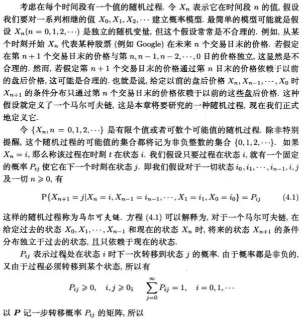

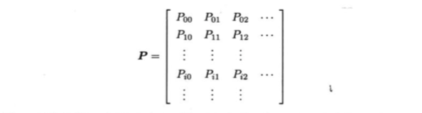

马尔可夫链：在任意时刻t的状态i到下一个时刻t+1的状态j的概率都是某个定值的随机过程。

## 4.2 C-K 方程

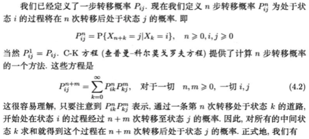

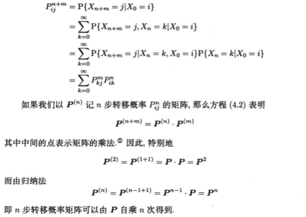

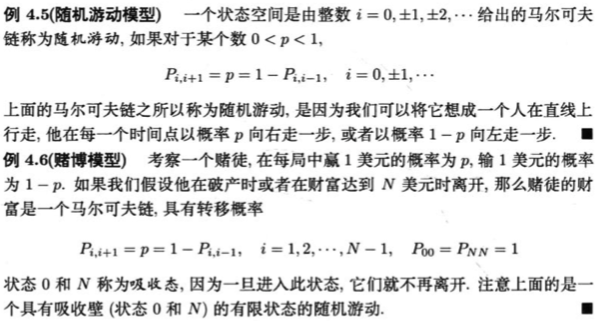

C-K方程：在马尔可夫链中，时刻t的状态i到时刻t+k的状态j的概率是$P^k_{ij}$。

吸收态：进入后就不再离开的状态。

**例4.10** 在瓮中总共有2个球，每个球的颜色要么为红色，要么为蓝色。每一个时刻随机取出一个球，并放回一个新球。其中有0.8的概率放回与取出的球具有相同颜色的球，有0.2的概率放回与取出的球具有相反颜色的球。如果开始两个球都是红色，求第五次取到的球是红色的概率。

解：首先定义马尔可夫链。令$X_n$ 为经过n词的抽取和放回后瓮中的红球的个数。那么$\{X_n, n\ge0\}$ 是一个以0, 1, 2为状态的马尔可夫链。其转移矩阵为

$P = \left(\begin{matrix}0.8&0.2&0\\0.1&0.8&0.1\\0&0.2&0.8\end{matrix}\right)$

因为有C-K方程，所以我们很容易就能算出$X_i$ 到$X_{i+4}$ 的转移矩阵$P^4$ ，那么我们就可以对第四次$X_4$ 取条件（枚举第四次放回后的状态）：

$P(\text{第五次取到的是红球}) = \sum\limits_{i=0}^2 P(\text{第五次取到的是红球}\mid X_4=i)P(X_4=i\mid X_0=2)$

$ = 0\times P_{2, 0}^4 + 0.5\times P_{2, 1} + 1\times P_{2, 2}$

$ = 0.5P_{2, 1} + P_{2, 2}$

计算$P^4$ 并代入上式可得

$P(\text{第五次取到的是红球}) = 0.7048$

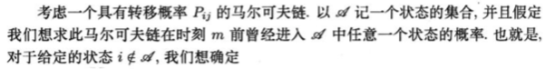

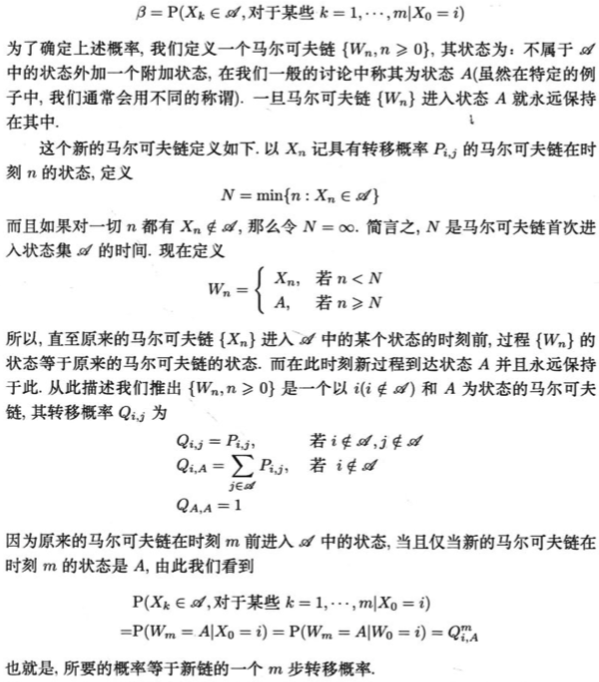

在马尔可夫链$\{X_n, n \ge 0\}$中，若想要计算：在时刻m或在此之前曾进入状态集 $\mathscr{A}$ 的概率 $\beta$，则可以这么做

1. 用吸收状态A来描述“旧的马尔可夫链曾进入过状态集$\mathscr{A}$ ”
2. 构造一个以 $i(i\notin \mathscr{A})$ 和A为状态的新的马尔可夫链 $\{W_n, n \ge 0\}$ 
3. 计算出新马尔可夫链的状态转移矩阵$\begin{equation} Q_{i, j} = \left\{ \begin{aligned} P_{i, j} & & i, j \notin \mathscr{A} \\ \sum\limits_{j \in \mathscr{A}}P_{i, j} & & i \notin \mathscr{A}, j \in \mathscr{A} \\ 1 & & i, j \in \mathscr{A} \\ 0 & & i \in \mathscr{A}, j \notin \mathscr{A} \end{aligned} \right. \end{equation}$

最后， $Q_{i, A}^m$ 即为所求。

**例4.12** 在一系列独立抛掷一个公平硬币的实验中，以N记直至出现连续3次正面时的抛掷次数。求

1. $P(N \le 8)$
2. $P(N = 8)$

解：显然 $P(N \le 8)$ 就是在时刻8活在此之前曾进入状态（集）“连续抛掷出3次正面”的概率。

1. 定义一个具有状态0, 1, 2, 3的马尔可夫链。其中状态0, 1, 2表示连续抛掷出0, 1, 2次正面，状态3表示连续抛掷出3次正面这件事已经发生。其转移矩阵为：

   $P = \left( \begin{matrix} 1/2 & 1/2 & 0 & 0 \\ 1/2 & 0 & 1/2 & 0 \\ 1/2 & 0 & 0 & 1/2 \\ 0 & 0 & 0 & 1 \end{matrix}\right)$

   所求的概率为$P_{0, 3}^8=107/256\approx0.4180$

2. 方法1是直接计算$P(N\le 8)-P(N\le7)$ 。方法2是考虑一个状态为0, 1, 2, 3, 4的马尔可夫链。其中状态0, 1, 2表示连续抛掷出0, 1, 2次正面，状态3表示连续抛掷出3次正面这件事刚发生，状态4表示连续抛掷出3次正面这件事已经发生过。其转移矩阵为

   $Q = \left( \begin{matrix} 1/2 & 1/2 & 0 & 0 & 0 \\ 1/2 & 0 & 1/2 & 0 & 0 \\ 1/2 & 0 & 0 & 1/2 & 0 \\ 0 & 0 & 0 & 0 & 1 \\ 0 & 0 & 0 & 0 & 1 \end{matrix}\right)$

   所求概率为$P^8_{0, 3}$

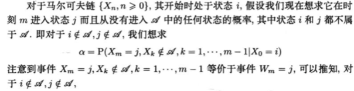

在马尔可夫链$\{X_n, n \ge 0\}$中，在时刻m或在此之前不曾进入状态集 $\mathscr{A}$ 的概率 $\alpha$ 为$Q^m_{i, j}(i, j \notin \mathscr{A})$ 

## 4.3 状态的分类

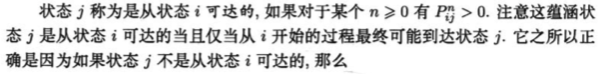

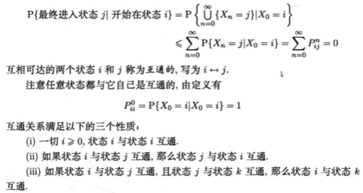

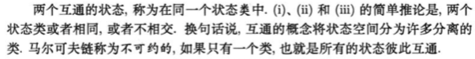

若从i开始的过程最终可能到达状态j，则说i可达j；若i和j相互可达，则说i与j互通；两个互通的状态在同一个状态类中（状态类类似于图论中的强连通分量）；若马尔可夫链只有一个状态类，则我们说这个链不可约。

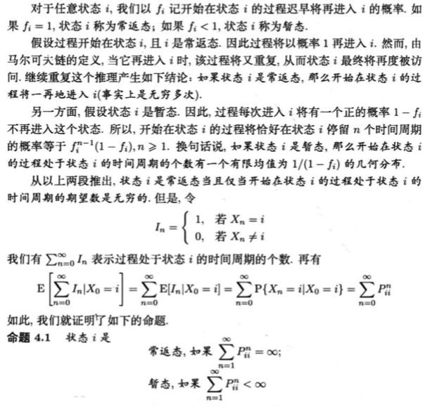

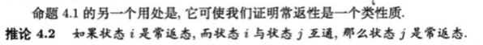

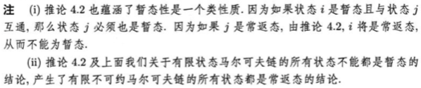

若从状态i出发后，迟早会回到状态i，则状态i被称为常返态，否则被称为暂态。

若$\sum\limits_{n=1}^\infin p_{ii}^n = \infin$ ，则状态i是常返态；若$\sum\limits_{n=1}^\infin p_{ii}^n < \infin$ ，则状态i是暂态。

有限状态马尔可夫链中不可能所有状态都是暂态（否则从某个时刻开始必定无处可去）。

无限状态马尔可夫链中有可能所有状态都是暂态（高维对称随机游走）。

若状态i是常返态，则与之互通的状态j也是常返态（状态j能到状态i，状态i能到状态i，状态i也能到状态j）。

有限不可约马尔可夫链的所有状态都是常返态（有限不可约马尔可夫链构成一个强连通分量）。

**例4.17** 考虑由状态0, 1, 2, 3, 4组成的马尔可夫链，而

$P = \left( \begin{matrix} 1/2&1/2&0&0&0\\1/2&1/2&0&0&0\\0&0&1/2&1/2&0\\0&0&1/2&1/2&0\\1/4&1/4&0&0&1/2 \end{matrix} \right)$

确定它的暂态和常返态。

解：状态0可以通过状态1回到状态0，因此状态0是常返态。状态0和1互通，因此状态1也是常返态。同理状态2, 3都是常返态。状态4有可能进入状态类{0, 1}后就回不来了，因此状态4是暂态。

